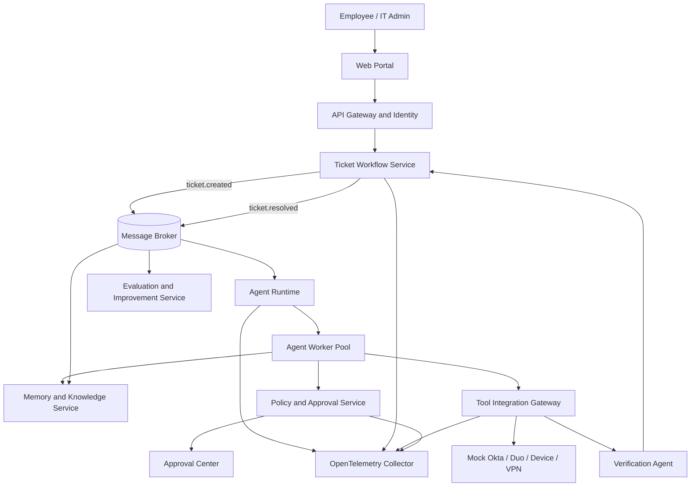

# OpsMind

> **Adaptive Multi-Agent Platform for Enterprise IT Support**  
> A production-oriented, event-driven AI agent platform that triages, investigates, resolves, verifies, and continuously improves enterprise IT service workflows.

**中文概述：** OpsMind 是一个面向企业 IT 服务与运维场景的自适应多智能体平台。它接收账号、权限、MFA、VPN、设备、软件和应用访问请求，协调专业 Agent 调查根因，通过受控工具网关执行低风险操作，对高风险操作请求人工审批，验证问题是否真正解决，并把成功与失败经验转化为可版本化、可评估、可回滚的长期记忆和改进策略。

---

## Table of Contents

- [1. Project Vision](#1-project-vision)
- [2. Business Problem](#2-business-problem)
- [3. Product Scope](#3-product-scope)
- [4. Users and Roles](#4-users-and-roles)
- [5. End-to-End Example](#5-end-to-end-example)
- [6. System Architecture](#6-system-architecture)
- [7. Logical Domains](#7-logical-domains)
- [8. Deployable Services](#8-deployable-services)
- [9. Agent System](#9-agent-system)
- [10. Memory Architecture](#10-memory-architecture)
- [11. Workflow and State Machine](#11-workflow-and-state-machine)
- [12. Tool Gateway and Governance](#12-tool-gateway-and-governance)
- [13. Distributed Systems Design](#13-distributed-systems-design)
- [14. Data Ownership](#14-data-ownership)
- [15. API and Event Contracts](#15-api-and-event-contracts)
- [16. Evaluation and Controlled Improvement](#16-evaluation-and-controlled-improvement)
- [17. Observability](#17-observability)
- [18. Security and Privacy](#18-security-and-privacy)
- [19. Non-Functional Requirements](#19-non-functional-requirements)
- [20. Technology Stack](#20-technology-stack)
- [21. Repository Structure](#21-repository-structure)
- [22. Local Development](#22-local-development)
- [23. Testing Strategy](#23-testing-strategy)
- [24. Benchmark Plan](#24-benchmark-plan)
- [25. Delivery Roadmap](#25-delivery-roadmap)
- [26. Demo Script](#26-demo-script)
- [27. Risks and Tradeoffs](#27-risks-and-tradeoffs)
- [28. Business Metrics](#28-business-metrics)
- [29. Interview Narrative](#29-interview-narrative)
- [30. Resume Bullets](#30-resume-bullets)

---

## 1. Project Vision

OpsMind is designed around one practical question:

> **How can an enterprise safely use AI agents to resolve repetitive IT service requests while preserving human control, auditability, reliability, and continuous learning?**

The platform is not a generic chatbot. It is a distributed business system that manages the complete lifecycle of an IT support request:

```text
Request intake
  -> Ticket creation
  -> Triage and routing
  -> Multi-agent investigation
  -> Evidence collection
  -> Resolution proposal
  -> Policy and approval checks
  -> Tool execution
  -> Independent verification
  -> Ticket closure
  -> Memory extraction
  -> Evaluation and controlled improvement
```

The primary engineering focus is **production AI agent platform engineering**: durable execution, structured memory, tool governance, event-driven coordination, evaluation, observability, and safe improvement.

### Design principles

1. **Business workflow first.** Agents exist to complete measurable IT workflows, not to demonstrate prompting tricks.
2. **Evidence over confidence.** Every diagnosis must reference logs, account state, knowledge documents, prior tickets, or tool results.
3. **Separation of duties.** Agents propose actions; policy decides whether actions are allowed; the tool gateway executes approved actions.
4. **Durable by default.** Long-running workflows survive restarts, timeouts, and duplicate messages.
5. **Memory is governed data.** Long-term memories are versioned, sourced, evaluated, and reversible.
6. **Improvement is evaluation-gated.** A candidate prompt, routing policy, or runbook must outperform the baseline before deployment.
7. **Human control is explicit.** Privileged operations require approval, audit records, and rollback or compensation plans.

---

## 2. Business Problem

Enterprise IT teams repeatedly handle requests such as:

- MFA or SSO login failures
- account lockouts and password resets
- incorrect application access or group membership
- VPN and Wi-Fi connectivity problems
- device compliance and software installation issues
- printer and peripheral troubleshooting
- asset checkout, return, and operating-system upgrade workflows
- internal application access and configuration questions

A typical support engineer must collect information from multiple systems, search documentation, compare historical tickets, ask the user follow-up questions, perform administrative actions, verify the result, and document the resolution. The work is repetitive, but it is not trivial because the correct action depends on context, permissions, risk, and current system state.

### Current workflow pain points

| Pain point | Operational impact |
|---|---|
| Information is spread across ticketing, identity, device, network, and knowledge systems | Slow diagnosis and repeated context switching |
| Resolution knowledge is buried in historical tickets or individual experience | New staff repeat old investigations |
| Support agents perform the same checks manually | High handling time and inconsistent quality |
| Automation scripts lack contextual reasoning | Brittle workflows and poor exception handling |
| General-purpose chatbots cannot safely execute privileged actions | Security, audit, and compliance risk |
| Agent changes are not regression-tested | Silent quality degradation after prompt or model updates |
| Long-running workflows lose state after failure | Repeated work and duplicate side effects |

### Intended business outcome

OpsMind aims to improve:

- first-contact resolution rate
- mean time to diagnose and resolve
- ticket deflection and automated resolution rate
- consistency of troubleshooting
- retention of institutional knowledge
- visibility into agent decisions and tool usage
- safety of privileged operations
- ability to measure and improve agent quality

---

## 3. Product Scope

### Initial supported domain

The first production-quality vertical is **Identity and Access Support**:

- Okta or SSO login failure
- Duo or MFA enrollment issues
- account lockout
- incorrect application group membership
- expired session or device token
- application access request

This narrow scope is intentional. It allows the project to deliver a complete, testable workflow before expanding into device, network, and application support.

### Planned expansion domains

1. **Device Support** - compliance status, operating-system version, software installation, disk usage, endpoint health.
2. **Network and VPN** - VPN authentication, DNS, Wi-Fi, internal service reachability.
3. **Enterprise Applications** - Google Workspace, Microsoft 365, internal portals, SaaS access.
4. **Asset Operations** - checkout, return, missing accessories, upgrade readiness.
5. **Major Incident Detection** - cluster similar tickets, detect system-wide incidents, and escalate to operations teams.

### Non-goals for the initial version

- fully autonomous execution of high-risk administrative actions
- unrestricted shell access
- production integration with every commercial IT tool
- model fine-tuning or online weight updates
- replacing human IT staff
- storing sensitive user data without retention and access controls

---

## 4. Users and Roles

| Role | Main responsibilities | Typical permissions |
|---|---|---|
| Employee / requester | Submit a request, answer questions, confirm resolution | Create and view own tickets |
| IT support analyst | Review investigations, communicate with users, intervene in workflows | View assigned tickets and evidence |
| IT administrator | Approve medium-risk actions such as MFA reset | Approve scoped administrative actions |
| Security administrator | Approve access changes and high-risk operations | Review policy-sensitive requests |
| Service manager | Monitor SLA, automation rate, and escalations | View operational dashboards |
| Auditor | Inspect historical decisions and actions | Read-only access to append-only audit logs |
| Platform engineer | Manage models, agent versions, tools, and reliability | Deploy and roll back platform components |

Role-based access control is enforced at the API gateway, policy service, and tool gateway. The model never receives broad administrator credentials.

---

## 5. End-to-End Example

### Scenario

A user submits:

> “I cannot sign in to the Housing Portal. Duo keeps failing, but my account and application group look correct.”

### Step 1: Ticket creation

```json
{
  "ticket_id": "INC-2048",
  "category": "UNCLASSIFIED",
  "priority": "MEDIUM",
  "status": "NEW",
  "application": "Housing Portal"
}
```

The ticket service stores the request and publishes `ticket.created` through the transactional outbox.

### Step 2: Triage

The Triage Agent extracts entities and returns a typed result:

```json
{
  "category": "IDENTITY_ACCESS",
  "subcategory": "MFA_FAILURE",
  "priority": "MEDIUM",
  "recommended_agents": ["identity-agent", "knowledge-agent"],
  "confidence": 0.94
}
```

### Step 3: Shared working memory

The runtime creates a ticket-scoped workspace:

```json
{
  "verified_facts": [
    "Account is active",
    "Housing Portal group membership is correct"
  ],
  "current_hypotheses": [
    "Expired Duo enrollment",
    "Corrupted SSO session"
  ],
  "completed_tasks": [],
  "pending_tasks": [
    "Check Duo enrollment",
    "Inspect authentication failures",
    "Retrieve similar tickets"
  ]
}
```

### Step 4: Parallel investigation

The Identity Agent queries the simulated identity and MFA systems. The Knowledge Agent searches runbooks and historical tickets. The two tasks execute in parallel through the worker pool.

Evidence returned:

```text
Account status: ACTIVE
Housing Portal group: PRESENT
Duo device token: EXPIRED
Failed MFA attempts: 7
Similar ticket: INC-1783, resolved by reset and re-enrollment
```

### Step 5: Resolution proposal

The Resolution Agent proposes:

```json
{
  "root_cause": "EXPIRED_DUO_ENROLLMENT",
  "confidence": 0.91,
  "recommended_action": {
    "tool": "reset_duo_enrollment",
    "arguments": {"user_id": "user-1024"}
  },
  "evidence_ids": ["ev-41", "ev-42", "mem-1783"]
}
```

### Step 6: Policy and approval

The policy service classifies the action as medium risk and creates an approval request. The workflow is checkpointed and paused without occupying a worker.

### Step 7: Controlled execution

After approval, the tool gateway validates the approval, target identity, schema, and idempotency key before calling the MFA adapter.

### Step 8: Independent verification

The Verification Agent checks the external system state and a simulated successful login event. The ticket is resolved only after objective success conditions are met.

### Step 9: Memory and evaluation

The platform generates a post-resolution record, extracts candidate episodic and procedural memories, removes sensitive data, checks for conflicts, versions the memory, and runs an evaluation job over the complete trace.

---

## 6. System Architecture



### Architectural layers

1. **Experience layer** - web portal, admin console, real-time updates.
2. **Business workflow layer** - ticket state, SLA, ownership, notifications.
3. **Agent intelligence layer** - planning, routing, specialized agents, memory access.
4. **Control and governance layer** - policy, approvals, audit, risk classification.
5. **Enterprise integration layer** - structured tools and vendor adapters.
6. **Platform infrastructure layer** - databases, queue, cache, observability, deployment.

---

## 7. Logical Domains

OpsMind contains eight logical domains. A domain is a responsibility boundary, not automatically a microservice.

### 7.1 Experience and Identity

- employee and administrator interfaces
- authentication and authorization
- ticket conversations and attachments
- approval center and dashboards
- real-time workflow updates

### 7.2 Ticket and Workflow

- ticket lifecycle and state machine
- category, priority, SLA, assignment, escalation
- user messages and resolution confirmation
- major-incident clustering hooks
- optimistic concurrency and legal state transitions

### 7.3 Agent Runtime and Orchestration

- workflow creation and checkpointing
- task decomposition and routing
- parallel execution and handoffs
- retry, timeout, cost, and iteration budgets
- fallback models and manual escalation

### 7.4 Memory and Knowledge

- ticket-scoped working memory
- episodic, semantic, procedural, and organizational memory
- RAG over formal knowledge documents
- memory extraction, deduplication, conflict detection, versioning, and deletion

### 7.5 Tool Integration

- tool registry and typed schemas
- vendor-neutral adapters
- secret injection and credential isolation
- idempotent execution and result normalization
- external-system health and rate-limit handling

### 7.6 Policy, Approval, and Audit

- risk scoring and access rules
- approval workflows and expiration
- separation of duties
- immutable audit history
- sensitive-data handling and kill switch

### 7.7 Evaluation and Improvement

- golden datasets and scenario simulation
- deterministic graders and LLM judges
- regression suites and CI quality gates
- trace analysis and candidate improvements
- canary deployment and rollback

### 7.8 Observability and Platform Operations

- logs, metrics, traces, and correlation IDs
- model, prompt, memory, and tool versions
- queue lag, worker health, latency, cost, and errors
- operational dashboards and alerts

---

## 8. Deployable Services

### Recommended complete topology

| Deployable unit | Responsibility |
|---|---|
| `web-portal` | Employee and administrator user experience |
| `api-gateway` | Authentication, rate limiting, routing, request correlation |
| `ticket-workflow-service` | Ticket state, SLA, messages, ownership, state transitions |
| `agent-runtime-service` | Workflow control, routing, checkpointing, budgets |
| `agent-worker` | Stateless execution of agent tasks; horizontally scalable |
| `memory-knowledge-service` | Working memory, long-term memory, document retrieval |
| `tool-integration-gateway` | Tool registry, adapters, idempotent execution |
| `policy-approval-service` | Risk policy, approvals, permissions, audit decisions |
| `evaluation-improvement-service` | Benchmarks, regressions, candidate versions, rollout |
| `notification-service` | Email, Slack/Teams, and user notifications |

### MVP topology

The first iteration can combine related responsibilities into five application components:

```text
web-portal
  + ticket-service
  + agent-runtime
  + memory-service
  + tool-policy-gateway
```

Shared infrastructure:

```text
PostgreSQL + pgvector
Redis
RabbitMQ or NATS
MinIO
OpenTelemetry Collector
Prometheus and Grafana
```

The project should split a component into a separate service only when independent scaling, failure isolation, security boundaries, or ownership justify the cost.

---

## 9. Agent System

### Agent roles

| Agent | Responsibility | Allowed tool class |
|---|---|---|
| Triage Agent | Classify, prioritize, extract entities, choose workflow | Read-only ticket and taxonomy tools |
| Coordinator Agent | Plan investigation, assign tasks, combine evidence | Runtime and memory tools |
| Identity Agent | Investigate SSO, MFA, accounts, groups, sessions | Identity read tools; privileged actions require approval |
| Device Agent | Investigate endpoint, OS, compliance, software | Device read tools and approved remediation |
| Network Agent | Investigate VPN, DNS, Wi-Fi, reachability | Network diagnostics |
| Knowledge Agent | Retrieve documents, runbooks, and similar incidents | Knowledge and memory search |
| Resolution Agent | Produce evidence-backed root cause and action plan | No direct privileged execution |
| Verification Agent | Independently verify success criteria | Read-only validation tools |

### Why agents are not individual microservices

Agent roles are configuration and policy boundaries. They can run on a shared worker pool. A worker loads the selected model, prompt, tool permissions, output schema, and evaluation policy. This avoids duplicated deployment logic and unnecessary network calls.

### Handoff contract

Every handoff uses structured data:

```json
{
  "task_id": "task-883",
  "ticket_id": "INC-2048",
  "objective": "Determine whether MFA enrollment is invalid",
  "known_facts": ["Account active", "Group correct"],
  "constraints": ["Read-only investigation"],
  "expected_output_schema": "IdentityEvidenceV1",
  "deadline": "2026-07-20T18:20:00Z"
}
```

### Runtime limits

```yaml
max_iterations: 10
max_tool_calls: 20
max_cost_usd: 1.00
timeout_minutes: 15
no_progress_limit: 2
fallback_model_attempts: 1
```

---

## 10. Memory Architecture

### 10.1 Short-term working memory

Ticket-scoped and temporary. It contains facts, hypotheses, rejected hypotheses, task status, user answers, approvals, and summaries. It supports checkpoint recovery and should not automatically become permanent knowledge.

### 10.2 Long-term memory types

**Episodic memory** - a specific resolved ticket, including symptoms, evidence, root cause, action, and outcome.

**Semantic memory** - generalized relationships derived from multiple validated episodes.

**Procedural memory** - successful troubleshooting sequences, decision rules, and runbooks.

**Organizational memory** - system ownership, escalation paths, approval rules, and internal dependencies.

**Agent performance memory** - measured strengths, weaknesses, latency, cost, and error patterns for routing decisions.

### Memory lifecycle

```text
Resolved ticket
  -> Candidate extraction
  -> PII and secret redaction
  -> Source and confidence assignment
  -> Deduplication
  -> Conflict detection
  -> Validation
  -> Versioned storage
  -> Retrieval evaluation
  -> Expiration, supersession, or deletion
```

### Storage model

- PostgreSQL: structured records, versions, provenance, retention metadata
- pgvector: semantic retrieval
- MinIO/S3: source documents, screenshots, and attachments
- Redis: transient caches and workflow leases

### Memory quality controls

- every memory references source tickets or documents
- conflicting memories coexist with status and evidence instead of silent overwrite
- retrieval records which memory influenced which decision
- low-confidence memories require review
- memories can be superseded or rolled back
- retention and deletion policies are enforced by category

---

## 11. Workflow and State Machine

### Ticket state machine

```text
NEW
  -> TRIAGING
  -> INVESTIGATING
       -> WAITING_FOR_USER
       -> WAITING_FOR_APPROVAL
       -> ESCALATED
  -> EXECUTING
  -> VERIFYING
       -> INVESTIGATING
  -> RESOLVED
  -> CLOSED
```

Exceptional states:

```text
FAILED | CANCELLED | REOPENED
```

The ticket service is the authority for valid transitions. Agents request transitions but cannot directly edit ticket tables.

### Workflow durability

The agent runtime persists:

- workflow ID and version
- current node or step
- completed and pending tasks
- intermediate evidence
- model and prompt version
- token and cost usage
- retry counters and deadlines
- approval wait state

A paused workflow consumes no worker. When an event such as `approval.granted` arrives, the runtime resumes from the last checkpoint.

---

## 12. Tool Gateway and Governance

### Tool execution pipeline

```text
Agent proposal
  -> Tool schema validation
  -> Agent and requester identity check
  -> Policy evaluation
  -> Approval validation
  -> Idempotency check
  -> Secret injection
  -> Adapter call
  -> Result normalization
  -> Audit record
  -> Completion event
```

### Example tool registry entry

```json
{
  "tool_name": "reset_duo_enrollment",
  "version": "1.2",
  "risk_level": "MEDIUM",
  "required_role": "IAM_ADMIN",
  "approval_required": true,
  "timeout_seconds": 20,
  "retryable": false,
  "idempotency_required": true
}
```

### Risk policy example

```yaml
get_account_status:
  risk: LOW
  approval: automatic

send_troubleshooting_instructions:
  risk: LOW
  approval: automatic

reset_duo_enrollment:
  risk: MEDIUM
  approval: it_admin

change_group_membership:
  risk: HIGH
  approval: security_admin

export_credentials:
  risk: FORBIDDEN
  approval: never
```

### Separation of duties

- Agent Runtime decides **what should be investigated or proposed**.
- Policy Service decides **whether the action is allowed and who must approve it**.
- Tool Gateway decides **how to execute the approved, structured action safely**.
- Verification Agent decides **whether the business outcome was achieved**.

---

## 13. Distributed Systems Design

OpsMind is not considered distributed merely because it uses containers. Its distributed-systems value comes from asynchronous workflows, partial failure, independent data ownership, and side-effect control.

### Event-driven architecture

Important events include:

```text
ticket.created
ticket.classified
workflow.started
agent.task.requested
agent.task.completed
evidence.collected
resolution.proposed
approval.requested
approval.granted
approval.rejected
tool.execution.requested
tool.execution.completed
verification.completed
ticket.resolved
memory.candidate.created
evaluation.requested
```

### Transactional outbox

The ticket service stores a business update and an outbox record in the same database transaction. A publisher delivers the event later. This prevents a ticket from being saved while its workflow-start event is lost.

### Idempotency

Message brokers may deliver at least once. Every side-effecting operation uses a stable idempotency key such as:

```text
{ticket_id}:{workflow_version}:{tool_name}:{target}:{action_version}
```

The tool gateway returns the original result for a duplicate request instead of repeating the action.

### Retry and backoff

- transient network or rate-limit failures: exponential backoff with jitter
- invalid model output: one schema-repair attempt, then fallback or manual review
- non-retryable privileged action: verify external state before deciding
- exhausted tasks: dead-letter queue with trace and failure category

### Optimistic concurrency

Ticket records include a version. A transition updates only when the expected version matches, preventing stale events from overwriting newer states.

### Distributed locks and leases

Workers claim tasks with renewable leases. If a worker dies, another worker can continue after lease expiration. Locks are used narrowly because checkpoints and idempotency are preferred over long-held distributed locks.

### Saga and compensation

Long-running operations are modeled as sagas. Example:

```text
Grant temporary access
  -> Send user notification
  -> Verify access
```

If verification fails, the compensation may revoke the temporary access. Compensation is explicit and audited, not generated as arbitrary model text.

### Eventual consistency

Different services may temporarily show different stages, but events converge the system toward a consistent state. The ticket service remains the business source of truth for lifecycle state.

### Failure scenarios

| Failure | Expected behavior |
|---|---|
| LLM timeout | Retry once, use fallback model, or escalate |
| Knowledge service unavailable | Continue with reduced evidence and mark degraded mode |
| Duplicate queue delivery | Idempotency prevents duplicate model charge or tool action |
| Runtime restart | Resume from persisted checkpoint |
| Approval expires | Reject execution and request a new approval |
| Tool gateway crashes after external success | Reconcile external state before retry |
| Malformed model JSON | Repair, validate schema, or fail safely |
| Infinite investigation loop | Stop on cost, iteration, timeout, or no-progress limit |

---

## 14. Data Ownership

| Service | Owned data |
|---|---|
| Ticket Workflow Service | tickets, messages, SLA, assignments, state transitions |
| Agent Runtime | workflows, tasks, checkpoints, agent outputs, budgets |
| Memory Service | memories, embeddings, provenance, document indexes |
| Tool Gateway | tool registry, connector status, execution records |
| Policy Service | policies, approvals, risk decisions, role requirements |
| Evaluation Service | datasets, experiments, graders, scores, versions |
| Audit subsystem | append-only audit events |

The MVP may use one PostgreSQL instance with separate schemas, but services do not directly edit one another's tables.

```text
ticket.*
agent.*
memory.*
tools.*
policy.*
evaluation.*
audit.*
```

---

## 15. API and Event Contracts

### Example REST endpoints

```http
POST /api/v1/tickets
GET  /api/v1/tickets/{ticketId}
POST /api/v1/tickets/{ticketId}/messages
POST /api/v1/tickets/{ticketId}/confirm-resolution
POST /api/v1/tickets/{ticketId}/reopen

GET  /api/v1/approvals
POST /api/v1/approvals/{approvalId}/approve
POST /api/v1/approvals/{approvalId}/reject

GET  /api/v1/traces/{traceId}
GET  /api/v1/memories/search?q=...
POST /api/v1/evaluations/run
```

### Event envelope

```json
{
  "event_id": "evt-01J2...",
  "event_type": "approval.granted",
  "event_version": 1,
  "occurred_at": "2026-07-20T18:30:00Z",
  "trace_id": "trace-abc123",
  "correlation_id": "INC-2048",
  "producer": "policy-approval-service",
  "payload": {}
}
```

Contracts are versioned. Consumers tolerate additive fields and route incompatible versions to a compatibility handler or DLQ.

---

## 16. Evaluation and Controlled Improvement

### Evaluation dimensions

1. ticket classification accuracy
2. root-cause identification accuracy
3. evidence completeness and groundedness
4. tool selection correctness
5. policy compliance
6. successful business outcome
7. memory retrieval relevance
8. agent handoff information preservation
9. latency and token cost
10. human escalation and intervention rate

### Grader types

- deterministic rules: exact category, allowed tools, required steps, state checks
- environment graders: external-system state after remediation
- trajectory graders: unnecessary tools, repeated investigation, unsafe path
- LLM judge: explanation quality and evidence coverage
- human review: ambiguous failures and high-risk policy cases

### Controlled improvement loop

```text
Production or simulated traces
  -> Failure classification
  -> Candidate prompt, routing, memory, or runbook change
  -> New version
  -> Full regression benchmark
  -> Baseline comparison
  -> Safety and cost checks
  -> Human approval
  -> Canary rollout
  -> Monitor
  -> Promote or roll back
```

The system may propose changes to prompts, routing, retrieval strategy, handoff format, retry policy, or runbook candidates. It may not autonomously weaken enterprise security rules or grant new privileges.

---

## 17. Observability

Every request receives a `trace_id` that propagates through the portal, gateway, ticket service, broker, runtime, memory, policy, tool gateway, and simulated enterprise systems.

### Platform metrics

- API latency and error rate
- database connections and query latency
- queue lag and delivery retries
- worker utilization and lease expiration
- cache hit rate
- connector health and rate limits

### Agent metrics

- classification and resolution success by agent version
- LLM latency, token usage, and cost
- tool-call count and failure rate
- loop iterations and no-progress stops
- handoff count and information-loss score
- memory retrieval precision and utilization
- approval wait duration
- human escalation rate

### Recommended stack

- OpenTelemetry for traces, logs, and metrics
- Prometheus for metrics storage
- Grafana for dashboards
- Loki for logs
- Tempo or Jaeger for distributed traces

---

## 18. Security and Privacy

- OIDC authentication and role-based authorization
- least-privilege tool permissions
- scoped credentials stored outside model context
- encrypted transport and encrypted secrets
- PII redaction before long-term memory creation
- append-only audit records
- approval expiration and replay protection
- tenant or organization isolation as a future extension
- tool allowlists; no unrestricted shell execution
- prompt-injection defenses for retrieved documents and user content
- data retention, deletion, and memory supersession workflows
- platform kill switch and per-tool disable switch

---

## 19. Non-Functional Requirements

| Category | Target for project benchmark |
|---|---|
| Availability | Core ticket API remains available during agent-worker restart |
| Durability | No completed ticket or approved action is lost after restart |
| Idempotency | Duplicate event does not repeat a side effect |
| Recovery | Paused or failed workflow resumes from checkpoint |
| Auditability | Every privileged proposal, approval, and execution is traceable |
| Safety | Forbidden tools are never executed in the benchmark |
| Observability | One trace links the full ticket lifecycle |
| Performance | Read-only investigation tasks can execute concurrently |
| Cost control | Per-ticket model and tool budgets are enforced |
| Extensibility | New vendor adapter does not require rewriting agent logic |

---

## 20. Technology Stack

### Application

- Frontend: React or Next.js, TypeScript
- Backend APIs: Python FastAPI or Java Spring Boot
- Agent runtime: LangGraph for MVP, with clear internal runtime abstractions
- LLM provider: configurable API adapter
- Validation: Pydantic or JSON Schema

### Data and messaging

- PostgreSQL
- pgvector
- Redis
- RabbitMQ, NATS, or Kafka
- MinIO or S3-compatible object storage

### Platform

- Docker Compose for local development
- Kubernetes and Helm as an advanced deployment target
- OpenTelemetry
- Prometheus, Grafana, Loki, Tempo/Jaeger
- GitHub Actions for tests, builds, and evaluation gates

---

## 21. Repository Structure

```text
opsmind/
├── README.md
├── docs/
│   ├── architecture.md
│   ├── api-contracts.md
│   ├── event-catalog.md
│   ├── memory-design.md
│   ├── evaluation-plan.md
│   └── threat-model.md
├── apps/
│   ├── web-portal/
│   ├── api-gateway/
│   ├── ticket-service/
│   ├── agent-runtime/
│   ├── memory-service/
│   ├── tool-gateway/
│   ├── policy-service/
│   └── evaluation-service/
├── workers/
│   └── agent-worker/
├── packages/
│   ├── contracts/
│   ├── agent-definitions/
│   ├── tool-schemas/
│   ├── observability/
│   └── test-fixtures/
├── integrations/
│   ├── mock-okta/
│   ├── mock-duo/
│   ├── mock-device-management/
│   └── mock-vpn/
├── infra/
│   ├── docker-compose.yml
│   ├── kubernetes/
│   ├── helm/
│   ├── prometheus/
│   └── grafana/
├── evals/
│   ├── datasets/
│   ├── graders/
│   ├── scenarios/
│   └── reports/
└── scripts/
    ├── seed_demo_data.sh
    ├── run_incident_scenario.sh
    └── run_evals.sh
```

---

## 22. Local Development

### Prerequisites

- Docker Desktop
- Node.js 20+
- Python 3.11+ or Java 21+
- PostgreSQL client tools
- an LLM API key, or a configured local-compatible endpoint

### Start shared infrastructure

```bash
docker compose up -d postgres redis rabbitmq minio
```

### Seed mock enterprise data

```bash
./scripts/seed_demo_data.sh
```

### Start services

```bash
make dev
```

### Run the primary demo scenario

```bash
./scripts/run_incident_scenario.sh duo-expired-token
```

### Run evaluation suite

```bash
./scripts/run_evals.sh --baseline v1 --candidate v2
```

Environment variable templates and secrets should be stored in `.env.example`; real credentials must never be committed.

---

## 23. Testing Strategy

### Unit tests

- state transition rules
- policy decisions
- tool schema validation
- idempotency-key generation
- memory conflict and version logic
- grader calculations

### Contract tests

- REST and event schema compatibility
- vendor adapter behavior
- model structured-output parsing

### Integration tests

- ticket creation to workflow start
- approval to tool execution
- checkpoint recovery after runtime restart
- outbox publication
- duplicate event handling

### End-to-end tests

- expired Duo token
- account lockout
- incorrect group membership
- incomplete user information
- forbidden privilege request
- tool timeout and recovery

### Chaos tests

- kill agent worker during investigation
- delay or duplicate broker messages
- stop memory service
- return partial external API success
- restart runtime while waiting for approval

---

## 24. Benchmark Plan

Create 40-60 deterministic support scenarios with ground truth:

- 15 identity and MFA cases
- 10 network and VPN cases
- 10 device cases
- 10 application access cases
- 5-15 ambiguous, adversarial, or incomplete cases

Compare:

| Variant | Description |
|---|---|
| Baseline | Single agent, no long-term memory |
| A | Single agent + formal knowledge RAG |
| B | Single agent + short/long-term memory |
| C | Multi-agent + memory |
| Full | Multi-agent + memory + policy + evaluation-driven improvement |

Report:

- classification accuracy
- root-cause accuracy
- verified resolution rate
- false remediation rate
- policy violation rate
- average tool calls
- repeated investigation rate
- memory retrieval precision
- human intervention rate
- latency and token cost

Do not invent performance numbers. Publish results generated by the repository's evaluation suite.

---

## 25. Delivery Roadmap

### Phase 0 - Design and contracts

- define ticket state machine
- define event envelope and core schemas
- define tool and policy metadata
- create benchmark scenarios before agent tuning

### Phase 1 - Identity-support vertical slice

- portal and ticket creation
- Triage, Identity, Knowledge, and Verification agents
- mock identity and Duo systems
- approval-based MFA reset
- verified ticket closure

### Phase 2 - Distributed reliability

- message broker and outbox
- checkpoints and resume
- idempotency and DLQ
- retries, timeouts, and worker leases
- distributed tracing

### Phase 3 - Memory and knowledge

- episodic and procedural memory
- document ingestion and retrieval
- memory provenance, versioning, and conflict handling

### Phase 4 - Evaluation platform

- golden dataset
- deterministic and LLM graders
- CI regression gate
- single-agent versus multi-agent ablation study

### Phase 5 - Controlled self-improvement

- trace-based failure classification
- candidate prompt, routing, and runbook versions
- offline benchmark comparison
- approval, canary, and rollback

### Phase 6 - Additional IT domains

- device and network agents
- VPN and software workflows
- ticket clustering and major-incident mode

---

## 26. Demo Script

A strong five-minute demo should show the complete business loop:

1. Submit a Housing Portal login ticket.
2. Watch the ticket move from `NEW` to `INVESTIGATING`.
3. Show the Identity and Knowledge agents running in parallel.
4. Open the evidence panel and historical-memory result.
5. Show the proposed Duo reset and policy decision.
6. Approve the action from the administrator account.
7. Show the idempotent tool execution and audit entry.
8. Show the Verification Agent confirming successful login.
9. Show the ticket become `RESOLVED`.
10. Open the generated memory candidate and evaluation scorecard.
11. Restart a worker during a second run to demonstrate checkpoint recovery.

---

## 27. Risks and Tradeoffs

| Risk | Mitigation |
|---|---|
| Over-engineering before a working workflow exists | Build one vertical slice before service expansion |
| Long-term memory pollution | Validation, provenance, confidence, versioning, rollback |
| Multi-agent cost and coordination overhead | Single-agent baseline and ablation testing |
| Model hallucination | Structured outputs, evidence requirements, deterministic checks |
| Unsafe tool use | Tool allowlist, policy service, approvals, least privilege |
| Vendor lock-in | Adapter interfaces for LLM and enterprise tools |
| Complex consistency model | Ticket service as lifecycle source of truth; events for propagation |
| Evaluation overfitting | Diverse scenarios, hidden test set, trajectory and outcome graders |
| Sensitive data retention | Redaction, retention policy, deletion, restricted memory access |

---

## 28. Business Metrics

- mean time to acknowledge, diagnose, and resolve
- first-contact resolution rate
- automated resolution rate
- ticket deflection rate
- reopen rate
- escalation rate
- SLA breach rate
- incorrect remediation rate
- privileged-action approval rate
- average model and tool cost per ticket
- support-agent time saved in the project benchmark

Project claims should be based on measured simulation results and clearly separated from hypothetical enterprise impact.

---

## 29. Interview Narrative

> I built OpsMind after observing that enterprise IT support requires repetitive investigation across identity, device, network, ticketing, and knowledge systems. The project is not just a chatbot: it is an event-driven agent platform with a ticket state machine, durable workflows, specialized agents, governed long-term memory, a policy-controlled tool gateway, human approval, independent verification, distributed tracing, and an evaluation-gated improvement loop. I used a simulated enterprise environment so every incident has ground truth and the system can be evaluated for root-cause accuracy, verified resolution, safety, latency, and cost. The key design decision was to separate business state, agent reasoning, authorization, execution, and verification so an agent cannot approve or validate its own privileged action.

---

## 30. Resume Bullets

- Built an event-driven enterprise IT support platform that coordinates specialized AI agents to triage, investigate, resolve, and verify identity and access incidents across simulated Okta, Duo, ticketing, and knowledge systems.
- Designed durable agent workflows with PostgreSQL checkpoints, message-driven workers, transactional outbox, retries, idempotency, dead-letter handling, and recovery from partial service failures.
- Implemented a policy-controlled tool gateway with structured tool schemas, RBAC, risk-based human approval, immutable audit records, and independent post-action verification.
- Developed versioned short-term and long-term memory pipelines with provenance, deduplication, conflict handling, semantic retrieval, retention, and rollback.
- Created an evaluation-driven improvement pipeline using golden scenarios, deterministic graders, trajectory analysis, LLM judging, regression gates, canary rollout, and rollback; report measured results after the benchmark is implemented.

---

## License

Choose a license before public release. Apache-2.0 is suitable when explicit patent terms are desired; MIT is simpler for a portfolio project.
