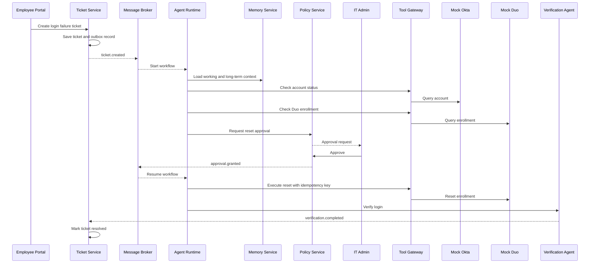

# OpsMind System Design Phase — Detailed Plan

> **Project:** OpsMind — Adaptive Multi-Agent Platform for Enterprise IT Support  
> **Purpose:** Define a clear, testable, recoverable, and extensible distributed agent system before implementation begins.  
> **MVP Business Scenario:** Automated investigation, approval, execution, and verification for Duo / Okta login and MFA failures.  
> **Version:** v1.0

---

## 1. Objectives of the System Design Phase

OpsMind is not a question-answering chatbot. It is a distributed agent platform for enterprise IT support. The system must support the following complete business loop:

```text
Employee submits an IT request
→ A ticket is created
→ The issue is classified and prioritized
→ Specialized agents investigate in parallel
→ Knowledge and historical cases are retrieved
→ An evidence-grounded root-cause hypothesis is produced
→ A resolution is proposed
→ Privileged operations require human approval
→ Approved actions execute through a controlled Tool Gateway
→ An independent Verification Agent validates the result
→ The ticket is resolved or reopened
→ Long-term memory is extracted
→ Agent performance is evaluated
→ Controlled improvement candidates are generated
```

The design phase must answer:

1. What exact business problem does the MVP solve?
2. What is in scope and out of scope?
3. How are components organized across the six layers?
4. What are the responsibilities of the eight logical domains?
5. Which domains should become independently deployable services?
6. Which interactions are synchronous APIs and which are asynchronous events?
7. Which service owns each category of data?
8. How do agent workflows pause, resume, retry, and prevent duplicate side effects?
9. How are privileged actions approved, audited, and rolled back?
10. How will memory, multi-agent collaboration, and controlled improvement be evaluated?

---

## 2. Core Design Principles

### 2.1 Business Scenario First

Every technology must solve a demonstrated business problem. Microservices, message queues, RAG, multi-agent orchestration, and LangGraph must not be added only for complexity or visual appeal.

### 2.2 The Six-Layer Architecture Provides the Global View

OpsMind uses six layers:

1. **Experience Layer**
2. **Business Workflow Layer**
3. **Agent Intelligence Layer**
4. **Control & Governance Layer**
5. **Enterprise Integration Layer**
6. **Platform Infrastructure Layer**

The layers describe how a request moves from the user-facing interface to the platform infrastructure.

### 2.3 The Eight Logical Domains Define Responsibility Boundaries

The eight domains are:

1. User Access & Authentication
2. Ticket & Business Workflow
3. Agent Runtime & Task Orchestration
4. Memory & Enterprise Knowledge
5. Tool Integration & Execution Gateway
6. Policy, Approval & Security Governance
7. Evaluation & Controlled Autonomous Improvement
8. Observability & Platform Infrastructure

The domains define who owns each capability, dataset, and decision.

### 2.4 A Logical Domain Is Not Automatically a Microservice

The MVP should first establish clean module boundaries. A module should become an independent service only when required for:

- Independent deployment
- Independent scaling
- Fault isolation
- Security isolation
- Independent data ownership
- A different technical stack or release lifecycle

### 2.5 Ticket State and Agent Workflow State Must Be Separate

- **Ticket state** represents business progress.
- **Workflow state** represents technical execution progress.

Example:

```text
Ticket Status: WAITING_FOR_APPROVAL
Workflow Status: PAUSED
```

### 2.6 Agents Must Not Directly Call Enterprise Administrative APIs

All operations must follow:

```text
Agent Runtime
→ Policy Check
→ Approval Check
→ Tool Gateway
→ Enterprise System
```

### 2.7 Agents Must Not Self-Certify Success

The Resolution Agent proposes a solution. An independent Verification Agent must validate external system state.

### 2.8 Autonomous Improvement Must Be Controlled

The platform may generate prompt, routing, runbook, or memory-policy candidates, but production changes require:

```text
Offline evaluation
→ Regression tests
→ Human approval
→ Canary deployment
→ Promotion or rollback
```

---

## 3. Recommended System Design Sequence

```text
1. Freeze the MVP scope and Golden Path
2. Confirm the System Context Diagram
3. Confirm the Six-Layer Component Diagram
4. Complete the Six-Layer × Eight-Domain Mapping Matrix
5. Define the eight logical domain boundaries
6. Create the Golden Path Sequence Diagram
7. Design the Ticket State Machine
8. Design the Agent Workflow State Machine
9. Derive MVP service boundaries
10. Define synchronous APIs
11. Define the asynchronous Event Catalog
12. Design data ownership and the core data model
13. Design reliability, recovery, and consistency
14. Design security, approval, and audit
15. Design memory and knowledge lifecycles
16. Design evaluation and controlled improvement
17. Design observability and deployment
18. Write Architecture Decision Records
19. Complete the design review
20. Begin implementation
```

---

# 4. Phase 0: Freeze the MVP Scope and Golden Path

## 4.1 MVP Business Problem

Employees may fail to access internal applications because of:

- Locked Okta accounts
- Disabled accounts
- Incorrect application group membership
- Expired Duo enrollment
- Mismatched Duo device registration
- Corrupted Okta sessions
- Incomplete user information

Traditional IT support requires manual work across multiple systems, repeated knowledge searches, sensitive administrative actions, and user follow-up.

The MVP objective is:

> Automate the main login and MFA investigation workflow while preserving human approval for privileged actions.

## 4.2 MVP Golden Path

```text
User submits: “I cannot log in to the Housing Portal; Duo keeps failing.”
→ Create ticket
→ Triage Agent classifies the issue as Identity / MFA
→ Identity Agent checks account state
→ Identity Agent checks application group membership
→ Identity Agent checks Duo enrollment
→ Knowledge Agent retrieves documentation and similar tickets
→ Coordinator merges the evidence
→ Resolution Agent identifies an expired Duo enrollment
→ Resolution Agent recommends a Duo reset
→ Policy Engine requires IT administrator approval
→ Agent Workflow saves a checkpoint and pauses
→ Administrator reviews the evidence and approves
→ Workflow resumes from the checkpoint
→ Tool Gateway executes a mock Duo reset
→ Verification Agent validates the new login
→ Ticket becomes RESOLVED only after verification succeeds
→ A structured long-term-memory candidate is generated
→ Evaluation is triggered asynchronously
```

## 4.3 In Scope

- Create, query, and update tickets
- Classify and prioritize tickets
- Query mock Okta account state
- Query mock group membership
- Query mock Duo enrollment
- Retrieve knowledge documents and historical tickets
- Produce evidence-grounded root-cause hypotheses
- Create and process Duo reset approvals
- Execute a mock Duo reset
- Verify the login result
- Resolve or reopen the ticket
- Generate a memory candidate
- Persist traces and audit records

## 4.4 Out of Scope

- Production Okta or Duo integration
- VPN, printer, software installation, and device support
- Automatic group membership modification
- Arbitrary shell, SQL, or administrator commands
- Agent-controlled policy modification
- Online model-weight training
- Full replacement of ServiceNow or Jira
- Multi-region production availability

## 4.5 MVP Success Criteria

1. A ticket can be created.
2. The issue is classified as Identity / MFA.
3. The system identifies the expired Duo enrollment.
4. The reset cannot execute without approval.
5. Duplicate messages cannot cause duplicate resets.
6. The workflow resumes from a checkpoint after a runtime restart.
7. The ticket cannot close before verification succeeds.
8. Every tool call and approval decision is auditable.
9. A structured memory candidate is generated.
10. Evaluation determines whether the workflow was correct.

## 4.6 MVP Failure Criteria

- An agent claims success without verification.
- Tool Gateway executes before approval.
- Duplicate events cause multiple resets.
- A runtime crash restarts the workflow from the beginning.
- The ticket closes after failed verification.
- An agent bypasses Tool Gateway.
- Unvalidated memory enters long-term storage.

## 4.7 Deliverable

```text
docs/system-design/01-mvp-scope-and-golden-path.md
```

---

# 5. Phase 1: Confirm the System Context and Six-Layer Architecture

## 5.1 System Context Diagram

The context diagram should contain:

### User Roles

- Employee
- IT Support
- IT Administrator
- IT Manager
- Auditor / Compliance Reviewer

### External Systems

- Mock Okta
- Mock Duo
- Mock Device Management
- Mock VPN
- Email Service
- Knowledge Sources

### OpsMind System Boundary

OpsMind owns:

- Ticket workflow
- Agent investigation
- Policy and approval
- Tool execution
- Verification
- Memory
- Evaluation
- Audit and observability

External identity, MFA, device, and network systems remain independently owned.

## 5.2 Six-Layer Component Diagram

### Layer 1 — Experience Layer

- Employee Portal
- IT Admin Console
- API Gateway
- Authentication / OIDC
- Realtime Status Updates

### Layer 2 — Business Workflow Layer

- Ticket Service
- Ticket State Machine
- SLA Engine
- Notification Workflow
- User Message Handling

### Layer 3 — Agent Intelligence Layer

- Agent Runtime
- Coordinator
- Agent Worker Pool
- Short-Term Memory
- Long-Term Memory Retrieval
- Knowledge Retrieval
- Evaluation Hooks

### Layer 4 — Control & Governance Layer

- Policy Engine
- Approval Service
- RBAC / ABAC
- Guardrails
- Audit
- Sensitive Data Controls

### Layer 5 — Enterprise Integration Layer

- Tool Gateway
- Okta Adapter
- Duo Adapter
- Email Adapter
- Future Device / VPN Adapters
- Credential Isolation

### Layer 6 — Platform Infrastructure Layer

- PostgreSQL
- pgvector
- Redis
- RabbitMQ
- Object Storage
- OpenTelemetry
- Prometheus / Grafana
- Logs and Distributed Traces

## 5.3 Dependency Rules

- Experience Layer must not access the agent database directly.
- Agent Runtime must not bypass Policy or Tool Gateway.
- Integration Layer must not directly modify ticket state.
- Policy Service must not execute tools.
- Tool Gateway must not decide whether a ticket is resolved.
- Infrastructure Layer contains no business decisions.

## 5.4 Deliverables

```text
docs/system-design/diagrams/system-context.png
docs/system-design/diagrams/six-layer-architecture.png
docs/system-design/diagrams/layer-domain-matrix.png
```

---

# 6. Phase 2: Define the Eight Logical Domains

Every domain specification must include:

- Responsibilities
- Non-responsibilities
- Owned Data
- Synchronous APIs
- Published Events
- Consumed Events
- Failure Behavior
- Security Boundary
- MVP Scope
- Future Scope

## 6.1 User Access & Authentication

**Responsibilities:**

- User authentication
- Token validation
- RBAC
- Ticket submission interfaces
- Administrator approval interface
- User resolution confirmation

**Non-responsibilities:**

- Ticket lifecycle
- Agent reasoning
- Tool execution
- Memory writes

## 6.2 Ticket & Business Workflow

**Responsibilities:**

- Ticket lifecycle
- Ticket state machine
- SLA
- User messages
- Ticket reopening
- Business-state history

**Non-responsibilities:**

- LLM calls
- Enterprise operations
- Policy decisions
- Long-term memory

## 6.3 Agent Runtime & Task Orchestration

**Responsibilities:**

- Create agent workflows
- Plan and delegate tasks
- Multi-agent handoffs
- Merge evidence
- Checkpointing
- Retry, timeout, and budget control
- Pause and resume

**Non-responsibilities:**

- Approving its own actions
- Direct administrative API access
- Direct modification of ticket tables
- Self-certification of business success

## 6.4 Memory & Enterprise Knowledge

**Responsibilities:**

- Working memory
- Episodic memory
- Semantic memory
- Procedural memory
- Organizational memory
- Knowledge document indexes
- Memory versioning
- Provenance

**Non-responsibilities:**

- Ticket state
- Tool execution
- Policy decisions

## 6.5 Tool Integration & Execution Gateway

**Responsibilities:**

- Tool registry
- Parameter schema validation
- Connectors and adapters
- Credential isolation
- Idempotent execution
- Tool execution records

**Non-responsibilities:**

- Deciding which business action is required
- Approving its own operations
- Closing tickets

## 6.6 Policy, Approval & Security Governance

**Responsibilities:**

- Risk classification
- RBAC / ABAC
- Approval requests
- Approval decisions
- Guardrails
- Audit trails
- Kill switch

**Non-responsibilities:**

- Agent reasoning
- Enterprise API execution
- Root-cause diagnosis

## 6.7 Evaluation & Controlled Autonomous Improvement

**Responsibilities:**

- Golden datasets
- Offline evaluation
- Regression testing
- Prompt and routing versions
- Improvement candidates
- Canary and rollback decisions

**Non-responsibilities:**

- Direct unvalidated production changes
- Automatic modification of critical security rules

## 6.8 Observability & Platform Infrastructure

**Responsibilities:**

- Logs
- Metrics
- Distributed traces
- Queue lag
- Agent cost
- LLM latency
- Tool failure rate
- Runtime health

**Non-responsibilities:**

- Business decisions
- Root-cause diagnosis

## 6.9 Deliverable

```text
docs/system-design/02-domain-boundaries.md
```

---

# 7. Phase 3: Design the Golden Path Sequence Diagram

## 7.1 Participants

- Employee Portal
- API Gateway
- Ticket Workflow Service
- Message Broker
- Agent Runtime
- Agent Worker
- Memory Service
- Policy Service
- IT Administrator
- Tool Gateway
- Mock Okta
- Mock Duo
- Verification Agent
- Evaluation Service

## 7.2 The Diagram Must Show

1. Ticket creation.
2. Ticket and outbox written in one transaction.
3. `ticket.created` publication.
4. Workflow creation.
5. Triage Agent execution.
6. Parallel Identity Agent and Knowledge Agent work.
7. Root-cause hypothesis generation.
8. Approval request creation.
9. Checkpoint persistence and workflow pause.
10. Approval event resumes the workflow.
11. Reset executes with an idempotency key.
12. Verification Agent validates the result.
13. Ticket state changes.
14. Memory and evaluation start asynchronously.

## 7.3 Mermaid Skeleton



## 7.4 Deliverables

```text
docs/system-design/03-golden-path-sequence.md
docs/system-design/diagrams/golden-path-sequence.svg
```

---

# 8. Phase 4: Design the Two State Machines

## 8.1 Ticket State Machine

```text
NEW
→ TRIAGING
→ INVESTIGATING
→ WAITING_FOR_USER
→ WAITING_FOR_APPROVAL
→ EXECUTING
→ VERIFYING
→ RESOLVED
→ CLOSED
```

Exception and recovery states:

```text
ESCALATED
FAILED
CANCELLED
REOPENED
```

For every state, define:

- Entry conditions
- Allowed operations
- Exit events
- Timeout policy
- Illegal transitions
- Required data updates

## 8.2 Agent Workflow State Machine

```text
PENDING
→ RUNNING
→ WAITING_FOR_EVENT
→ PAUSED
→ RUNNING
→ COMPLETED
```

Exception states:

```text
RETRYING
TIMED_OUT
FAILED
CANCELLED
```

## 8.3 Relationship Between the State Machines

| Ticket Status | Workflow Status | Meaning |
|---|---|---|
| INVESTIGATING | RUNNING | Agents are investigating |
| WAITING_FOR_APPROVAL | PAUSED | Waiting for administrator approval |
| EXECUTING | RUNNING | Tool execution is active |
| VERIFYING | RUNNING | Verification is active |
| RESOLVED | COMPLETED | Business and technical workflows completed |
| ESCALATED | FAILED / PAUSED | Human support owns the case |

## 8.4 Deliverables

```text
docs/system-design/04-state-machines.md
docs/system-design/diagrams/ticket-state-machine.svg
docs/system-design/diagrams/agent-workflow-state-machine.svg
```

---

# 9. Phase 5: Derive MVP Service Boundaries

## 9.1 Recommended MVP Services

```text
1. web-portal
2. api-gateway
3. ticket-workflow-service
4. agent-runtime-service
5. agent-worker
6. memory-knowledge-service
7. tool-policy-gateway
8. mock-enterprise-services
```

Evaluation may initially remain a module inside Agent Runtime and become an independent service later.

## 9.2 Why Each Agent Is Not a Microservice

- Agent roles are logical units rather than deployment units.
- Agents share model access, tracing, retry, and state infrastructure.
- Independent agent services would duplicate code.
- They would introduce excessive network communication.
- A worker pool is a better scaling model.

## 9.3 Service Extraction Criteria

Create a separate service only when required for:

- Independent deployment
- Independent scaling
- Fault isolation
- Security isolation
- Independent data ownership
- A substantially different stack or lifecycle

## 9.4 Deliverable

```text
docs/system-design/05-service-boundaries.md
```

---

# 10. Phase 6: Design Synchronous APIs and Asynchronous Events

## 10.1 Synchronous APIs

Use synchronous APIs for:

- Ticket creation and retrieval
- Approval queries and decisions
- Memory search
- Policy evaluation
- Read-oriented tool operations
- Administrative dashboard queries

Examples:

```http
POST /api/v1/tickets
GET  /api/v1/tickets/{ticketId}
POST /api/v1/tickets/{ticketId}/messages
POST /api/v1/tickets/{ticketId}/reopen

POST /api/v1/approvals/{approvalId}/approve
POST /api/v1/approvals/{approvalId}/reject

POST /internal/v1/memory/search
POST /internal/v1/policies/evaluate
POST /internal/v1/tools/execute
```

## 10.2 Asynchronous Events

```text
ticket.created
ticket.updated
ticket.user_replied
ticket.cancelled
ticket.reopened

agent.workflow.started
agent.task.requested
agent.task.completed
agent.workflow.paused
agent.workflow.resumed
agent.workflow.failed

approval.requested
approval.granted
approval.rejected
approval.expired

tool.execution.requested
tool.execution.started
tool.execution.completed
tool.execution.failed

verification.completed
ticket.resolved

memory.candidate.created
evaluation.requested
```

## 10.3 Every Event Must Define

- Event Name
- Version
- Producer
- Consumers
- Payload Schema
- Correlation ID
- Trace ID
- Idempotency Key
- Ordering Requirement
- Retry Policy
- DLQ Policy
- PII Classification

## 10.4 Deliverables

```text
docs/system-design/06-api-contracts.md
docs/system-design/07-event-catalog.md
```

---

# 11. Phase 7: Design Data Ownership and the Core Data Model

## 11.1 Data Ownership Principles

- A service directly writes only the data it owns.
- Cross-service mutations use APIs or events.
- The MVP may share one PostgreSQL instance.
- Each domain uses an isolated schema.
- Multiple services must not modify the same business table.

## 11.2 Suggested Schemas

```text
ticket.*
agent.*
memory.*
tool.*
policy.*
evaluation.*
audit.*
```

## 11.3 Core Tables

### Ticket

```text
ticket.tickets
ticket.ticket_messages
ticket.ticket_status_history
ticket.sla_records
ticket.outbox_events
```

### Agent

```text
agent.workflows
agent.workflow_steps
agent.agent_tasks
agent.checkpoints
agent.model_calls
agent.task_idempotency
```

### Memory

```text
memory.working_memory
memory.memories
memory.memory_versions
memory.memory_sources
memory.knowledge_documents
memory.document_chunks
memory.embeddings
```

### Tool

```text
tool.tool_registry
tool.tool_executions
tool.connector_health
tool.execution_idempotency
```

### Policy

```text
policy.policies
policy.approval_requests
policy.approval_decisions
policy.role_bindings
```

### Evaluation

```text
evaluation.datasets
evaluation.test_cases
evaluation.runs
evaluation.scores
evaluation.agent_versions
evaluation.improvement_candidates
```

### Audit

```text
audit.audit_events
```

## 11.4 Database Concerns

- Optimistic locking
- Unique constraints
- Idempotency keys
- Soft delete
- Retention policies
- PII redaction
- Append-only audit
- Vector indexes
- Transactional outbox
- Workflow resume support

## 11.5 Deliverables

```text
docs/system-design/08-data-ownership.md
docs/system-design/09-data-model.md
docs/system-design/diagrams/data-ownership.svg
```

---

# 12. Phase 8: Design Reliability, Recovery, and Consistency

## 12.1 Required Failure Scenarios

| Failure | Expected Behavior |
|---|---|
| LLM timeout | Retry, fallback, or human escalation |
| Invalid model JSON | Schema repair; fail the task if repair fails |
| Worker crash | Resume from durable checkpoint |
| Duplicate message | Deduplicate using an idempotency key |
| DB write succeeds but event send fails | Transactional outbox |
| Duplicate approval | Optimistic locking |
| Tool executed but response lost | Query external state; do not blindly retry |
| Memory Service unavailable | Degrade to no-long-term-memory mode |
| Agent loop makes no progress | No-progress limit |
| Repeated failure | DLQ and human escalation |
| Verification failure | Return to INVESTIGATING or ESCALATED |
| Ticket cancellation | Cancel pending work and block privileged actions |

## 12.2 Core Mechanisms

- Transactional outbox
- At-least-once delivery
- Idempotent consumer
- Exponential backoff
- Dead-letter queue
- Distributed lock / task lease
- Optimistic concurrency control
- Durable checkpoint
- Circuit breaker
- Timeout
- Compensation
- Manual escalation

## 12.3 Idempotency Key for Privileged Tools

```text
ticket_id
+ workflow_id
+ tool_name
+ target_user
+ action_version
```

## 12.4 Deliverables

```text
docs/system-design/10-failure-recovery.md
docs/system-design/11-consistency-model.md
```

---

# 13. Phase 9: Design Security, Approval, and Audit

## 13.1 Roles

- Employee
- IT Support
- IT Administrator
- Security Administrator
- IT Manager
- Auditor
- Agent Identity
- Service Identity

## 13.2 Risk Levels

### Low Risk

- Read account state
- Query logs
- Search knowledge
- Send standard troubleshooting instructions

### Medium Risk

- Reset MFA
- Unlock account
- Clear session

### High Risk

- Modify group membership
- Grant administrative privileges
- Perform bulk account changes

### Forbidden

- Delete critical accounts
- Export secrets
- Bypass MFA
- Disable auditing
- Allow an agent to elevate its own privileges

## 13.3 Approval Flow

```text
Agent proposes action
→ Policy evaluates risk
→ Approval request created
→ Workflow paused
→ Authorized administrator reviews evidence
→ Approve / Reject / Expire
→ Event resumes or terminates the workflow
```

## 13.4 Audit Fields

- actor_type
- actor_id
- action
- target
- ticket_id
- workflow_id
- policy_result
- approval_id
- tool_result
- trace_id
- timestamp
- request_hash
- response_hash

## 13.5 Deliverables

```text
docs/system-design/12-security-and-approval.md
docs/system-design/13-audit-model.md
```

---

# 14. Phase 10: Design Memory and Knowledge

## 14.1 Short-Term Memory

Store current-ticket information:

- Facts
- Hypotheses
- Rejected hypotheses
- Completed tasks
- Pending tasks
- User responses
- Tool results
- Approval decisions
- Context summary

Required capabilities:

- Ticket-level isolation
- Checkpoints
- Versioning
- Merge
- Conflict detection
- Expiration

## 14.2 Long-Term Memory

### Episodic Memory

Specific historical tickets and outcomes.

### Semantic Memory

General patterns derived from multiple tickets.

### Procedural Memory

Validated troubleshooting procedures and runbooks.

### Organizational Memory

Service owners, system relationships, approval paths, and escalation rules.

### Agent Performance Memory

Accuracy, cost, and failure patterns for each agent and task type.

## 14.3 Memory Write Pipeline

```text
Resolved ticket
→ Candidate extraction
→ PII redaction
→ Deduplication
→ Conflict check
→ Confidence scoring
→ Evaluation
→ Versioned storage
→ Future retrieval
```

## 14.4 Retrieval Strategy

- Structured filters
- Semantic similarity
- Recency
- Source trust
- Ticket category
- Application
- Resolution outcome
- Human validation

## 14.5 Deliverable

```text
docs/system-design/14-memory-and-knowledge.md
```

---

# 15. Phase 11: Design Evaluation and Controlled Improvement

## 15.1 Evaluation Metrics

- Ticket classification accuracy
- Root-cause accuracy
- Tool selection correctness
- Tool argument correctness
- Policy compliance
- Memory retrieval precision
- Resolution success
- Reopen rate
- Human escalation rate
- Token cost
- Latency
- Handoff information loss

## 15.2 Benchmark Dataset

Create 30–50 scenarios:

- Identity / MFA
- Account lock
- Incorrect group membership
- Expired Duo enrollment
- Okta session problem
- Incomplete user descriptions
- Misleading symptoms
- Policy-sensitive requests
- Duplicate events
- Service failures

Each case should include:

- User request
- Mock system state
- Correct category
- Ground-truth root cause
- Allowed tools
- Forbidden tools
- Required approval
- Verification condition
- Expected final state

## 15.3 Ablation Study

| Version | Capabilities |
|---|---|
| Baseline | Single agent, no long-term memory |
| Version A | Single agent + RAG |
| Version B | Single agent + short/long memory |
| Version C | Multi-agent + memory |
| Full System | Multi-agent + memory + policy + improvement |

## 15.4 Controlled Improvement Flow

```text
Collect traces
→ Classify failures
→ Generate candidate improvement
→ Create version
→ Run benchmark
→ Compare with baseline
→ Check regressions
→ Human approval
→ Canary
→ Promote or rollback
```

## 15.5 Deliverables

```text
docs/system-design/15-evaluation-strategy.md
docs/system-design/16-controlled-improvement.md
```

---

# 16. Phase 12: Design Observability and Deployment

## 16.1 Business Metrics

- Ticket volume
- SLA compliance
- Mean time to resolution
- First-contact resolution rate
- Reopen rate
- Human escalation rate
- Approval waiting time

## 16.2 Agent Metrics

- Agent success rate
- Tool call count
- Tool failure rate
- Token cost
- LLM latency
- Loop iterations
- Memory retrieval hit rate
- Handoff count
- Workflow resume count
- Evaluation score

## 16.3 Distributed Tracing

Every operation for the same ticket should share:

- trace_id
- correlation_id
- ticket_id
- workflow_id

## 16.4 MVP Deployment

```text
Docker Compose
├── web-portal
├── api-gateway
├── ticket-workflow-service
├── agent-runtime-service
├── agent-worker
├── memory-knowledge-service
├── tool-policy-gateway
├── mock-okta
├── mock-duo
├── postgresql
├── redis
├── rabbitmq
└── otel-collector
```

## 16.5 Future Kubernetes Deployment

- Deployment
- Service
- ConfigMap
- Secret
- HPA
- Readiness probe
- Liveness probe
- Persistent volume
- Network policy
- OpenTelemetry Collector
- Prometheus / Grafana

## 16.6 Deliverables

```text
docs/system-design/17-observability.md
docs/system-design/18-deployment.md
docs/system-design/diagrams/deployment.svg
```

---

# 17. Phase 13: Write Architecture Decision Records

Suggested ADRs:

```text
ADR-001: Why OpsMind uses an event-driven architecture
ADR-002: Why RabbitMQ is selected for the MVP
ADR-003: Why agent roles are not separate microservices
ADR-004: Why Agent Runtime cannot call enterprise APIs directly
ADR-005: Why PostgreSQL + pgvector is used
ADR-006: Why Ticket state and Workflow state are separated
ADR-007: Why high-risk actions require human approval
ADR-008: Why memory writes are versioned and evaluated
ADR-009: Why the Verification Agent is independent
ADR-010: Why the MVP starts with Identity and MFA support
```

Each ADR should contain:

- Context
- Decision
- Alternatives
- Consequences
- Status

Directory:

```text
docs/adr/
```

---

# 18. Suggested 10-Day System Design Schedule

## Day 1 — MVP Scope

- Business problem
- In scope / out of scope
- Golden Path
- Success and failure criteria

## Day 2 — Global Architecture

- System Context Diagram
- Six-Layer Architecture
- Layer-to-Domain Mapping

## Day 3 — Domain Boundaries

- Responsibilities
- Non-responsibilities
- Owned data
- Dependency rules

## Day 4 — Dynamic Workflow

- Golden Path Sequence Diagram
- Synchronous vs. asynchronous interactions
- Checkpoint, approval, and idempotency points

## Day 5 — State Machines

- Ticket State Machine
- Agent Workflow State Machine
- Illegal transitions and timeouts

## Day 6 — Services and Communication

- MVP service boundaries
- API contracts
- Event catalog

## Day 7 — Data Design

- Data ownership
- Core tables
- Outbox
- Idempotency
- Audit

## Day 8 — Reliability and Security

- Failure-recovery matrix
- Policy and approval
- Compensation and escalation

## Day 9 — Memory and Evaluation

- Memory lifecycle
- Knowledge retrieval
- Benchmark
- Controlled improvement

## Day 10 — Platform and Review

- Observability
- Deployment diagram
- ADRs
- Pre-coding review

---

# 19. Pre-Implementation Acceptance Checklist

## Business

- [ ] MVP focuses only on Identity / MFA
- [ ] Golden Path is complete
- [ ] Success and failure criteria are testable
- [ ] User roles and external systems are clear

## Architecture

- [ ] System Context Diagram is complete
- [ ] Six-Layer Architecture is complete
- [ ] Eight domain boundaries are complete
- [ ] Every service extraction has a clear reason

## Workflow

- [ ] Golden Path Sequence Diagram is complete
- [ ] Ticket State Machine is complete
- [ ] Agent Workflow State Machine is complete
- [ ] Approval pause and resume behavior is defined

## Communication and Data

- [ ] API contracts are complete
- [ ] Event catalog is complete
- [ ] Every event has a producer and consumers
- [ ] Data ownership is clear
- [ ] Outbox and idempotency are defined

## Reliability

- [ ] Worker crashes can recover
- [ ] Duplicate events cannot duplicate tool actions
- [ ] Lost tool responses have a recovery strategy
- [ ] Verification failure has a fallback path
- [ ] DLQ and human escalation are defined

## Security

- [ ] Agents cannot directly access enterprise APIs
- [ ] Privileged actions require approval
- [ ] Credentials never enter LLM context
- [ ] All actions are auditable

## Agent System

- [ ] Short-term memory schema is defined
- [ ] Long-term memory types are defined
- [ ] Memory writes use a validation pipeline
- [ ] Evaluation dataset structure is defined
- [ ] Autonomous improvement cannot bypass evaluation

---

# 20. Recommended Repository Structure

```text
OpsMind/
├── README.md
├── docs/
│   ├── system-design/
│   │   ├── 01-mvp-scope-and-golden-path.md
│   │   ├── 02-domain-boundaries.md
│   │   ├── 03-golden-path-sequence.md
│   │   ├── 04-state-machines.md
│   │   ├── 05-service-boundaries.md
│   │   ├── 06-api-contracts.md
│   │   ├── 07-event-catalog.md
│   │   ├── 08-data-ownership.md
│   │   ├── 09-data-model.md
│   │   ├── 10-failure-recovery.md
│   │   ├── 11-consistency-model.md
│   │   ├── 12-security-and-approval.md
│   │   ├── 13-audit-model.md
│   │   ├── 14-memory-and-knowledge.md
│   │   ├── 15-evaluation-strategy.md
│   │   ├── 16-controlled-improvement.md
│   │   ├── 17-observability.md
│   │   ├── 18-deployment.md
│   │   └── diagrams/
│   └── adr/
│       ├── ADR-001-event-driven-architecture.md
│       ├── ADR-002-message-broker.md
│       └── ...
├── apps/
│   ├── web-portal/
│   └── api-gateway/
├── services/
│   ├── ticket-workflow-service/
│   ├── agent-runtime-service/
│   ├── memory-knowledge-service/
│   ├── tool-policy-gateway/
│   └── mock-enterprise-services/
├── packages/
│   ├── event-schemas/
│   ├── api-contracts/
│   └── observability/
├── infrastructure/
│   ├── docker-compose/
│   └── kubernetes/
└── tests/
    ├── integration/
    ├── failure-injection/
    └── evaluation/
```

---

# 21. Final Deliverables

The system-design phase should produce:

1. MVP Scope and Golden Path
2. System Context Diagram
3. Six-Layer Architecture Diagram
4. Six-Layer × Eight-Domain Mapping Matrix
5. Eight Domain Boundary Specifications
6. Golden Path Sequence Diagram
7. Ticket State Machine
8. Agent Workflow State Machine
9. Service Boundary Design
10. API Contracts
11. Event Catalog
12. Data Ownership Model
13. Core Data Model
14. Failure and Recovery Matrix
15. Consistency Model
16. Security and Approval Model
17. Audit Model
18. Memory and Knowledge Design
19. Evaluation Strategy
20. Controlled Improvement Loop
21. Observability Design
22. Deployment Diagram
23. Architecture Decision Records
24. Pre-coding Design Review Checklist

---

# 22. Immediate Next Tasks

Do not create every microservice yet. Complete and review these documents first:

```text
1. docs/system-design/01-mvp-scope-and-golden-path.md
2. docs/system-design/03-golden-path-sequence.md
3. docs/system-design/04-state-machines.md
```

After these are stable, continue with:

```text
Domain Boundaries
→ Service Boundaries
→ API Contracts
→ Event Catalog
→ Data Ownership
→ Reliability and Security
```

This sequence minimizes architecture rework and unnecessary implementation.
