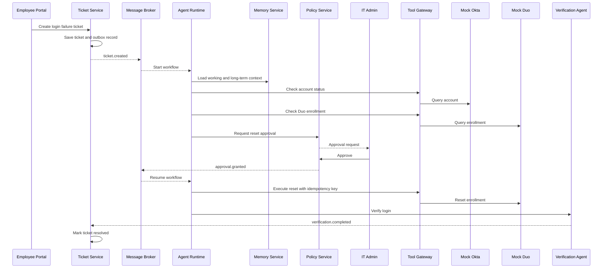

# OpsMind 系统设计阶段详细规划书

> **项目名称：** OpsMind — Adaptive Multi-Agent Platform for Enterprise IT Support  
> **文档目的：** 在正式编码之前，完成一个边界清晰、可验证、可恢复、可扩展的企业级分布式 Agent 系统设计。  
> **MVP 核心业务场景：** Duo / Okta 登录与 MFA 故障的自动调查、审批、执行与验证。  
> **版本：** v1.0

---

## 1. 系统设计阶段的目标

OpsMind 不是一个只回答问题的聊天机器人，而是一个面向企业 IT 服务的分布式 Agent 平台。系统需要完成以下业务闭环：

```text
员工提交 IT 请求
→ 创建 Ticket
→ 自动分类和判断优先级
→ 多个专业 Agent 协同调查
→ 检索知识库和历史案例
→ 形成有证据支持的根因判断
→ 提出解决方案
→ 对敏感操作请求人工审批
→ 通过受控 Tool Gateway 执行操作
→ Verification Agent 独立验证结果
→ 关闭或重新打开 Ticket
→ 提取长期记忆
→ 评估 Agent 表现
→ 生成受控改进候选
```

系统设计阶段需要回答：

1. 第一版具体解决什么业务问题？
2. 哪些功能属于 MVP，哪些暂时不做？
3. 六层架构中的组件如何组织？
4. 八个逻辑业务板块分别负责什么？
5. 哪些逻辑板块需要成为独立服务？
6. 服务之间使用同步 API 还是异步事件？
7. 每类数据由哪个服务拥有？
8. Agent 工作流如何暂停、恢复、重试和避免重复操作？
9. 高风险操作如何审批、审计和回滚？
10. 长期记忆、多 Agent 和自主改进如何被验证？

---

## 2. 总体设计原则

### 2.1 业务场景优先

所有技术选择必须服务于真实业务流程。不能为了展示微服务、消息队列、RAG、多 Agent 或 LangGraph 而增加无意义复杂度。

### 2.2 六层架构描述全局组织

OpsMind 使用以下六层架构：

1. **Experience Layer** — 用户体验层  
2. **Business Workflow Layer** — 业务工作流层  
3. **Agent Intelligence Layer** — 智能体层  
4. **Control & Governance Layer** — 控制与治理层  
5. **Enterprise Integration Layer** — 企业集成层  
6. **Platform Infrastructure Layer** — 平台基础设施层  

六层架构主要回答“请求从用户进入后，会依次经过哪些系统能力”。

### 2.3 八个逻辑板块描述责任边界

系统包含八个逻辑业务板块：

1. 用户入口与身份认证  
2. Ticket 与业务工作流  
3. Agent Runtime 与任务编排  
4. Memory 与企业知识系统  
5. 工具集成与执行网关  
6. Policy、审批与安全治理  
7. Evaluation 与受控自主改进  
8. 可观测性与平台基础设施  

八个板块主要回答“每项能力由谁负责、拥有哪些数据、不能做什么”。

### 2.4 逻辑板块不等于微服务

第一版应先建立清晰模块边界，再根据以下条件决定是否拆为独立服务：

- 是否需要独立部署
- 是否需要独立扩容
- 是否需要故障隔离
- 是否有独立数据所有权
- 是否有严格安全边界
- 是否采用不同技术栈或发布周期

### 2.5 Ticket 状态与 Agent Workflow 状态必须分离

- **Ticket 状态**描述业务处理进度。
- **Workflow 状态**描述 Agent 技术执行进度。

例如：

```text
Ticket Status: WAITING_FOR_APPROVAL
Workflow Status: PAUSED
```

### 2.6 Agent 不能直接调用企业管理员 API

所有工具操作必须经过：

```text
Agent Runtime
→ Policy Check
→ Approval Check
→ Tool Gateway
→ Enterprise System
```

### 2.7 Agent 不能自己宣布成功

Resolution Agent 只负责提出解决方案。Verification Agent 必须读取外部系统状态并独立验证。

### 2.8 自主改进必须受控

系统可以生成新的 Prompt、路由、Runbook 或 Memory 策略候选，但必须经过：

```text
离线评估
→ 回归测试
→ 人工批准
→ Canary
→ 上线或回滚
```

---

## 3. 推荐的系统设计顺序

```text
1. 固定 MVP 范围和 Golden Path
2. 确认 System Context Diagram
3. 确认六层组件图
4. 完成六层与八板块映射矩阵
5. 定义八个逻辑板块边界
6. 绘制 Golden Path Sequence Diagram
7. 设计 Ticket State Machine
8. 设计 Agent Workflow State Machine
9. 推导 MVP 服务边界
10. 定义同步 API
11. 定义异步 Event Catalog
12. 设计数据所有权和核心数据模型
13. 设计可靠性、故障恢复与一致性
14. 设计安全、审批与审计
15. 设计 Memory 与 Knowledge 生命周期
16. 设计 Evaluation 与受控改进
17. 设计 Observability 与 Deployment
18. 编写 Architecture Decision Records
19. 完成设计验收
20. 开始编码
```

---

# 4. 阶段 0：固定 MVP 范围与 Golden Path

## 4.1 MVP 业务问题

企业员工可能因为以下原因无法登录内部应用：

- Okta 账号被锁定
- 账号已禁用
- 应用权限组错误
- Duo Enrollment 过期
- Duo 设备注册不匹配
- Okta Session 异常
- 用户提供的信息不完整

传统 IT Support 需要手动检查多个系统、搜索知识库、确认权限、执行重置并持续跟进用户。

OpsMind MVP 的目标是：

> 自动完成登录与 MFA 故障的主要调查流程，同时对敏感操作保留人工审批。

## 4.2 MVP Golden Path

```text
用户提交：“无法登录 Housing Portal，Duo 一直认证失败”
→ 创建 Ticket
→ Triage Agent 分类为 Identity / MFA
→ Identity Agent 检查账号状态
→ Identity Agent 检查应用权限组
→ Identity Agent 检查 Duo Enrollment
→ Knowledge Agent 检索文档和历史 Ticket
→ Coordinator 合并证据
→ Resolution Agent 判断根因为 Duo Enrollment 过期
→ Resolution Agent 建议执行 Duo Reset
→ Policy Engine 判断该操作需要 IT Admin 审批
→ Agent Workflow 保存 Checkpoint 并暂停
→ 管理员查看证据并批准
→ Workflow 从 Checkpoint 恢复
→ Tool Gateway 执行 Mock Duo Reset
→ Verification Agent 验证新登录是否成功
→ 验证成功后 Ticket 进入 RESOLVED
→ 生成结构化长期记忆候选
→ 异步触发 Evaluation
```

## 4.3 MVP 支持范围

- 创建、查询和更新 Ticket
- Ticket 分类和优先级判断
- 查询 Mock Okta 账号状态
- 查询 Mock Group Membership
- 查询 Mock Duo Enrollment
- 检索知识库和历史 Ticket
- 形成有证据支持的根因假设
- 创建和处理 Duo Reset 审批
- 执行 Mock Duo Reset
- 验证登录结果
- 关闭或重新打开 Ticket
- 生成 Memory Candidate
- 保存执行 Trace 和 Audit Record

## 4.4 MVP 不支持范围

- 真实生产 Okta / Duo
- VPN、打印机和设备管理
- 软件安装
- 自动修改权限组
- 任意 Shell、SQL 或管理员命令
- Agent 自动修改安全 Policy
- 在线训练模型权重
- 完整替代 ServiceNow 或 Jira
- 跨区域生产级高可用

## 4.5 MVP 成功标准

1. Ticket 可以成功创建。
2. 问题能被分类为 Identity / MFA。
3. 系统能识别过期的 Duo Enrollment。
4. 未经审批不能执行 Reset。
5. 重复消息不能触发重复 Reset。
6. Runtime 重启后可以从 Checkpoint 恢复。
7. Verification 成功前不能关闭 Ticket。
8. Tool Call 和审批决定全部可审计。
9. Ticket 解决后生成结构化 Memory Candidate。
10. Evaluation 能判断流程是否正确。

## 4.6 MVP 失败标准

- Agent 没有验证就声明成功。
- Tool Gateway 在审批前执行 Reset。
- 重复事件导致多次 Reset。
- Runtime 崩溃后从头执行。
- Ticket 在验证失败后仍被关闭。
- Agent 绕过 Tool Gateway 直接访问企业系统。
- 错误 Memory 未经检查进入长期记忆。

## 4.7 交付文件

```text
docs/system-design/01-mvp-scope-and-golden-path.md
```

---

# 5. 阶段 1：确认系统上下文与六层架构

## 5.1 System Context Diagram

系统上下文图需要包含：

### 用户角色

- Employee
- IT Support
- IT Administrator
- IT Manager
- Auditor / Compliance Reviewer

### 外部系统

- Mock Okta
- Mock Duo
- Mock Device Management
- Mock VPN
- Email Service
- Knowledge Sources

### OpsMind 系统边界

OpsMind 负责：

- Ticket 工作流
- Agent 调查
- Policy 和审批
- Tool 调用
- 结果验证
- Memory
- Evaluation
- Audit 和 Observability

外部身份、MFA、设备和网络系统仍由其自身管理。

## 5.2 六层组件图

### Layer 1 — Experience Layer

- Employee Portal
- IT Admin Console
- API Gateway
- Authentication / OIDC
- Realtime Status Updates

### Layer 2 — Business Workflow Layer

- Ticket Service
- Ticket State Machine
- SLA Engine
- Notification Workflow
- User Message Handling

### Layer 3 — Agent Intelligence Layer

- Agent Runtime
- Coordinator
- Agent Worker Pool
- Short-Term Memory
- Long-Term Memory Retrieval
- Knowledge Retrieval
- Evaluation Hooks

### Layer 4 — Control & Governance Layer

- Policy Engine
- Approval Service
- RBAC / ABAC
- Guardrails
- Audit
- Sensitive Data Controls

### Layer 5 — Enterprise Integration Layer

- Tool Gateway
- Okta Adapter
- Duo Adapter
- Email Adapter
- Future Device / VPN Adapters
- Credential Isolation

### Layer 6 — Platform Infrastructure Layer

- PostgreSQL
- pgvector
- Redis
- RabbitMQ
- Object Storage
- OpenTelemetry
- Prometheus / Grafana
- Logs and Distributed Traces

## 5.3 六层依赖原则

- Experience Layer 不能直接访问 Agent 数据库。
- Agent Runtime 不能绕过 Policy 与 Tool Gateway。
- Integration Layer 不能直接修改 Ticket 状态。
- Policy Service 不能执行真实 Tool。
- Tool Gateway 不能决定是否关闭 Ticket。
- Infrastructure Layer 不包含业务决策。

## 5.4 交付文件

```text
docs/system-design/diagrams/system-context.png
docs/system-design/diagrams/six-layer-architecture.png
docs/system-design/diagrams/layer-domain-matrix.png
```

---

# 6. 阶段 2：定义八个逻辑业务板块

每个板块都需要记录：

- Responsibilities
- Non-responsibilities
- Owned Data
- Synchronous APIs
- Published Events
- Consumed Events
- Failure Behavior
- Security Boundary
- MVP Scope
- Future Scope

## 6.1 用户入口与身份认证

**负责：**

- 用户登录
- Token 验证
- RBAC
- Ticket 提交入口
- 管理员审批界面
- 用户确认解决结果

**不负责：**

- Ticket 生命周期
- Agent 推理
- Tool 执行
- Memory 写入

## 6.2 Ticket 与业务工作流

**负责：**

- Ticket 生命周期
- Ticket 状态机
- SLA
- 用户消息
- Ticket 重新打开
- 业务状态历史

**不负责：**

- 调用 LLM
- 执行企业操作
- Policy 决策
- 长期记忆

## 6.3 Agent Runtime 与任务编排

**负责：**

- 创建 Agent Workflow
- 任务规划与分配
- 多 Agent Handoff
- 证据合并
- Checkpoint
- Retry / Timeout / Budget
- 暂停和恢复

**不负责：**

- 批准自己的操作
- 直接访问企业管理员 API
- 直接修改 Ticket 表
- 自己证明业务成功

## 6.4 Memory 与企业知识系统

**负责：**

- Working Memory
- Episodic Memory
- Semantic Memory
- Procedural Memory
- Organizational Memory
- Knowledge Document Index
- Memory Versioning
- Provenance

**不负责：**

- Ticket 状态
- Tool 执行
- Policy 决策

## 6.5 工具集成与执行网关

**负责：**

- Tool Registry
- 参数 Schema 验证
- Connector / Adapter
- Credential Isolation
- Idempotent Execution
- Tool Execution Record

**不负责：**

- 决定业务行动
- 批准自己的操作
- 关闭 Ticket

## 6.6 Policy、审批与安全治理

**负责：**

- Risk Classification
- RBAC / ABAC
- Approval Request
- Approval Decision
- Guardrails
- Audit Trail
- Kill Switch

**不负责：**

- Agent 推理
- 执行企业 API
- 根因判断

## 6.7 Evaluation 与受控自主改进

**负责：**

- Golden Dataset
- Offline Evaluation
- Regression Tests
- Prompt / Routing Version
- Improvement Candidate
- Canary / Rollback Decision

**不负责：**

- 未经评估直接修改生产 Agent
- 自动修改关键安全规则

## 6.8 可观测性与平台基础设施

**负责：**

- Logs
- Metrics
- Distributed Traces
- Queue Lag
- Agent Cost
- LLM Latency
- Tool Failure Rate
- Runtime Health

**不负责：**

- 业务决策
- 根因判断

## 6.9 交付文件

```text
docs/system-design/02-domain-boundaries.md
```

---

# 7. 阶段 3：设计 Golden Path Sequence Diagram

## 7.1 参与者

- Employee Portal
- API Gateway
- Ticket Workflow Service
- Message Broker
- Agent Runtime
- Agent Worker
- Memory Service
- Policy Service
- IT Admin
- Tool Gateway
- Mock Okta
- Mock Duo
- Verification Agent
- Evaluation Service

## 7.2 时序图必须表现

1. Ticket 创建。
2. 数据库与 Outbox 同事务写入。
3. `ticket.created` 发布。
4. Agent Workflow 创建。
5. Triage Agent 执行。
6. Identity Agent 和 Knowledge Agent 并行执行。
7. Root Cause Hypothesis 形成。
8. Approval Request 创建。
9. Workflow 保存 Checkpoint 并暂停。
10. Approval Event 唤醒 Workflow。
11. Reset 使用 Idempotency Key 执行。
12. Verification Agent 独立验证。
13. Ticket 状态更新。
14. Memory 和 Evaluation 异步触发。

## 7.3 Mermaid 骨架



## 7.4 交付文件

```text
docs/system-design/03-golden-path-sequence.md
docs/system-design/diagrams/golden-path-sequence.svg
```

---

# 8. 阶段 4：设计两套状态机

## 8.1 Ticket State Machine

```text
NEW
→ TRIAGING
→ INVESTIGATING
→ WAITING_FOR_USER
→ WAITING_FOR_APPROVAL
→ EXECUTING
→ VERIFYING
→ RESOLVED
→ CLOSED
```

异常与恢复状态：

```text
ESCALATED
FAILED
CANCELLED
REOPENED
```

每个状态必须定义：

- 进入条件
- 允许操作
- 退出事件
- 超时策略
- 非法转换
- 数据更新要求

## 8.2 Agent Workflow State Machine

```text
PENDING
→ RUNNING
→ WAITING_FOR_EVENT
→ PAUSED
→ RUNNING
→ COMPLETED
```

异常状态：

```text
RETRYING
TIMED_OUT
FAILED
CANCELLED
```

## 8.3 两套状态的关系

| Ticket Status | Workflow Status | 含义 |
|---|---|---|
| INVESTIGATING | RUNNING | Agent 正在调查 |
| WAITING_FOR_APPROVAL | PAUSED | 等待管理员审批 |
| EXECUTING | RUNNING | Tool 正在执行 |
| VERIFYING | RUNNING | Verification 正在运行 |
| RESOLVED | COMPLETED | 业务和技术流程完成 |
| ESCALATED | FAILED / PAUSED | 转人工处理 |

## 8.4 交付文件

```text
docs/system-design/04-state-machines.md
docs/system-design/diagrams/ticket-state-machine.svg
docs/system-design/diagrams/agent-workflow-state-machine.svg
```

---

# 9. 阶段 5：推导 MVP 服务边界

## 9.1 推荐的 MVP 服务

```text
1. web-portal
2. api-gateway
3. ticket-workflow-service
4. agent-runtime-service
5. agent-worker
6. memory-knowledge-service
7. tool-policy-gateway
8. mock-enterprise-services
```

Evaluation 第一版可以作为 Agent Runtime 内的独立模块，后续再拆成服务。

## 9.2 为什么不把每个 Agent 变成微服务

- Agent 是逻辑角色，不一定是部署单元。
- 多数 Agent 共用模型、Tracing、Retry 和 State。
- 单独部署会造成大量重复代码。
- 会产生过多网络调用。
- Worker Pool 更适合横向扩容。

## 9.3 拆服务判断标准

满足以下条件之一才考虑独立服务：

- 独立部署
- 独立扩容
- 故障隔离
- 安全隔离
- 独立数据所有权
- 明显不同的技术栈和生命周期

## 9.4 交付文件

```text
docs/system-design/05-service-boundaries.md
```

---

# 10. 阶段 6：设计同步 API 与异步事件

## 10.1 同步 API

建议用于：

- Ticket 创建与查询
- Approval 查询与处理
- Memory Search
- Policy Check
- Tool 查询类操作
- 管理界面读取

示例：

```http
POST /api/v1/tickets
GET  /api/v1/tickets/{ticketId}
POST /api/v1/tickets/{ticketId}/messages
POST /api/v1/tickets/{ticketId}/reopen

POST /api/v1/approvals/{approvalId}/approve
POST /api/v1/approvals/{approvalId}/reject

POST /internal/v1/memory/search
POST /internal/v1/policies/evaluate
POST /internal/v1/tools/execute
```

## 10.2 异步事件

```text
ticket.created
ticket.updated
ticket.user_replied
ticket.cancelled
ticket.reopened

agent.workflow.started
agent.task.requested
agent.task.completed
agent.workflow.paused
agent.workflow.resumed
agent.workflow.failed

approval.requested
approval.granted
approval.rejected
approval.expired

tool.execution.requested
tool.execution.started
tool.execution.completed
tool.execution.failed

verification.completed
ticket.resolved

memory.candidate.created
evaluation.requested
```

## 10.3 每个事件必须记录

- Event Name
- Version
- Producer
- Consumer
- Payload Schema
- Correlation ID
- Trace ID
- Idempotency Key
- Ordering Requirement
- Retry Policy
- DLQ Policy
- PII Classification

## 10.4 交付文件

```text
docs/system-design/06-api-contracts.md
docs/system-design/07-event-catalog.md
```

---

# 11. 阶段 7：设计数据所有权与核心数据模型

## 11.1 数据所有权原则

- 服务只能直接写自己拥有的数据。
- 跨服务修改通过 API 或 Event。
- MVP 可以共用一个 PostgreSQL 实例。
- 不同服务使用不同 Schema。
- 禁止多个服务直接修改同一张业务表。

## 11.2 建议 Schema

```text
ticket.*
agent.*
memory.*
tool.*
policy.*
evaluation.*
audit.*
```

## 11.3 核心表

### Ticket

```text
ticket.tickets
ticket.ticket_messages
ticket.ticket_status_history
ticket.sla_records
ticket.outbox_events
```

### Agent

```text
agent.workflows
agent.workflow_steps
agent.agent_tasks
agent.checkpoints
agent.model_calls
agent.task_idempotency
```

### Memory

```text
memory.working_memory
memory.memories
memory.memory_versions
memory.memory_sources
memory.knowledge_documents
memory.document_chunks
memory.embeddings
```

### Tool

```text
tool.tool_registry
tool.tool_executions
tool.connector_health
tool.execution_idempotency
```

### Policy

```text
policy.policies
policy.approval_requests
policy.approval_decisions
policy.role_bindings
```

### Evaluation

```text
evaluation.datasets
evaluation.test_cases
evaluation.runs
evaluation.scores
evaluation.agent_versions
evaluation.improvement_candidates
```

### Audit

```text
audit.audit_events
```

## 11.4 数据库设计重点

- Optimistic Locking
- Unique Constraints
- Idempotency Keys
- Soft Delete
- Retention Policy
- PII Redaction
- Append-only Audit
- Vector Index
- Transactional Outbox
- Workflow Resume

## 11.5 交付文件

```text
docs/system-design/08-data-ownership.md
docs/system-design/09-data-model.md
docs/system-design/diagrams/data-ownership.svg
```

---

# 12. 阶段 8：设计可靠性、故障恢复与一致性

## 12.1 必须覆盖的故障场景

| 故障 | 预期处理 |
|---|---|
| LLM 超时 | Retry、Fallback 或转人工 |
| 模型返回非法 JSON | Schema Repair，失败后 Task Failed |
| Worker 崩溃 | 从持久化 Checkpoint 恢复 |
| 消息重复投递 | Idempotency Key 去重 |
| DB 写入成功但事件发送失败 | Transactional Outbox |
| Approval 重复提交 | Optimistic Lock |
| Tool 已执行但响应丢失 | 查询外部状态，禁止盲目重试 |
| Memory Service 不可用 | 降级为无长期记忆模式 |
| Agent 无进展循环 | no-progress limit |
| 多次重试失败 | DLQ + 人工升级 |
| Verification 失败 | 返回 INVESTIGATING 或 ESCALATED |
| Ticket 被取消 | 取消待执行任务并阻止高风险操作 |

## 12.2 关键机制

- Transactional Outbox
- At-least-once Delivery
- Idempotent Consumer
- Exponential Backoff
- Dead-Letter Queue
- Distributed Lock / Task Lease
- Optimistic Concurrency Control
- Durable Checkpoint
- Circuit Breaker
- Timeout
- Compensation
- Manual Escalation

## 12.3 高风险 Tool 的 Idempotency Key

```text
ticket_id
+ workflow_id
+ tool_name
+ target_user
+ action_version
```

## 12.4 交付文件

```text
docs/system-design/10-failure-recovery.md
docs/system-design/11-consistency-model.md
```

---

# 13. 阶段 9：设计安全、审批与审计

## 13.1 系统角色

- Employee
- IT Support
- IT Administrator
- Security Administrator
- IT Manager
- Auditor
- Agent Identity
- Service Identity

## 13.2 风险等级

### Low Risk

- 查询账号
- 查询日志
- 检索知识库
- 发送标准排查说明

### Medium Risk

- Reset MFA
- Unlock Account
- Clear Session

### High Risk

- 修改权限组
- 授予管理员权限
- 批量修改账号

### Forbidden

- 删除关键账号
- 导出密钥
- 绕过 MFA
- 禁用审计
- Agent 自行提升权限

## 13.3 审批流程

```text
Agent proposes action
→ Policy evaluates risk
→ Approval request created
→ Workflow paused
→ Authorized admin reviews evidence
→ Approve / Reject / Expire
→ Event resumes or terminates workflow
```

## 13.4 Audit 字段

- actor_type
- actor_id
- action
- target
- ticket_id
- workflow_id
- policy_result
- approval_id
- tool_result
- trace_id
- timestamp
- request_hash
- response_hash

## 13.5 交付文件

```text
docs/system-design/12-security-and-approval.md
docs/system-design/13-audit-model.md
```

---

# 14. 阶段 10：设计 Memory 与 Knowledge

## 14.1 Short-Term Memory

保存当前 Ticket：

- Facts
- Hypotheses
- Rejected Hypotheses
- Completed Tasks
- Pending Tasks
- User Responses
- Tool Results
- Approval Decisions
- Context Summary

必须支持：

- Ticket-level Isolation
- Checkpoint
- Version
- Merge
- Conflict Detection
- Expiration

## 14.2 Long-Term Memory

### Episodic Memory

具体历史 Ticket 和解决结果。

### Semantic Memory

从多个 Ticket 中总结的通用规律。

### Procedural Memory

经过验证的排查步骤和 Runbook。

### Organizational Memory

服务负责人、系统关系、审批路径和升级规则。

### Agent Performance Memory

记录各 Agent 在不同任务中的准确率、成本和失败模式。

## 14.3 Memory 写入流水线

```text
Resolved Ticket
→ Candidate Extraction
→ PII Redaction
→ Deduplication
→ Conflict Check
→ Confidence Scoring
→ Evaluation
→ Versioned Storage
→ Future Retrieval
```

## 14.4 Memory 检索策略

- Structured Filters
- Semantic Similarity
- Recency
- Source Trust
- Ticket Category
- Application
- Resolution Outcome
- Human Validation

## 14.5 交付文件

```text
docs/system-design/14-memory-and-knowledge.md
```

---

# 15. 阶段 11：设计 Evaluation 与受控自主改进

## 15.1 Evaluation 指标

- Ticket Classification Accuracy
- Root Cause Accuracy
- Tool Selection Correctness
- Tool Argument Correctness
- Policy Compliance
- Memory Retrieval Precision
- Resolution Success
- Reopen Rate
- Human Escalation Rate
- Token Cost
- Latency
- Handoff Information Loss

## 15.2 Benchmark Dataset

建议设计 30–50 个场景：

- Identity / MFA
- Account Lock
- Wrong Group
- Expired Duo Enrollment
- Okta Session Problem
- Incomplete User Description
- Misleading Symptoms
- Policy-sensitive Request
- Duplicate Event
- Service Failure

每个测试案例包含：

- User Request
- Mock System State
- Correct Category
- Ground-truth Root Cause
- Allowed Tools
- Forbidden Tools
- Required Approval
- Verification Condition
- Expected Final Status

## 15.3 对照实验

| 版本 | 能力 |
|---|---|
| Baseline | Single Agent，无长期记忆 |
| Version A | Single Agent + RAG |
| Version B | Single Agent + Short/Long Memory |
| Version C | Multi-Agent + Memory |
| Full System | Multi-Agent + Memory + Policy + Improvement |

## 15.4 受控改进流程

```text
Collect Traces
→ Classify Failures
→ Generate Candidate Improvement
→ Create Version
→ Run Benchmark
→ Compare with Baseline
→ Check Regressions
→ Human Approval
→ Canary
→ Promote or Rollback
```

## 15.5 交付文件

```text
docs/system-design/15-evaluation-strategy.md
docs/system-design/16-controlled-improvement.md
```

---

# 16. 阶段 12：设计可观测性与部署

## 16.1 业务指标

- Ticket Volume
- SLA Compliance
- Mean Time to Resolution
- First-contact Resolution Rate
- Reopen Rate
- Human Escalation Rate
- Approval Waiting Time

## 16.2 Agent 指标

- Agent Success Rate
- Tool Call Count
- Tool Failure Rate
- Token Cost
- LLM Latency
- Loop Iterations
- Memory Retrieval Hit Rate
- Handoff Count
- Workflow Resume Count
- Evaluation Score

## 16.3 分布式 Trace

同一个 Ticket 的所有操作共享：

- trace_id
- correlation_id
- ticket_id
- workflow_id

## 16.4 MVP 部署结构

```text
Docker Compose
├── web-portal
├── api-gateway
├── ticket-workflow-service
├── agent-runtime-service
├── agent-worker
├── memory-knowledge-service
├── tool-policy-gateway
├── mock-okta
├── mock-duo
├── postgresql
├── redis
├── rabbitmq
└── otel-collector
```

## 16.5 后续 Kubernetes 版本

- Deployment
- Service
- ConfigMap
- Secret
- HPA
- Readiness Probe
- Liveness Probe
- Persistent Volume
- Network Policy
- OpenTelemetry Collector
- Prometheus / Grafana

## 16.6 交付文件

```text
docs/system-design/17-observability.md
docs/system-design/18-deployment.md
docs/system-design/diagrams/deployment.svg
```

---

# 17. 阶段 13：编写 ADR

建议第一批 ADR：

```text
ADR-001: Why OpsMind uses an event-driven architecture
ADR-002: Why RabbitMQ is selected for the MVP
ADR-003: Why Agent roles are not separate microservices
ADR-004: Why Agent Runtime cannot call enterprise APIs directly
ADR-005: Why PostgreSQL + pgvector is used
ADR-006: Why Ticket state and Workflow state are separated
ADR-007: Why high-risk actions require human approval
ADR-008: Why memory writes are versioned and evaluated
ADR-009: Why Verification Agent is independent
ADR-010: Why the MVP starts with Identity and MFA support
```

每个 ADR 包含：

- Context
- Decision
- Alternatives
- Consequences
- Status

目录：

```text
docs/adr/
```

---

# 18. 建议的 10 天系统设计计划

## Day 1 — MVP Scope

- 业务问题
- In Scope / Out of Scope
- Golden Path
- 成功和失败标准

## Day 2 — 全局架构

- System Context Diagram
- Six-Layer Architecture
- Layer-to-Domain Mapping

## Day 3 — Domain Boundaries

- Responsibilities
- Non-responsibilities
- Owned Data
- Dependency Rules

## Day 4 — Dynamic Workflow

- Golden Path Sequence Diagram
- 同步与异步交互
- Checkpoint、Approval 和 Idempotency

## Day 5 — State Machines

- Ticket State Machine
- Agent Workflow State Machine
- 非法转换和 Timeout

## Day 6 — Services and Communication

- MVP Service Boundaries
- API Contracts
- Event Catalog

## Day 7 — Data Design

- Data Ownership
- Core Tables
- Outbox
- Idempotency
- Audit

## Day 8 — Reliability and Security

- Failure Recovery Matrix
- Policy and Approval
- Compensation and Escalation

## Day 9 — Memory and Evaluation

- Memory Lifecycle
- Knowledge Retrieval
- Benchmark
- Controlled Improvement

## Day 10 — Platform and Review

- Observability
- Deployment Diagram
- ADR
- Pre-coding Review

---

# 19. 进入编码前的验收清单

## 业务

- [ ] MVP 只聚焦 Identity / MFA
- [ ] Golden Path 完整
- [ ] 成功和失败条件可验证
- [ ] 用户角色和外部系统清晰

## 架构

- [ ] System Context Diagram 完成
- [ ] 六层架构完成
- [ ] 八板块边界完成
- [ ] 每个服务拆分都有明确理由

## 流程

- [ ] Golden Path Sequence Diagram 完成
- [ ] Ticket State Machine 完成
- [ ] Agent Workflow State Machine 完成
- [ ] Approval Pause / Resume 已设计

## 通信与数据

- [ ] API Contracts 完成
- [ ] Event Catalog 完成
- [ ] 每个 Event 有 Producer 和 Consumer
- [ ] 数据所有权清晰
- [ ] Outbox 和 Idempotency 已设计

## 可靠性

- [ ] Worker Crash 可以恢复
- [ ] Duplicate Event 不会重复执行 Tool
- [ ] Tool Response Lost 有处理方案
- [ ] Verification Failure 有回退路径
- [ ] DLQ 和人工升级路径清晰

## 安全

- [ ] Agent 不能直接访问企业 API
- [ ] 高风险操作需要审批
- [ ] 凭证不会进入 LLM Context
- [ ] 所有操作可审计

## Agent 系统

- [ ] Short-Term Memory Schema 已定义
- [ ] Long-Term Memory 类型已定义
- [ ] Memory 写入有验证流程
- [ ] Evaluation Dataset 结构已定义
- [ ] 自主改进不能绕过 Evaluation

---

# 20. 推荐仓库结构

```text
OpsMind/
├── README.md
├── docs/
│   ├── system-design/
│   │   ├── 01-mvp-scope-and-golden-path.md
│   │   ├── 02-domain-boundaries.md
│   │   ├── 03-golden-path-sequence.md
│   │   ├── 04-state-machines.md
│   │   ├── 05-service-boundaries.md
│   │   ├── 06-api-contracts.md
│   │   ├── 07-event-catalog.md
│   │   ├── 08-data-ownership.md
│   │   ├── 09-data-model.md
│   │   ├── 10-failure-recovery.md
│   │   ├── 11-consistency-model.md
│   │   ├── 12-security-and-approval.md
│   │   ├── 13-audit-model.md
│   │   ├── 14-memory-and-knowledge.md
│   │   ├── 15-evaluation-strategy.md
│   │   ├── 16-controlled-improvement.md
│   │   ├── 17-observability.md
│   │   ├── 18-deployment.md
│   │   └── diagrams/
│   └── adr/
│       ├── ADR-001-event-driven-architecture.md
│       ├── ADR-002-message-broker.md
│       └── ...
├── apps/
│   ├── web-portal/
│   └── api-gateway/
├── services/
│   ├── ticket-workflow-service/
│   ├── agent-runtime-service/
│   ├── memory-knowledge-service/
│   ├── tool-policy-gateway/
│   └── mock-enterprise-services/
├── packages/
│   ├── event-schemas/
│   ├── api-contracts/
│   └── observability/
├── infrastructure/
│   ├── docker-compose/
│   └── kubernetes/
└── tests/
    ├── integration/
    ├── failure-injection/
    └── evaluation/
```

---

# 21. 最终交付物

系统设计阶段最终需要产出：

1. MVP Scope and Golden Path
2. System Context Diagram
3. Six-Layer Architecture Diagram
4. Six-Layer × Eight-Domain Mapping Matrix
5. Eight Domain Boundary Specifications
6. Golden Path Sequence Diagram
7. Ticket State Machine
8. Agent Workflow State Machine
9. Service Boundary Design
10. API Contracts
11. Event Catalog
12. Data Ownership Model
13. Core Data Model
14. Failure and Recovery Matrix
15. Consistency Model
16. Security and Approval Model
17. Audit Model
18. Memory and Knowledge Design
19. Evaluation Strategy
20. Controlled Improvement Loop
21. Observability Design
22. Deployment Diagram
23. Architecture Decision Records
24. Pre-coding Design Review Checklist

---

# 22. 现在应该立即执行的任务

暂时不要创建所有微服务。先完成并审查：

```text
1. docs/system-design/01-mvp-scope-and-golden-path.md
2. docs/system-design/03-golden-path-sequence.md
3. docs/system-design/04-state-machines.md
```

这三项稳定后，再继续：

```text
Domain Boundaries
→ Service Boundaries
→ API Contracts
→ Event Catalog
→ Data Ownership
→ Reliability and Security
```

这样可以最大限度减少后期架构推翻和重复开发。
