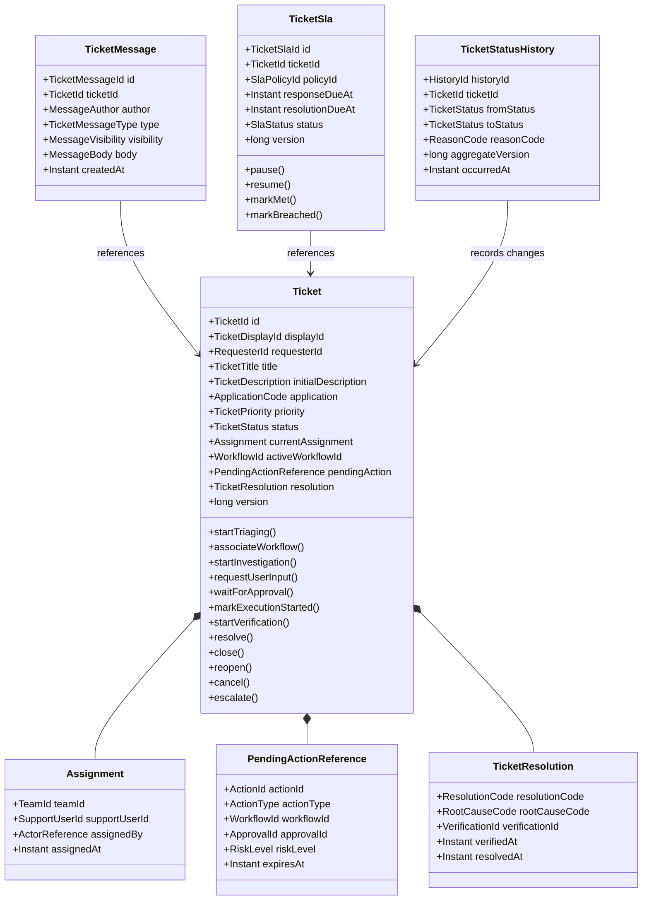

# OpsMind Ticket Workflow — 01 Domain Model

> **领域：** Ticket & Business Workflow  
> **文档类型：** Low-Level Domain Model  
> **版本：** 1.0  
> **状态：** Proposed  
> **依赖：** `technology-baseline`、`02-Ticket-Workflow/README_CN.md`  
> **建议路径：** `docs/low-level-design/domains/02-ticket-workflow/01-domain-model/README_CN.md`

---

## 1. 文档目的

本文档定义 OpsMind Ticket Workflow 的领域模型。

它回答：

- 哪个对象是 Aggregate Root
- Ticket Aggregate 内部保存哪些数据
- 哪些对象必须独立于 Ticket Aggregate
- 哪些概念使用 Entity，哪些使用 Value Object
- Ticket 与 Agent Workflow、Approval、Tool Execution 和 Verification 如何关联
- Ticket 可以执行哪些领域行为
- 哪些 Domain Event 由 Ticket 产生
- Repository Interface 应该如何定义
- 哪些规则属于 Ticket Domain，哪些不属于

本文档不负责：

- 完整状态转换表
- API Request / Response
- Event JSON Schema
- 数据库表与索引
- Spring Boot 类的最终实现
- JPA Mapping
- 权限矩阵

这些内容分别由后续文档定义。

---

# 2. 建模原则

## 2.1 从业务一致性边界出发

Aggregate Boundary 不按照数据库表划分，也不按照 UI 页面划分。

判断一个对象是否属于 Ticket Aggregate，主要看：

> 它是否必须与 Ticket 核心状态在同一个事务中保持强一致？

## 2.2 Ticket Aggregate 保持精简

每次状态更新都不应该加载：

- 全部用户消息
- 全部状态历史
- 全部审批记录
- 全部 Tool Execution
- 全部 Agent Trace
- 全部 SLA 历史

这些数据可能持续增长，因此不能全部作为 Ticket Aggregate 的内部集合。

## 2.3 跨领域只保存引用

Ticket Domain 不加载其他领域的完整对象。

它只保存必要的 Reference：

```text
WorkflowId
ApprovalId
ActionId
ToolExecutionId
VerificationId
```

完整对象由各自领域拥有。

## 2.4 Domain Model 不依赖技术框架

Domain 层不能依赖：

- Spring MVC
- Spring Data JPA
- RabbitMQ
- PostgreSQL
- OpenTelemetry
- LangSmith
- Keycloak

Domain Model 应该可以通过纯 Java Unit Test 验证。

## 2.5 强一致只保护核心不变量

Ticket 的状态、Active Workflow、Pending Action 和 Resolution Eligibility 需要强一致。

Timeline、搜索索引、Dashboard 和跨服务状态允许最终一致。

---

# 3. Ubiquitous Language

| 术语 | 定义 |
|---|---|
| Ticket | 员工 IT 问题的核心业务记录 |
| Requester | 提交 Ticket 的员工 |
| Ticket Status | Ticket 当前业务处理阶段 |
| Agent Workflow | Agent Runtime 中负责调查该 Ticket 的技术流程 |
| Active Workflow | 当前唯一允许推动 Ticket 调查的 Workflow |
| Pending Action | 已提出但尚未完成的敏感操作 |
| Approval | Policy & Approval 领域对 Pending Action 的授权结果 |
| Tool Execution | Tool Gateway 对企业系统执行的操作 |
| Verification | 对问题是否真正解决的独立检查 |
| Resolution | Ticket 已解决时保存的业务结果 |
| Assignment | 当前负责 Ticket 的 Support Team 或人员 |
| SLA | Ticket 的响应和解决目标 |
| Reopen | 已解决或关闭的 Ticket 因问题复发重新进入处理流程 |
| Escalation | Ticket 转交人工、高权限团队或其他处理路径 |
| Timeline | Ticket 相关业务事件的只读时间序列 |
| Domain Event | Ticket Aggregate 完成业务变化后产生的领域事实 |
| Integration Event | 发布给其他服务的版本化外部事件 |

---

# 4. Aggregate 设计结论

Ticket Workflow MVP 使用以下核心 Aggregate：

```text
1. Ticket
2. TicketMessage
3. TicketSla
```

其中只有 `Ticket` 是 Ticket 生命周期的主 Aggregate Root。

## 4.1 为什么不使用一个巨大 Ticket Aggregate

不采用：

```text
Ticket
├── all messages
├── all assignments
├── all status history
├── all approvals
├── all tool executions
├── all SLA records
└── all audit records
```

原因：

- Aggregate 会持续变大。
- 每次状态转换都需要加载大量无关数据。
- 并发冲突会显著增加。
- 消息追加、SLA 更新和状态更新会互相阻塞。
- Approval、Tool 和 Agent Workflow 属于其他领域。
- Audit 和 Timeline 更适合 Append-only Record 或 Read Model。

---

# 5. Aggregate Root：Ticket

## 5.1 Ticket 的职责

Ticket Aggregate 负责：

- 保存 Ticket 核心身份和当前状态
- 保护状态转换合法性
- 保证同一时间只有一个 Active Workflow
- 保存当前 Assignment
- 保存当前 Pending Action Reference
- 保存 Resolution
- 保存关键时间
- 产生 Domain Event
- 维护 Aggregate Version
- 防止已取消或已关闭 Ticket 被错误推进

Ticket Aggregate 不负责：

- 保存全部消息内容
- 调用 Agent Runtime
- 执行 Policy Check
- 执行 Tool
- 调用企业系统
- 写入 RabbitMQ
- 创建 LangSmith Trace
- 计算复杂 SLA 计时
- 查询历史 Timeline

## 5.2 Ticket 建议字段

```text
Ticket
├── id: TicketId
├── displayId: TicketDisplayId
├── requesterId: RequesterId
├── title: TicketTitle
├── initialDescription: TicketDescription
├── source: TicketSource
├── application: ApplicationCode
├── category: TicketCategory?
├── subcategory: TicketSubcategory?
├── priority: TicketPriority
├── status: TicketStatus
├── currentAssignment: Assignment?
├── activeWorkflowId: WorkflowId?
├── pendingAction: PendingActionReference?
├── resolution: TicketResolution?
├── createdAt: Instant
├── updatedAt: Instant
├── resolvedAt: Instant?
├── closedAt: Instant?
├── cancelledAt: Instant?
├── version: long
└── domainEvents: List<DomainEvent>
```

## 5.3 Ticket 不保存的字段

Ticket Aggregate 不保存以下完整对象：

```text
AgentWorkflow
ApprovalRequest
ApprovalDecision
ToolExecution
VerificationRun
KnowledgeDocument
Memory
LangSmithTrace
AuditEvent
```

只在确有必要时保存它们的 ID 或结果摘要。

---

# 6. Ticket 的创建

推荐使用命名工厂方法：

```java
Ticket.create(
    TicketId id,
    TicketDisplayId displayId,
    RequesterId requesterId,
    TicketTitle title,
    TicketDescription description,
    ApplicationCode application,
    TicketSource source,
    Instant now
)
```

创建结果：

```text
status = NEW
priority = UNASSIGNED
category = null
activeWorkflowId = null
pendingAction = null
resolution = null
version = 0
```

同时产生：

```text
TicketCreated
```

## 6.1 创建时必须验证

- `TicketId` 存在。
- `TicketDisplayId` 存在。
- `RequesterId` 存在。
- Title 非空且长度合法。
- Description 非空且长度合法。
- ApplicationCode 合法。
- Source 合法。
- 创建时间存在。

---

# 7. Ticket 的领域行为

以下方法名称是 Domain Design 建议，不代表最终 Java 方法签名已经冻结。

## 7.1 Workflow 行为

```text
startTriaging()
associateWorkflow(workflowId)
startInvestigation(classification)
clearActiveWorkflow(reason)
```

规则：

- 同一时间只能存在一个 Active Workflow。
- 新 Workflow 不能覆盖仍处于 Active 状态的 Workflow。
- Ticket 已取消或关闭时不能关联新 Workflow。

## 7.2 User Interaction 行为

```text
requestUserInput(requestId, reason)
resumeAfterUserReply(messageId)
```

Ticket 不保存完整 Message，只保存必要的业务变化并产生 Event。

## 7.3 Approval 行为

```text
waitForApproval(pendingActionReference)
handleApprovalGranted(approvalReference)
handleApprovalRejected(approvalReference, reason)
handleApprovalExpired(approvalReference)
```

`PendingActionReference` 必须能够证明：

- 该 Action 属于当前 Ticket。
- 该 Action 属于 Active Workflow。
- Approval 对应同一 Action。
- Approval 尚未过期。

详细规则在 Business Invariants 和 State Machine 中定义。

## 7.4 Tool Execution 行为

```text
markExecutionStarted(toolExecutionId)
handleToolExecutionSucceeded(toolExecutionSummary)
handleToolExecutionFailed(toolExecutionSummary)
handleToolExecutionUnknown(toolExecutionId)
```

Tool 执行成功只能推动 Ticket 进入 Verification，不得直接 Resolve。

## 7.5 Verification 行为

```text
startVerification(verificationId)
resolve(verificationEvidence, resolution)
returnToInvestigation(verificationFailure)
```

`resolve()` 必须要求有效的 Verification Evidence。

## 7.6 Closure 行为

```text
close(closeReason, actor)
reopen(reopenReason, actor, newWorkflowId?)
cancel(cancelReason, actor)
escalate(escalationTarget, reason, actor)
```

## 7.7 Assignment 行为

```text
assignToTeam(teamId, actor)
assignToAgent(supportUserId, actor)
unassign(actor)
```

Assignment 变化产生独立 Domain Event，但完整 Assignment History 不保存在 Ticket Aggregate 内。

---

# 8. TicketMessage Aggregate

## 8.1 设计结论

`TicketMessage` 是独立 Aggregate Root，而不是 Ticket Aggregate 中不断增长的 Message Collection。

原因：

- Message 数量可能持续增长。
- Message 追加频率可能高于 Ticket 状态更新。
- 读取 Ticket 核心状态不应加载全部 Message。
- Message 可以独立进行附件、脱敏和可见性控制。
- 避免 Message Append 与 Ticket State Transition 产生不必要的 Optimistic Lock Conflict。

## 8.2 TicketMessage 字段

```text
TicketMessage
├── id: TicketMessageId
├── ticketId: TicketId
├── author: MessageAuthor
├── type: TicketMessageType
├── visibility: MessageVisibility
├── body: MessageBody
├── attachmentIds: List<AttachmentId>
├── replyToMessageId: TicketMessageId?
├── createdAt: Instant
└── metadata: MessageMetadata
```

## 8.3 TicketMessage 类型

```text
USER_MESSAGE
SUPPORT_MESSAGE
SYSTEM_MESSAGE
AGENT_QUESTION
AGENT_SUMMARY
RESOLUTION_INSTRUCTION
```

## 8.4 Visibility

```text
REQUESTER_VISIBLE
INTERNAL_SUPPORT_ONLY
AUDIT_ONLY
```

## 8.5 Message 行为

Message 创建后原则上不可修改。

纠错通过新增 Message 完成，不覆盖原始内容。

允许的技术操作：

- Redaction Marker
- Retention Processing
- Attachment Quarantine
- Visibility Correction，且必须审计

## 8.6 Message 与 Ticket 状态的协作

用户回复需要：

```text
1. 创建 TicketMessage
2. 验证 Ticket 当前为 WAITING_FOR_USER
3. 推动 Ticket 返回 INVESTIGATING
4. 写入 Outbox Event
```

这些操作由 Application Service 协调。

在 MVP 中，它们可以在同一个 Ticket Service 数据库事务中完成，但仍保持两个 Aggregate 的概念边界。

---

# 9. TicketSla Aggregate

## 9.1 设计结论

SLA 不放入 Ticket Aggregate 内部。

原因：

- SLA Timer 可能由 Scheduler 独立更新。
- 暂停、恢复和 Breach Calculation 与 Ticket 核心状态变化频率不同。
- SLA 规则未来可能独立复杂化。
- SLA 更新不应频繁制造 Ticket Version Conflict。

## 9.2 TicketSla 字段

```text
TicketSla
├── id: TicketSlaId
├── ticketId: TicketId
├── policyId: SlaPolicyId
├── responseDueAt: Instant?
├── resolutionDueAt: Instant?
├── pausedAt: Instant?
├── accumulatedPausedDuration: Duration
├── status: SlaStatus
├── breachedAt: Instant?
└── version: long
```

## 9.3 SLA 状态

```text
ACTIVE
PAUSED
MET
BREACHED
CANCELLED
```

## 9.4 SLA 与 Ticket 的关系

Ticket Status 变化可以发布 Event：

```text
ticket.status_changed
```

SLA 组件根据状态决定：

- 是否暂停 Timer
- 是否恢复 Timer
- 是否标记 Met
- 是否标记 Cancelled

Ticket Aggregate 不直接计算 SLA Deadline。

---

# 10. 状态历史、Assignment History 与 Timeline

## 10.1 TicketStatusHistory

`TicketStatusHistory` 是 Append-only Domain Record，不是 Ticket Aggregate 内的可变 Entity。

字段：

```text
historyId
ticketId
fromStatus
toStatus
reasonCode
actor
sourceEventId
aggregateVersion
occurredAt
```

每次状态变化必须在同一事务中：

```text
Update Ticket
+
Insert Status History
+
Insert Outbox Event
```

## 10.2 Assignment History

当前 Assignment 保存在 Ticket Aggregate。

完整 Assignment History 使用 Append-only Record：

```text
TicketAssignmentHistory
```

## 10.3 Ticket Timeline

Timeline 是 Read Model，不是 Aggregate。

它可以组合：

- Status History
- Messages
- Approval Summary
- Tool Execution Summary
- Verification Summary
- Assignment History
- Escalation
- Resolution

Timeline 允许最终一致，不参与 Ticket 强一致事务。

---

# 11. Value Objects

## 11.1 TicketId

内部全局唯一 ID。

建议使用：

```text
UUID 或 ULID
```

## 11.2 TicketDisplayId

用户可读 ID：

```text
INC-2048
```

Display ID 与内部 TicketId 分离。

## 11.3 RequesterId

引用身份系统中的用户。

Ticket Domain 不保存完整 User Profile。

## 11.4 TicketTitle

规则示例：

```text
required
trimmed
1–200 characters
no control characters
```

## 11.5 TicketDescription

规则示例：

```text
required
1–10000 characters
stored as plain or sanitized rich text
classified as potentially sensitive
```

## 11.6 ApplicationCode

MVP 示例：

```text
HOUSING_PORTAL
EMAIL
VPN
OTHER
```

第一版 Golden Path 使用：

```text
HOUSING_PORTAL
```

## 11.7 TicketCategory

未来类别：

```text
IDENTITY_ACCESS
NETWORK
DEVICE
SOFTWARE
PRINTING
OTHER
```

MVP 主要支持：

```text
IDENTITY_ACCESS
```

## 11.8 TicketSubcategory

MVP 示例：

```text
MFA_FAILURE
ACCOUNT_LOCKED
GROUP_MEMBERSHIP
SESSION_FAILURE
UNKNOWN_IDENTITY_ISSUE
```

## 11.9 TicketPriority

```text
UNASSIGNED
LOW
MEDIUM
HIGH
CRITICAL
```

Priority 与 SLA Policy 相关，但不由 Ticket Aggregate 自己计算。

## 11.10 Assignment

```text
Assignment
├── teamId
├── supportUserId?
├── assignedBy
└── assignedAt
```

## 11.11 PendingActionReference

```text
PendingActionReference
├── actionId
├── actionType
├── workflowId
├── approvalId?
├── riskLevel
├── requestedAt
└── expiresAt?
```

不保存 Credential 或完整 Tool Payload。

## 11.12 TicketResolution

```text
TicketResolution
├── resolutionCode
├── summary
├── rootCauseCode
├── verificationId
├── verifiedAt
├── resolvedBy
└── resolvedAt
```

Resolution 必须引用 Verification Result。

## 11.13 ActorReference

```text
ActorReference
├── actorType
└── actorId
```

Actor Type：

```text
EMPLOYEE
IT_SUPPORT
IT_ADMIN
SYSTEM
AGENT
SERVICE
```

---

# 12. 枚举与状态

## 12.1 TicketStatus

```text
NEW
TRIAGING
INVESTIGATING
WAITING_FOR_USER
WAITING_FOR_APPROVAL
EXECUTING
VERIFYING
RESOLVED
CLOSED
ESCALATED
FAILED
CANCELLED
REOPENED
```

详细合法转换由 `03-state-machine/` 定义。

## 12.2 TicketSource

```text
PORTAL
EMAIL
API
SYSTEM
```

MVP 只需要：

```text
PORTAL
```

## 12.3 ResolutionCode

MVP 示例：

```text
MFA_RESET_SUCCESSFUL
ACCOUNT_UNLOCKED
USER_GUIDANCE_SUCCESSFUL
NO_ISSUE_FOUND
ESCALATED_TO_HUMAN
UNRESOLVED
```

---

# 13. 跨领域引用

## 13.1 WorkflowId

由 Agent Runtime 拥有。

Ticket 只保存当前 Active Workflow ID。

## 13.2 ApprovalId

由 Policy & Approval 领域拥有。

Ticket 只保存 Pending Action 当前关联的 Approval ID。

## 13.3 ToolExecutionId

由 Tool Gateway 拥有。

Ticket 只在必要的状态变化或 Resolution Evidence 中保存引用。

## 13.4 VerificationId

由 Agent Runtime 或 Verification 模块拥有。

Ticket 进入 RESOLVED 时必须保存 Verification Reference。

## 13.5 AttachmentId

由 Object Storage Metadata 模块拥有。

TicketMessage 保存 Attachment Reference，不保存二进制内容。

---

# 14. Domain Services 与 Policies

不是所有规则都必须放进 Ticket Entity。

建议的 Domain Policies：

## 14.1 TicketTransitionPolicy

负责判断状态转换是否允许。

最终实现可以：

- 由 Ticket 内部方法实现；或
- 由 Ticket 调用纯 Domain Policy。

不得依赖数据库或远程服务。

## 14.2 TicketResolutionPolicy

输入：

```text
Ticket
VerificationEvidence
PendingAction State
```

输出：

```text
ResolutionAllowed
ResolutionDenied(reason)
```

## 14.3 TicketReopenPolicy

判断：

- 当前状态是否允许 Reopen
- Reopen Window 是否有效
- Actor 是否具备业务资格
- 是否需要创建新 Workflow

授权身份校验仍由 Application / Security 层完成。

## 14.4 TicketCancellationPolicy

根据当前状态判断：

- 可以立即取消
- 需要等待 Tool Result
- 需要 Compensation
- 禁止取消并必须 Escalate

## 14.5 TicketDisplayIdGenerator

生成用户可读 ID。

Interface 属于 Domain，实现在 Infrastructure。

---

# 15. Domain Events

Ticket Aggregate 产生内部 Domain Event。

Application Layer 将其转换为 Integration Event 并写入 Outbox。

## 15.1 TicketCreated

```text
ticketId
displayId
requesterId
application
source
createdAt
```

不建议把完整敏感 Description 放进广泛广播的 Integration Event。

## 15.2 TicketClassified

```text
ticketId
category
subcategory
priority
classificationSource
classifiedAt
```

## 15.3 TicketStatusChanged

```text
ticketId
fromStatus
toStatus
reasonCode
actor
aggregateVersion
occurredAt
```

## 15.4 TicketWaitingForUser

```text
ticketId
requestId
reasonCode
workflowId
```

## 15.5 TicketWaitingForApproval

```text
ticketId
workflowId
actionId
actionType
approvalId
riskLevel
```

## 15.6 TicketExecutionReady

```text
ticketId
workflowId
actionId
approvalId
```

## 15.7 TicketVerificationStarted

```text
ticketId
workflowId
toolExecutionId
verificationId
```

## 15.8 TicketResolved

```text
ticketId
resolutionCode
rootCauseCode
verificationId
resolvedAt
```

## 15.9 TicketClosed

```text
ticketId
closeReason
closedBy
closedAt
```

## 15.10 TicketReopened

```text
ticketId
reason
reopenedBy
newWorkflowId?
reopenedAt
```

## 15.11 TicketCancelled

```text
ticketId
reason
cancelledBy
cancelledAt
```

## 15.12 TicketEscalated

```text
ticketId
target
reason
escalatedBy
escalatedAt
```

---

# 16. Domain Event 与 Integration Event 的区别

## Domain Event

存在于 Java Domain 内：

```text
TicketResolved
```

特点：

- 由 Aggregate 产生。
- 不包含 RabbitMQ 细节。
- 不包含 Queue、Routing Key。
- 可以是 Java Record 或普通不可变对象。

## Integration Event

发布给其他服务：

```text
ticket.resolved.v1
```

特点：

- 使用 Versioned JSON Envelope。
- 通过 Outbox 发布。
- 必须考虑兼容性、PII、Retry 和 Idempotency。
- Payload 可以与 Domain Event 不同。

不能直接把 Domain Object 序列化后发送到 RabbitMQ。

---

# 17. Repository Interfaces

Domain 层定义 Interface，Infrastructure 层实现。

## 17.1 TicketRepository

```java
interface TicketRepository {
    Optional<Ticket> findById(TicketId ticketId);
    Ticket save(Ticket ticket);
    boolean existsByDisplayId(TicketDisplayId displayId);
}
```

## 17.2 TicketMessageRepository

```java
interface TicketMessageRepository {
    TicketMessage save(TicketMessage message);
    Optional<TicketMessage> findById(TicketMessageId messageId);
}
```

消息列表查询可以由 Query Repository 负责，不一定放在 Domain Repository。

## 17.3 TicketSlaRepository

```java
interface TicketSlaRepository {
    Optional<TicketSla> findByTicketId(TicketId ticketId);
    TicketSla save(TicketSla sla);
}
```

## 17.4 Query Interfaces

```text
TicketQueryRepository
TicketTimelineQueryRepository
SupportQueueQueryRepository
```

Query Interface 可以返回 Read DTO，不返回 Aggregate。

---

# 18. Application Service 协调多个 Aggregate

## 18.1 用户回复

```text
AddTicketMessageCommand
→ Load Ticket
→ Create TicketMessage
→ Ticket.resumeAfterUserReply(messageId)
→ Save Message
→ Save Ticket
→ Insert Status History
→ Insert Outbox Event
→ Commit
```

## 18.2 创建 Ticket

```text
CreateTicketCommand
→ Generate TicketId and DisplayId
→ Ticket.create()
→ Create initial TicketSla
→ Save Ticket
→ Save SLA
→ Insert Status History
→ Insert Outbox Event
→ Commit
```

是否让 Ticket 和 SLA 在同一事务创建属于 Application Transaction Decision，不改变它们的 Aggregate Boundary。

## 18.3 Verification Success

```text
verification.completed
→ Deduplicate Event
→ Load Ticket
→ Build VerificationEvidence
→ Ticket.resolve(evidence, resolution)
→ Save Ticket
→ Insert Status History
→ Insert Outbox Event
→ Mark Event Processed
→ Commit
```

---

# 19. Aggregate Version 与并发

`Ticket.version` 用于 Optimistic Locking。

典型场景：

```text
Approval Granted Event
和
User Cancel Command
同时到达
```

只有一个事务可以基于当前 Version 成功。

失败方必须：

```text
Reload Ticket
→ Re-evaluate Business Rule
→ Return idempotent result, retry, or reject
```

TicketMessage 使用独立 Aggregate，因此追加消息不会自动增加 Ticket Version，除非该 Message 同时触发 Ticket 状态变化。

TicketSla 使用自己的 Version。

---

# 20. PII 与数据分类

## 20.1 Ticket 核心字段

| 字段 | 分类 |
|---|---|
| ticketId | Internal |
| displayId | Internal |
| requesterId | Sensitive |
| title | Sensitive |
| description | Sensitive |
| category | Internal |
| status | Internal |
| rootCauseCode | Internal |
| workflowId | Internal |
| approvalId | Internal |

## 20.2 Domain 规则

- Domain Event 避免携带完整 Description。
- Integration Event 使用最小必要数据。
- Log 不调用 Ticket 的完整 `toString()` 输出敏感字段。
- LangSmith Metadata 只使用脱敏或 Hash 后的 Requester Identifier。
- Message Body 不进入通用 Metrics Label。
- Secret 永远不属于 Ticket Domain Model。

---

# 21. Mermaid Class Diagram



---

# 22. 关键建模决策

## Decision 1：Ticket 是主 Aggregate Root

状态、Active Workflow、Pending Action 和 Resolution 由 Ticket 保护。

## Decision 2：TicketMessage 独立 Aggregate

避免无限增长和无关并发冲突。

## Decision 3：TicketSla 独立 Aggregate

支持 Scheduler 和独立计时更新。

## Decision 4：Status History 是 Append-only Record

它记录事实，不参与 Ticket 行为。

## Decision 5：Timeline 是 Read Model

由多个来源组合，允许最终一致。

## Decision 6：Approval、Workflow、Tool Execution 不属于 Ticket Aggregate

这些属于其他领域，Ticket 只保存 Reference。

## Decision 7：Tool Success 不能直接 Resolve Ticket

必须经过独立 Verification。

## Decision 8：Domain Event 与 Integration Event 分离

避免 Domain Model 与 RabbitMQ Contract 耦合。

---

# 23. 被拒绝的模型方案

## 23.1 巨型 Ticket Aggregate

拒绝，因为会产生性能、并发和边界问题。

## 23.2 将 Ticket 建模为纯 JPA Data Object

拒绝，因为状态规则会泄漏到 Controller 和 Service。

## 23.3 Agent Runtime 直接更新 Ticket Table

拒绝，因为破坏数据所有权和业务不变量。

## 23.4 Ticket 保存完整 Approval 和 Tool Object

拒绝，因为造成跨领域耦合。

## 23.5 Tool Success 直接将 Ticket 标记为 RESOLVED

拒绝，因为没有独立 Verification。

## 23.6 把 Status History 当作 Ticket 内部 List

拒绝，因为会持续增长并影响每次加载。

---

# 24. 后续文档需要解决的问题

以下内容在本文件中不最终冻结：

1. 每个 Ticket Status 的合法转换。
2. `FAILED` 是终止状态还是中间状态。
3. `REOPENED` 是独立状态还是一个 Domain Event 后直接进入 `INVESTIGATING`。
4. Tool 已执行时 Cancel 的具体规则。
5. Reopen 时间窗口。
6. Auto-close 时间。
7. Priority 计算规则。
8. SLA Pause 状态集合。
9. Message 与 Ticket 状态变化的事务细节。
10. Pending Action 是否允许多个。
11. 一个 Ticket 是否可能存在多个顺序 Workflow。
12. Verification Evidence 的最小字段。
13. Resolution Code 和 Root Cause Code 的最终枚举。
14. Category 修改权限和历史结构。

这些问题将在：

```text
02-business-invariants/
03-state-machine/
04-use-cases/
07-data-model/
08-transaction-and-outbox/
```

中继续解决。

---

# 25. 验收标准

- [x] 主 Aggregate Root 已确定为 Ticket。
- [x] Ticket 核心职责已定义。
- [x] TicketMessage 被定义为独立 Aggregate。
- [x] TicketSla 被定义为独立 Aggregate。
- [x] Status History 被定义为 Append-only Record。
- [x] Timeline 被定义为 Read Model。
- [x] Value Objects 已初步定义。
- [x] 跨领域 Reference 已定义。
- [x] Domain Behaviors 已初步定义。
- [x] Domain Events 已初步定义。
- [x] Repository Interfaces 已初步定义。
- [x] PII 分类原则已定义。
- [x] 被拒绝方案已记录。
- [ ] 状态转换将在 `03-state-machine/` 中冻结。
- [ ] 完整业务不变量将在 `02-business-invariants/` 中冻结。

---

# 26. 下一步

下一份文档：

```text
02-business-invariants/README_CN.md
02-business-invariants/README_EN.md
```

随后设计：

```text
03-state-machine/README_CN.md
03-state-machine/README_EN.md
```

Business Invariants 必须基于本文档的 Aggregate Boundary 编写。
