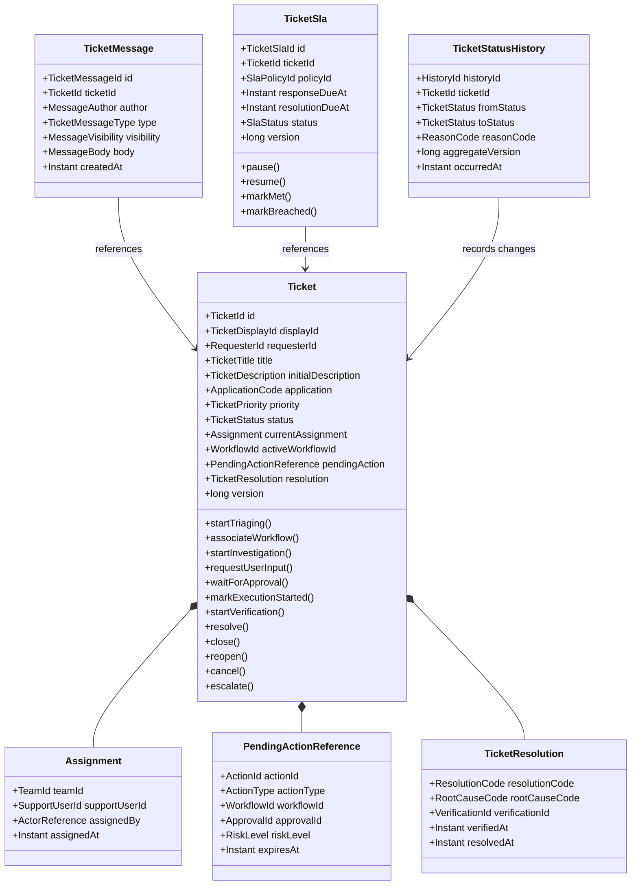

# OpsMind Ticket Workflow — 01 Domain Model

> **Domain:** Ticket & Business Workflow  
> **Document Type:** Low-Level Domain Model  
> **Version:** 1.0  
> **Status:** Proposed  
> **Dependencies:** `technology-baseline`, `02-Ticket-Workflow/README_EN.md`  
> **Recommended Path:** `docs/low-level-design/domains/02-ticket-workflow/01-domain-model/README_EN.md`

---

## 1. Purpose

This document defines the OpsMind Ticket Workflow domain model.

It answers:

- Which object is the aggregate root
- What belongs inside the Ticket aggregate
- Which objects remain independent aggregates or records
- Which concepts are entities and which are value objects
- How Ticket references Agent Workflow, Approval, Tool Execution, and Verification
- Which domain behaviors Ticket exposes
- Which domain events Ticket produces
- Which repository interfaces belong to the domain
- Which rules belong inside Ticket Domain and which do not

This document does not define:

- The complete transition matrix
- API request and response contracts
- Integration-event JSON schemas
- Database tables and indexes
- Final Spring Boot classes
- JPA mappings
- The permission matrix

Those concerns are defined in later documents.

---

# 2. Modeling Principles

## 2.1 Model Around Consistency Boundaries

Aggregate boundaries are not based on database tables or UI screens.

The primary question is:

> Must this object remain strongly consistent with core Ticket state in the same transaction?

## 2.2 Keep the Ticket Aggregate Small

A status transition must not load:

- Every user message
- Every historical transition
- Every approval record
- Every tool execution
- Every agent trace
- Every SLA history record

These collections grow over time and do not belong inside the core aggregate.

## 2.3 Store References Across Domains

Ticket Domain does not load complete objects owned by other domains.

It stores only necessary references:

```text
WorkflowId
ApprovalId
ActionId
ToolExecutionId
VerificationId
```

## 2.4 Keep the Domain Framework-Independent

The Domain layer does not depend on:

- Spring MVC
- Spring Data JPA
- RabbitMQ
- PostgreSQL
- OpenTelemetry
- LangSmith
- Keycloak

The model must be testable with pure Java unit tests.

## 2.5 Use Strong Consistency Only for Core Invariants

Ticket status, active workflow, pending action, and resolution eligibility require strong consistency.

Timelines, dashboards, search indexes, and cross-service views may be eventually consistent.

---

# 3. Ubiquitous Language

| Term | Definition |
|---|---|
| Ticket | Core business record for an employee IT issue |
| Requester | Employee who submitted the Ticket |
| Ticket Status | Current business-processing stage |
| Agent Workflow | Technical investigation workflow in Agent Runtime |
| Active Workflow | The only workflow currently allowed to advance the Ticket |
| Pending Action | Proposed sensitive action that is not complete |
| Approval | Authorization decision for a Pending Action |
| Tool Execution | Operation performed by Tool Gateway |
| Verification | Independent check that the issue is actually solved |
| Resolution | Business result stored when the Ticket is solved |
| Assignment | Current support team or person responsible |
| SLA | Response and resolution targets |
| Reopen | Return of a resolved or closed Ticket to active handling |
| Escalation | Transfer to human support or a higher-authority path |
| Timeline | Read-only chronological view of Ticket-related facts |
| Domain Event | Business fact emitted by the aggregate |
| Integration Event | Versioned event published to another service |

---

# 4. Aggregate Design Decision

The Ticket Workflow MVP uses three primary aggregates:

```text
1. Ticket
2. TicketMessage
3. TicketSla
```

`Ticket` is the main aggregate root for the lifecycle.

## 4.1 Rejected Giant Aggregate

The design does not use:

```text
Ticket
├── all messages
├── all assignments
├── all status history
├── all approvals
├── all tool executions
├── all SLA records
└── all audit records
```

Reasons:

- The aggregate grows without bound.
- Every transition loads irrelevant data.
- Concurrency conflicts increase.
- Message append, SLA updates, and lifecycle changes block one another.
- Approval, Tool, and Workflow belong to other domains.
- Audit and Timeline are better modeled as append-only records or read models.

---

# 5. Aggregate Root: Ticket

## 5.1 Responsibilities

Ticket owns:

- Core identity and current status
- Lifecycle invariant enforcement
- One active workflow at a time
- Current assignment
- Current pending-action reference
- Resolution state
- Critical timestamps
- Domain-event generation
- Aggregate version
- Protection against invalid advancement after cancellation or closure

Ticket does not own:

- Complete message history
- Agent Runtime calls
- Policy evaluation
- Tool execution
- Enterprise-system calls
- RabbitMQ publication
- LangSmith tracing
- Complex SLA calculations
- Timeline queries

## 5.2 Suggested Fields

```text
Ticket
├── id: TicketId
├── displayId: TicketDisplayId
├── requesterId: RequesterId
├── title: TicketTitle
├── initialDescription: TicketDescription
├── source: TicketSource
├── application: ApplicationCode
├── category: TicketCategory?
├── subcategory: TicketSubcategory?
├── priority: TicketPriority
├── status: TicketStatus
├── currentAssignment: Assignment?
├── activeWorkflowId: WorkflowId?
├── pendingAction: PendingActionReference?
├── resolution: TicketResolution?
├── createdAt: Instant
├── updatedAt: Instant
├── resolvedAt: Instant?
├── closedAt: Instant?
├── cancelledAt: Instant?
├── version: long
└── domainEvents: List<DomainEvent>
```

## 5.3 Objects Not Stored in Ticket

Ticket does not store complete instances of:

```text
AgentWorkflow
ApprovalRequest
ApprovalDecision
ToolExecution
VerificationRun
KnowledgeDocument
Memory
LangSmithTrace
AuditEvent
```

Only required references or summaries are stored.

---

# 6. Ticket Creation

Recommended named factory:

```java
Ticket.create(
    TicketId id,
    TicketDisplayId displayId,
    RequesterId requesterId,
    TicketTitle title,
    TicketDescription description,
    ApplicationCode application,
    TicketSource source,
    Instant now
)
```

Initial state:

```text
status = NEW
priority = UNASSIGNED
category = null
activeWorkflowId = null
pendingAction = null
resolution = null
version = 0
```

The aggregate produces:

```text
TicketCreated
```

## 6.1 Creation Validation

- TicketId exists.
- TicketDisplayId exists.
- RequesterId exists.
- Title is present and valid.
- Description is present and valid.
- ApplicationCode is valid.
- Source is valid.
- Creation time exists.

---

# 7. Ticket Domain Behaviors

Names below are design proposals, not frozen Java signatures.

## 7.1 Workflow Behaviors

```text
startTriaging()
associateWorkflow(workflowId)
startInvestigation(classification)
clearActiveWorkflow(reason)
```

Rules:

- Only one active workflow exists at a time.
- A new workflow cannot overwrite another active workflow.
- Cancelled or closed tickets cannot receive a new workflow.

## 7.2 User Interaction Behaviors

```text
requestUserInput(requestId, reason)
resumeAfterUserReply(messageId)
```

Ticket does not store the complete message. It records the lifecycle change and emits an event.

## 7.3 Approval Behaviors

```text
waitForApproval(pendingActionReference)
handleApprovalGranted(approvalReference)
handleApprovalRejected(approvalReference, reason)
handleApprovalExpired(approvalReference)
```

The pending action must prove:

- The action belongs to the Ticket.
- The action belongs to the active Workflow.
- Approval refers to the same action.
- Approval is not expired.

## 7.4 Tool Execution Behaviors

```text
markExecutionStarted(toolExecutionId)
handleToolExecutionSucceeded(toolExecutionSummary)
handleToolExecutionFailed(toolExecutionSummary)
handleToolExecutionUnknown(toolExecutionId)
```

Tool success advances to Verification, never directly to Resolution.

## 7.5 Verification Behaviors

```text
startVerification(verificationId)
resolve(verificationEvidence, resolution)
returnToInvestigation(verificationFailure)
```

`resolve()` requires valid Verification Evidence.

## 7.6 Closure Behaviors

```text
close(closeReason, actor)
reopen(reopenReason, actor, newWorkflowId?)
cancel(cancelReason, actor)
escalate(escalationTarget, reason, actor)
```

## 7.7 Assignment Behaviors

```text
assignToTeam(teamId, actor)
assignToAgent(supportUserId, actor)
unassign(actor)
```

Assignment changes emit domain events. Full history is stored separately.

---

# 8. TicketMessage Aggregate

## 8.1 Decision

`TicketMessage` is an independent aggregate root rather than an ever-growing collection inside Ticket.

Reasons:

- Message count can grow indefinitely.
- Message append frequency may exceed Ticket updates.
- Loading core Ticket state must not load every message.
- Messages need independent attachment, redaction, and visibility controls.
- This avoids unnecessary optimistic-lock conflicts.

## 8.2 Fields

```text
TicketMessage
├── id: TicketMessageId
├── ticketId: TicketId
├── author: MessageAuthor
├── type: TicketMessageType
├── visibility: MessageVisibility
├── body: MessageBody
├── attachmentIds: List<AttachmentId>
├── replyToMessageId: TicketMessageId?
├── createdAt: Instant
└── metadata: MessageMetadata
```

## 8.3 Message Types

```text
USER_MESSAGE
SUPPORT_MESSAGE
SYSTEM_MESSAGE
AGENT_QUESTION
AGENT_SUMMARY
RESOLUTION_INSTRUCTION
```

## 8.4 Visibility

```text
REQUESTER_VISIBLE
INTERNAL_SUPPORT_ONLY
AUDIT_ONLY
```

## 8.5 Message Behavior

Messages are immutable after creation.

Corrections create a new message rather than overwriting the original.

Permitted technical actions include:

- Redaction marker
- Retention processing
- Attachment quarantine
- Audited visibility correction

## 8.6 Coordination with Ticket

A user reply requires:

```text
1. Create TicketMessage
2. Validate that Ticket is WAITING_FOR_USER
3. Return Ticket to INVESTIGATING
4. Write an Outbox Event
```

The Application Service coordinates these actions.

In the MVP they may occur in one Ticket Service database transaction while preserving conceptual aggregate boundaries.

---

# 9. TicketSla Aggregate

## 9.1 Decision

SLA is not placed inside Ticket.

Reasons:

- A scheduler may update SLA timers independently.
- Pause, resume, and breach calculation differ from Ticket lifecycle updates.
- SLA rules may evolve independently.
- SLA updates should not cause frequent Ticket version conflicts.

## 9.2 Fields

```text
TicketSla
├── id: TicketSlaId
├── ticketId: TicketId
├── policyId: SlaPolicyId
├── responseDueAt: Instant?
├── resolutionDueAt: Instant?
├── pausedAt: Instant?
├── accumulatedPausedDuration: Duration
├── status: SlaStatus
├── breachedAt: Instant?
└── version: long
```

## 9.3 SLA Status

```text
ACTIVE
PAUSED
MET
BREACHED
CANCELLED
```

## 9.4 Relationship to Ticket

Ticket status changes emit:

```text
ticket.status_changed
```

The SLA component decides whether to pause, resume, mark met, or cancel the timer.

Ticket itself does not calculate SLA deadlines.

---

# 10. Status History, Assignment History, and Timeline

## 10.1 TicketStatusHistory

`TicketStatusHistory` is an append-only domain record, not a mutable entity inside Ticket.

Fields:

```text
historyId
ticketId
fromStatus
toStatus
reasonCode
actor
sourceEventId
aggregateVersion
occurredAt
```

Every transition transaction writes:

```text
Update Ticket
+
Insert Status History
+
Insert Outbox Event
```

## 10.2 Assignment History

Current assignment belongs to Ticket.

Full assignment history is an append-only record:

```text
TicketAssignmentHistory
```

## 10.3 Ticket Timeline

Timeline is a read model, not an aggregate.

It may combine:

- Status history
- Messages
- Approval summaries
- Tool execution summaries
- Verification summaries
- Assignment history
- Escalation
- Resolution

The Timeline may be eventually consistent.

---

# 11. Value Objects

## 11.1 TicketId

Globally unique internal ID.

Recommended:

```text
UUID or ULID
```

## 11.2 TicketDisplayId

Human-readable ID:

```text
INC-2048
```

Separate from internal TicketId.

## 11.3 RequesterId

Reference to identity data.

Ticket Domain does not store a full user profile.

## 11.4 TicketTitle

Example rules:

```text
required
trimmed
1–200 characters
no control characters
```

## 11.5 TicketDescription

Example rules:

```text
required
1–10000 characters
plain text or sanitized rich text
classified as potentially sensitive
```

## 11.6 ApplicationCode

Examples:

```text
HOUSING_PORTAL
EMAIL
VPN
OTHER
```

The MVP Golden Path uses:

```text
HOUSING_PORTAL
```

## 11.7 TicketCategory

Future categories:

```text
IDENTITY_ACCESS
NETWORK
DEVICE
SOFTWARE
PRINTING
OTHER
```

MVP focus:

```text
IDENTITY_ACCESS
```

## 11.8 TicketSubcategory

MVP examples:

```text
MFA_FAILURE
ACCOUNT_LOCKED
GROUP_MEMBERSHIP
SESSION_FAILURE
UNKNOWN_IDENTITY_ISSUE
```

## 11.9 TicketPriority

```text
UNASSIGNED
LOW
MEDIUM
HIGH
CRITICAL
```

Priority influences SLA policy but is not calculated inside Ticket.

## 11.10 Assignment

```text
Assignment
├── teamId
├── supportUserId?
├── assignedBy
└── assignedAt
```

## 11.11 PendingActionReference

```text
PendingActionReference
├── actionId
├── actionType
├── workflowId
├── approvalId?
├── riskLevel
├── requestedAt
└── expiresAt?
```

It does not contain credentials or full tool payloads.

## 11.12 TicketResolution

```text
TicketResolution
├── resolutionCode
├── summary
├── rootCauseCode
├── verificationId
├── verifiedAt
├── resolvedBy
└── resolvedAt
```

Resolution must reference a verification result.

## 11.13 ActorReference

```text
ActorReference
├── actorType
└── actorId
```

Actor types:

```text
EMPLOYEE
IT_SUPPORT
IT_ADMIN
SYSTEM
AGENT
SERVICE
```

---

# 12. Enumerations and State

## 12.1 TicketStatus

```text
NEW
TRIAGING
INVESTIGATING
WAITING_FOR_USER
WAITING_FOR_APPROVAL
EXECUTING
VERIFYING
RESOLVED
CLOSED
ESCALATED
FAILED
CANCELLED
REOPENED
```

Legal transitions are finalized in `03-state-machine/`.

## 12.2 TicketSource

```text
PORTAL
EMAIL
API
SYSTEM
```

MVP requires:

```text
PORTAL
```

## 12.3 ResolutionCode

MVP examples:

```text
MFA_RESET_SUCCESSFUL
ACCOUNT_UNLOCKED
USER_GUIDANCE_SUCCESSFUL
NO_ISSUE_FOUND
ESCALATED_TO_HUMAN
UNRESOLVED
```

---

# 13. Cross-Domain References

## 13.1 WorkflowId

Owned by Agent Runtime.

Ticket stores only the current active workflow ID.

## 13.2 ApprovalId

Owned by Policy & Approval.

Ticket stores the approval associated with the current pending action.

## 13.3 ToolExecutionId

Owned by Tool Gateway.

Ticket stores a reference only when required for lifecycle state or resolution evidence.

## 13.4 VerificationId

Owned by Agent Runtime or the Verification module.

Ticket must store a verification reference when entering RESOLVED.

## 13.5 AttachmentId

Owned by object-storage metadata.

TicketMessage stores references, never binary data.

---

# 14. Domain Services and Policies

Not every rule belongs directly inside the Ticket entity.

## 14.1 TicketTransitionPolicy

Determines whether a transition is allowed.

It may be implemented inside Ticket or as a pure domain policy called by Ticket.

It never depends on databases or remote services.

## 14.2 TicketResolutionPolicy

Inputs:

```text
Ticket
VerificationEvidence
PendingAction state
```

Output:

```text
ResolutionAllowed
ResolutionDenied(reason)
```

## 14.3 TicketReopenPolicy

Determines:

- Whether current state allows reopen
- Whether the reopen window remains valid
- Whether the business actor is eligible
- Whether a new Workflow is required

Identity authorization remains in the Application / Security layer.

## 14.4 TicketCancellationPolicy

Determines whether the operation:

- Cancels immediately
- Waits for a tool result
- Requires compensation
- Is rejected and escalated

## 14.5 TicketDisplayIdGenerator

Generates human-readable display IDs.

The interface belongs to Domain; the implementation belongs to Infrastructure.

---

# 15. Domain Events

Ticket produces internal domain events.

The Application layer converts them to integration events and writes them to the Outbox.

## 15.1 TicketCreated

```text
ticketId
displayId
requesterId
application
source
createdAt
```

The broadly published integration event should avoid carrying a complete sensitive description.

## 15.2 TicketClassified

```text
ticketId
category
subcategory
priority
classificationSource
classifiedAt
```

## 15.3 TicketStatusChanged

```text
ticketId
fromStatus
toStatus
reasonCode
actor
aggregateVersion
occurredAt
```

## 15.4 TicketWaitingForUser

```text
ticketId
requestId
reasonCode
workflowId
```

## 15.5 TicketWaitingForApproval

```text
ticketId
workflowId
actionId
actionType
approvalId
riskLevel
```

## 15.6 TicketExecutionReady

```text
ticketId
workflowId
actionId
approvalId
```

## 15.7 TicketVerificationStarted

```text
ticketId
workflowId
toolExecutionId
verificationId
```

## 15.8 TicketResolved

```text
ticketId
resolutionCode
rootCauseCode
verificationId
resolvedAt
```

## 15.9 TicketClosed

```text
ticketId
closeReason
closedBy
closedAt
```

## 15.10 TicketReopened

```text
ticketId
reason
reopenedBy
newWorkflowId?
reopenedAt
```

## 15.11 TicketCancelled

```text
ticketId
reason
cancelledBy
cancelledAt
```

## 15.12 TicketEscalated

```text
ticketId
target
reason
escalatedBy
escalatedAt
```

---

# 16. Domain Events vs. Integration Events

## Domain Event

Exists inside the Java Domain:

```text
TicketResolved
```

Characteristics:

- Produced by the aggregate
- No RabbitMQ concepts
- No queue or routing-key details
- Implemented as an immutable Java object

## Integration Event

Published to another service:

```text
ticket.resolved.v1
```

Characteristics:

- Uses the versioned JSON envelope
- Published through the Outbox
- Must address compatibility, PII, retry, and idempotency
- Payload may differ from the domain event

The system never serializes the complete domain object directly to RabbitMQ.

---

# 17. Repository Interfaces

Domain defines interfaces; Infrastructure implements them.

## 17.1 TicketRepository

```java
interface TicketRepository {
    Optional<Ticket> findById(TicketId ticketId);
    Ticket save(Ticket ticket);
    boolean existsByDisplayId(TicketDisplayId displayId);
}
```

## 17.2 TicketMessageRepository

```java
interface TicketMessageRepository {
    TicketMessage save(TicketMessage message);
    Optional<TicketMessage> findById(TicketMessageId messageId);
}
```

Message-list retrieval may use a query repository rather than the domain repository.

## 17.3 TicketSlaRepository

```java
interface TicketSlaRepository {
    Optional<TicketSla> findByTicketId(TicketId ticketId);
    TicketSla save(TicketSla sla);
}
```

## 17.4 Query Interfaces

```text
TicketQueryRepository
TicketTimelineQueryRepository
SupportQueueQueryRepository
```

Query interfaces may return read DTOs rather than aggregates.

---

# 18. Application Services Coordinate Multiple Aggregates

## 18.1 User Reply

```text
AddTicketMessageCommand
→ Load Ticket
→ Create TicketMessage
→ Ticket.resumeAfterUserReply(messageId)
→ Save Message
→ Save Ticket
→ Insert Status History
→ Insert Outbox Event
→ Commit
```

## 18.2 Ticket Creation

```text
CreateTicketCommand
→ Generate TicketId and DisplayId
→ Ticket.create()
→ Create initial TicketSla
→ Save Ticket
→ Save SLA
→ Insert Status History
→ Insert Outbox Event
→ Commit
```

Creating Ticket and SLA in one application transaction does not change their aggregate boundaries.

## 18.3 Verification Success

```text
verification.completed
→ Deduplicate Event
→ Load Ticket
→ Build VerificationEvidence
→ Ticket.resolve(evidence, resolution)
→ Save Ticket
→ Insert Status History
→ Insert Outbox Event
→ Mark Event Processed
→ Commit
```

---

# 19. Aggregate Version and Concurrency

`Ticket.version` supports optimistic locking.

Example:

```text
Approval Granted Event
and
User Cancel Command
arrive concurrently
```

Only one transaction can commit against the current version.

The loser must:

```text
Reload Ticket
→ Re-evaluate the business rule
→ Return an idempotent result, retry, or reject
```

TicketMessage is independent, so appending a message does not automatically increment Ticket version unless it also changes Ticket state.

TicketSla has its own version.

---

# 20. PII and Data Classification

## 20.1 Core Ticket Fields

| Field | Classification |
|---|---|
| ticketId | Internal |
| displayId | Internal |
| requesterId | Sensitive |
| title | Sensitive |
| description | Sensitive |
| category | Internal |
| status | Internal |
| rootCauseCode | Internal |
| workflowId | Internal |
| approvalId | Internal |

## 20.2 Domain Rules

- Domain events avoid complete descriptions.
- Integration events include only necessary data.
- Logs do not serialize the complete Ticket through `toString()`.
- LangSmith metadata uses redacted or hashed requester identifiers.
- Message bodies never become metrics labels.
- Secrets never belong in the Ticket domain model.

---

# 21. Mermaid Class Diagram



---

# 22. Key Modeling Decisions

## Decision 1: Ticket Is the Main Aggregate Root

It protects status, active workflow, pending action, and resolution.

## Decision 2: TicketMessage Is an Independent Aggregate

This avoids unbounded growth and unrelated concurrency conflicts.

## Decision 3: TicketSla Is an Independent Aggregate

This supports scheduler-driven and independent timer updates.

## Decision 4: Status History Is an Append-Only Record

It records facts and does not own Ticket behavior.

## Decision 5: Timeline Is a Read Model

It combines multiple sources and may be eventually consistent.

## Decision 6: Approval, Workflow, and Tool Execution Are External References

They belong to other domains.

## Decision 7: Tool Success Never Resolves the Ticket Directly

Independent verification is required.

## Decision 8: Domain Events and Integration Events Are Separate

This prevents RabbitMQ contracts from coupling to the domain model.

---

# 23. Rejected Modeling Alternatives

## 23.1 Giant Ticket Aggregate

Rejected because of performance, concurrency, and boundary problems.

## 23.2 Ticket as a Passive JPA Data Object

Rejected because lifecycle rules would leak into controllers and services.

## 23.3 Agent Runtime Directly Updating Ticket Tables

Rejected because it violates data ownership and invariants.

## 23.4 Storing Complete Approval and Tool Objects Inside Ticket

Rejected because it creates cross-domain coupling.

## 23.5 Tool Success Directly Setting RESOLVED

Rejected because independent verification is missing.

## 23.6 Status History as an Internal Ticket List

Rejected because it grows indefinitely and affects every load.

---

# 24. Questions for Later Documents

This file does not finalize:

1. The complete legal-transition matrix.
2. Whether `FAILED` is terminal or intermediate.
3. Whether `REOPENED` is a persistent state or an event followed by `INVESTIGATING`.
4. Exact cancellation rules after tool execution.
5. Reopen window.
6. Auto-close duration.
7. Priority calculation.
8. Which states pause SLA.
9. Transaction details for message and Ticket updates.
10. Whether multiple pending actions are allowed.
11. Whether one Ticket may have sequential workflows.
12. Minimum Verification Evidence fields.
13. Final ResolutionCode and RootCauseCode values.
14. Category-change authorization and history.

These are resolved in:

```text
02-business-invariants/
03-state-machine/
04-use-cases/
07-data-model/
08-transaction-and-outbox/
```

---

# 25. Acceptance Criteria

- [x] Ticket is selected as the main aggregate root.
- [x] Ticket responsibilities are defined.
- [x] TicketMessage is an independent aggregate.
- [x] TicketSla is an independent aggregate.
- [x] Status History is an append-only record.
- [x] Timeline is a read model.
- [x] Initial value objects are defined.
- [x] Cross-domain references are defined.
- [x] Domain behaviors are proposed.
- [x] Domain events are proposed.
- [x] Repository interfaces are proposed.
- [x] PII principles are defined.
- [x] Rejected alternatives are recorded.
- [ ] Transitions will be finalized in `03-state-machine/`.
- [ ] Complete invariants will be finalized in `02-business-invariants/`.

---

# 26. Next Step

Create:

```text
02-business-invariants/README_CN.md
02-business-invariants/README_EN.md
```

Then create:

```text
03-state-machine/README_CN.md
03-state-machine/README_EN.md
```

Business invariants must follow the aggregate boundaries defined here.
