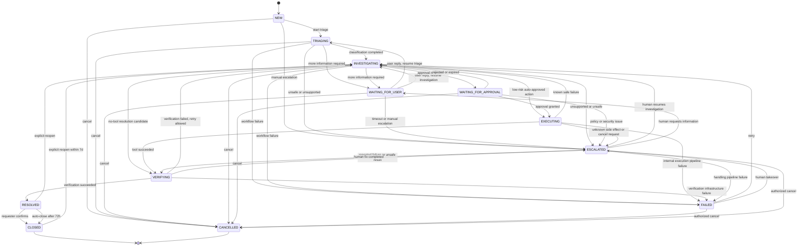

# OpsMind Ticket Workflow — 03 State Machine

> **领域：** Ticket & Business Workflow  
> **文档类型：** Low-Level State Machine Specification  
> **版本：** 1.0  
> **状态：** Proposed for Review  
> **依赖：** `01-domain-model/README_CN.md`、`02-business-invariants/README_CN.md`  
> **建议路径：** `docs/low-level-design/domains/02-ticket-workflow/03-state-machine/README_CN.md`

---

> **⚠️ 对 Phase 03 已过时（2026-07-31）。** 本文档冻结的是一套 AI Agent 自动化驱动的工作流模型
> （`NEW → TRIAGING → INVESTIGATING → EXECUTING → VERIFYING → RESOLVED → CLOSED`，依赖
> `activeWorkflowId`、Triage Agent、Tool Gateway 和独立的 Verification 环节），但这套模型从未被实际实现：
> `SPEC-TW-001` 到 `SPEC-TW-006` 从未给 `activeWorkflowId` 赋值，本代码库也不存在 Triage Agent、
> Tool Gateway、Policy、Approval 或 Verification 组件。`docs/implementation-plans/domains/
> 02-ticket-workflow/phase-03-ticket-lifecycle-and-ownership_CN.md` 规划的是一套人工客服归属驱动
> 的生命周期（`OPEN(NEW) → TRIAGED → ASSIGNED → IN_PROGRESS → WAITING_FOR_USER/APPROVAL →
> RESOLVED → CLOSED`），由 `SPEC-TW-007` 起开始实现，是当前对 `TicketStatus` 和工单归属的权威来源。
> 下文第 3 节起的状态集合与转换已不反映实际实现，仅作历史存档保留。和解记录见
> `docs/traceability/02-ticket-workflow/traceability-matrix.yaml` 的 `SPEC-TW-007`/`SPEC-TW-008` 条目。

---

## 1. 文档目的

本文档冻结 OpsMind Ticket Workflow 的状态集合、合法转换、触发条件、Guard、事务动作、Domain Event、Integration Event、失败行为和幂等规则。

本文档直接约束：

- `Ticket` Aggregate 的领域方法
- Application Service
- API Command Handler
- RabbitMQ Event Consumer
- Ticket Status History
- Transactional Outbox
- Optimistic Locking
- SLA 状态处理
- Agent Workflow 协作
- Policy、Approval、Tool 和 Verification 协作
- Unit Test、Integration Test 和 End-to-End Test

任何未在本文档中明确允许的状态转换都必须被拒绝。

---

# 2. 本文冻结的关键决策

## SD-001 `REOPENED` 不作为持久 Ticket Status

`REOPENED` 被建模为 Domain Event，而不是长期保存的状态。

实际转换：

```text
RESOLVED / CLOSED
→ INVESTIGATING
```

同时产生：

```text
TicketReopened
```

原因：

- `REOPENED` 描述的是一个动作，不是稳定处理阶段。
- Reopen 完成后 Ticket 必须立即进入新的调查周期。
- 避免 UI 和后端需要处理一个极短暂的中间状态。

## SD-002 `FAILED` 是可恢复状态，不是终止状态

`FAILED` 表示自动化流程因内部错误无法继续，但 Ticket 问题并未解决。

允许：

```text
FAILED → INVESTIGATING
FAILED → ESCALATED
FAILED → CANCELLED
```

不允许：

```text
FAILED → RESOLVED
FAILED → CLOSED
```

## SD-003 Terminal States

真正终止状态：

```text
CLOSED
CANCELLED
```

其中：

- `CLOSED` 可以在 Reopen Window 内显式 Reopen。
- `CANCELLED` 在 MVP 中不可 Reopen；用户需要创建新 Ticket。

## SD-004 Approval Rejected / Expired

默认转换：

```text
WAITING_FOR_APPROVAL
→ INVESTIGATING
```

Agent 可以提出其他低风险方案或转人工。

## SD-005 Verification Failure

默认：

```text
VERIFYING
→ INVESTIGATING
```

同一 Resolution Cycle 最多允许：

```text
2 次 Verification Failure
```

第三次失败或发现安全风险时：

```text
VERIFYING
→ ESCALATED
```

Verification Attempt Counter 由 Active Workflow Context 维护，并随 Event 传入 Ticket Application Service。

## SD-006 Auto-close

Ticket 进入 `RESOLVED` 后：

```text
72 小时
```

内无 Requester 回复或 Reopen，则由 Scheduler 自动执行：

```text
RESOLVED → CLOSED
```

## SD-007 Reopen Window

`CLOSED` Ticket 在关闭后：

```text
7 天
```

内允许 Requester 或授权 Support 显式 Reopen。

超过 7 天：

```text
拒绝 Reopen
→ 建议创建新 Ticket
```

`RESOLVED` 状态在 Auto-close 前可以随时 Reopen。

## SD-008 SLA Pause

MVP：

```text
WAITING_FOR_USER → SLA PAUSED
WAITING_FOR_APPROVAL → SLA ACTIVE
```

原因：

- 等待用户信息不应消耗 IT 团队处理时间。
- 审批流程仍属于企业 IT 责任范围。

## SD-009 Reopen 创建新处理周期

Reopen 后必须创建：

```text
new WorkflowId
new Resolution Cycle
new Verification Attempts
new SLA Cycle
```

旧 Resolution、Workflow 和 SLA 历史必须保留。

## SD-010 执行中取消

`EXECUTING` 和 `VERIFYING` 不允许直接进入 `CANCELLED`。

取消请求到达时：

- 如果确认 Tool 尚未开始，可由 Tool Gateway 撤销后回到 `INVESTIGATING`，再取消。
- 如果 Side Effect 已发生或状态未知，进入 `ESCALATED`。
- 不允许通过取消隐藏外部 Side Effect。

---

# 3. 状态集合

```text
NEW
TRIAGING
INVESTIGATING
WAITING_FOR_USER
WAITING_FOR_APPROVAL
EXECUTING
VERIFYING
RESOLVED
CLOSED
ESCALATED
FAILED
CANCELLED
```

---

# 4. 状态分类

## 4.1 Active States

```text
NEW
TRIAGING
INVESTIGATING
WAITING_FOR_USER
WAITING_FOR_APPROVAL
EXECUTING
VERIFYING
ESCALATED
FAILED
```

## 4.2 Resolution State

```text
RESOLVED
```

问题已通过 Verification，但 Ticket 尚未正式结束。

## 4.3 Terminal States

```text
CLOSED
CANCELLED
```

## 4.4 Automation-controlled States

```text
TRIAGING
INVESTIGATING
EXECUTING
VERIFYING
FAILED
```

## 4.5 Human-dependent States

```text
WAITING_FOR_USER
WAITING_FOR_APPROVAL
ESCALATED
RESOLVED
```

---

# 5. 状态定义

## 5.1 NEW

Ticket 已创建并持久化，但尚未开始分类。

必须满足：

```text
activeWorkflowId == null
pendingAction == null
resolution == null
```

允许进入：

```text
TRIAGING
CANCELLED
ESCALATED
```

## 5.2 TRIAGING

Triage Agent 正在识别 Category、Subcategory、Priority 和处理路线。

必须满足：

```text
activeWorkflowId != null
resolution == null
```

允许进入：

```text
INVESTIGATING
WAITING_FOR_USER
FAILED
ESCALATED
CANCELLED
```

## 5.3 INVESTIGATING

Agent 或 Support 正在收集证据、检索知识、判断 Root Cause 和制定 Action。

允许进入：

```text
WAITING_FOR_USER
WAITING_FOR_APPROVAL
EXECUTING
VERIFYING
FAILED
ESCALATED
CANCELLED
```

## 5.4 WAITING_FOR_USER

系统等待 Requester 提供额外信息。

必须满足：

```text
openUserRequestId != null
resumeStatus in {TRIAGING, INVESTIGATING}
```

SLA：

```text
PAUSED
```

允许进入：

```text
TRIAGING
INVESTIGATING
CANCELLED
ESCALATED
```

## 5.5 WAITING_FOR_APPROVAL

系统等待授权人员对 Pending Action 作出决定。

必须满足：

```text
activeWorkflowId != null
pendingAction != null
pendingAction.approvalId != null
```

SLA：

```text
ACTIVE
```

允许进入：

```text
EXECUTING
INVESTIGATING
CANCELLED
ESCALATED
```

## 5.6 EXECUTING

Tool Gateway 正在执行已授权 Action，或等待确定性执行结果。

必须满足：

```text
activeWorkflowId != null
pendingAction != null
toolExecutionId != null
```

允许进入：

```text
VERIFYING
INVESTIGATING
FAILED
ESCALATED
```

不允许直接进入：

```text
RESOLVED
CANCELLED
CLOSED
```

## 5.7 VERIFYING

系统正在独立验证问题是否真正解决。

必须满足：

```text
verificationId != null
activeWorkflowId != null
```

允许进入：

```text
RESOLVED
INVESTIGATING
ESCALATED
FAILED
```

## 5.8 RESOLVED

Verification 成功，系统认为问题已解决，等待用户确认或 Auto-close。

必须满足：

```text
resolution != null
resolution.verificationId != null
resolvedAt != null
pendingAction == null
```

允许进入：

```text
CLOSED
INVESTIGATING  // explicit reopen
```

## 5.9 CLOSED

Ticket 生命周期正式结束。

必须满足：

```text
resolution != null
closedAt != null
activeWorkflowId == null
pendingAction == null
```

允许进入：

```text
INVESTIGATING  // explicit reopen within 7 days
```

除此之外拒绝所有转换。

## 5.10 ESCALATED

Ticket 已转交人工或高权限处理路径。

必须满足：

```text
escalationTarget != null
escalationReason != null
```

允许进入：

```text
INVESTIGATING
WAITING_FOR_USER
VERIFYING
FAILED
CANCELLED
```

不能直接进入 `RESOLVED`，仍然需要 Verification。

## 5.11 FAILED

自动化处理因技术错误、不可恢复 Workflow Error 或依赖失败而停止。

允许进入：

```text
INVESTIGATING
ESCALATED
CANCELLED
```

## 5.12 CANCELLED

Ticket 被合法取消。

必须满足：

```text
cancelReason != null
cancelledBy != null
cancelledAt != null
activeWorkflowId == null 或 cancellation pending
pendingAction == null 或 invalidated
```

MVP 中无合法出站转换。

---

# 6. 高层状态图



---

# 7. Transition 执行模型

每个状态转换必须按照统一模型执行：

```text
1. Authenticate actor or validate event source
2. Deduplicate command or event
3. Load Ticket
4. Validate expected version
5. Validate source state
6. Validate transition-specific Guards
7. Apply Ticket Domain behavior
8. Increment aggregate version
9. Insert TicketStatusHistory
10. Insert domain-specific append-only records
11. Insert Outbox Event
12. Mark inbound event processed, if applicable
13. Commit transaction
14. Publish asynchronously through Outbox Publisher
```

数据库事务内禁止：

- RabbitMQ Publish
- LLM Call
- Tool Gateway Call
- LangSmith Export
- OpenTelemetry Export Blocking Call
- External Identity Administration Call

---

# 8. Transition Matrix 总览

| ID | From | To | Trigger |
|---|---|---|---|
| SM-001 | Initial | NEW | CreateTicket |
| SM-002 | NEW | TRIAGING | StartTriage |
| SM-003 | TRIAGING | INVESTIGATING | ClassificationCompleted |
| SM-004 | TRIAGING | WAITING_FOR_USER | UserInputRequired |
| SM-005 | WAITING_FOR_USER | TRIAGING | UserReplied, resume TRIAGING |
| SM-006 | WAITING_FOR_USER | INVESTIGATING | UserReplied, resume INVESTIGATING |
| SM-007 | INVESTIGATING | WAITING_FOR_USER | UserInputRequired |
| SM-008 | INVESTIGATING | WAITING_FOR_APPROVAL | ApprovalRequested |
| SM-009 | INVESTIGATING | EXECUTING | AutoApprovedActionReady |
| SM-010 | INVESTIGATING | VERIFYING | ResolutionCandidateReady |
| SM-011 | WAITING_FOR_APPROVAL | EXECUTING | ApprovalGranted |
| SM-012 | WAITING_FOR_APPROVAL | INVESTIGATING | ApprovalRejected |
| SM-013 | WAITING_FOR_APPROVAL | INVESTIGATING | ApprovalExpired |
| SM-014 | EXECUTING | VERIFYING | ToolExecutionSucceeded |
| SM-015 | EXECUTING | INVESTIGATING | ToolExecutionFailedSafe |
| SM-016 | EXECUTING | FAILED | ExecutionPipelineFailed |
| SM-017 | EXECUTING | ESCALATED | ToolResultUnknown / CancelDuringExecution |
| SM-018 | VERIFYING | RESOLVED | VerificationSucceeded |
| SM-019 | VERIFYING | INVESTIGATING | VerificationFailedRetryable |
| SM-020 | VERIFYING | ESCALATED | VerificationFailedLimitReached |
| SM-021 | VERIFYING | FAILED | VerificationPipelineFailed |
| SM-022 | RESOLVED | CLOSED | RequesterConfirmed |
| SM-023 | RESOLVED | CLOSED | AutoCloseTimeout |
| SM-024 | RESOLVED | INVESTIGATING | ReopenRequested |
| SM-025 | CLOSED | INVESTIGATING | ReopenRequestedWithinWindow |
| SM-026 | Any cancellable active state | CANCELLED | CancelRequested |
| SM-027 | TRIAGING / INVESTIGATING | FAILED | AgentWorkflowFailed |
| SM-028 | FAILED | INVESTIGATING | RetryApproved |
| SM-029 | FAILED | ESCALATED | EscalationRequired |
| SM-030 | ESCALATED | INVESTIGATING | HumanResume |
| SM-031 | ESCALATED | WAITING_FOR_USER | HumanRequestsInput |
| SM-032 | ESCALATED | VERIFYING | HumanFixCompleted |
| SM-033 | Any eligible active state | ESCALATED | EscalateRequested |
| SM-034 | NEW | ESCALATED | ManualIntakeEscalation |

---

# 9. Detailed Transitions

## SM-001 Initial → NEW

### Trigger

```text
CreateTicketCommand
```

### Actor

```text
EMPLOYEE
IT_SUPPORT
AUTHORIZED_SERVICE
```

### Guards

- BI-001–BI-008
- Idempotency-Key valid
- Requester identity exists at request time
- Payload passes validation

### Transaction

```text
Insert Ticket
Insert Initial Status History
Insert Initial SLA Cycle
Insert ticket.created Outbox Event
Insert Idempotency Record
```

### Domain Event

```text
TicketCreated
```

### Integration Event

```text
ticket.created.v1
```

### Idempotency

Same Requester + same Idempotency-Key + same payload returns original Ticket.

Same key + different payload returns:

```text
IDEMPOTENCY_KEY_REUSED
```

---

## SM-002 NEW → TRIAGING

### Trigger

```text
StartTriageCommand
或 agent.workflow.started
```

### Guards

- BI-017–BI-021
- Ticket not terminal
- No active workflow
- Workflow belongs to Ticket

### Actions

```text
associate activeWorkflowId
status = TRIAGING
```

### Events

```text
TicketStatusChanged
ticket.triaging_started.v1
```

### Failure Codes

```text
ACTIVE_WORKFLOW_ALREADY_EXISTS
WORKFLOW_REFERENCE_MISMATCH
INVALID_STATE_TRANSITION
```

---

## SM-003 TRIAGING → INVESTIGATING

### Trigger

```text
ticket.classification.completed
```

### Guards

- BI-008、BI-009
- BI-019
- Classification belongs to active workflow
- Category and Subcategory match
- Classification confidence passes minimum threshold or has human override

### Actions

```text
set category
set subcategory
set priority
status = INVESTIGATING
```

### Events

```text
TicketClassified
TicketStatusChanged
ticket.classified.v1
ticket.investigation_ready.v1
```

### Idempotency

Same classification EventId is ignored after first successful application.

---

## SM-004 TRIAGING → WAITING_FOR_USER

### Trigger

```text
agent.user_input_required
```

### Guards

- BI-023
- BI-019
- Request has reason and requestId
- Resume state set to `TRIAGING`

### Actions

```text
status = WAITING_FOR_USER
store openUserRequest reference
pause SLA
```

### Events

```text
TicketWaitingForUser
ticket.user_reply_requested.v1
```

---

## SM-005 WAITING_FOR_USER → TRIAGING

### Trigger

```text
UserReplyCommand
```

### Guards

- BI-024–BI-027
- Ticket currently waiting for user
- RequestId matches open request
- Resume target is TRIAGING
- Actor is Requester or authorized Support

### Transaction

```text
Insert TicketMessage
Update Ticket to TRIAGING
Clear open user request
Resume SLA
Insert History
Insert Outbox Event
```

### Events

```text
TicketUserReplied
ticket.user_replied.v1
ticket.triage_resume_requested.v1
```

---

## SM-006 WAITING_FOR_USER → INVESTIGATING

与 SM-005 相同，但 Resume Target 为 `INVESTIGATING`。

Integration Event：

```text
ticket.investigation_resume_requested.v1
```

---

## SM-007 INVESTIGATING → WAITING_FOR_USER

### Trigger

```text
agent.user_input_required
或 SupportRequestUserInputCommand
```

### Guards

- BI-023
- Active workflow matches
- Request reason is present
- No unresolved conflicting Pending Action

### Actions

```text
status = WAITING_FOR_USER
resumeStatus = INVESTIGATING
pause SLA
```

---

## SM-008 INVESTIGATING → WAITING_FOR_APPROVAL

### Trigger

```text
approval.requested
```

### Guards

- BI-028–BI-035
- Exactly one pending action
- Action belongs to active workflow
- Approval reference exists
- Ticket not cancelled, closed, or escalated
- Action is not already executing

### Actions

```text
store PendingActionReference
status = WAITING_FOR_APPROVAL
SLA remains ACTIVE
```

### Events

```text
TicketWaitingForApproval
ticket.approval_wait_started.v1
```

### Failure Codes

```text
ACTION_REFERENCE_MISMATCH
ACTIVE_WORKFLOW_ALREADY_EXISTS
INVALID_STATE_TRANSITION
```

---

## SM-009 INVESTIGATING → EXECUTING

### Trigger

```text
policy.action_auto_approved
```

### Use

仅用于 Policy 明确判断为低风险、无需人工审批的 Action。

### Guards

- BI-028–BI-031
- BI-040–BI-044
- Policy Decision = AUTO_APPROVED
- Action belongs to active workflow
- No existing Tool Execution
- Ticket not cancelled or closed

### Actions

```text
store pending action
store toolExecutionId
status = EXECUTING
```

### Events

```text
TicketExecutionReady
ticket.execution_ready.v1
```

---

## SM-010 INVESTIGATING → VERIFYING

### Trigger

```text
agent.resolution_candidate_ready
```

### Use

无需 Tool 的解决路径，例如：

- 用户指导
- 配置确认
- 问题已自然恢复
- 只读调查已得到结论

### Guards

- Active workflow matches
- Resolution candidate exists
- No unresolved Pending Action
- Verification request created

### Actions

```text
store verificationId
status = VERIFYING
```

### Events

```text
TicketVerificationStarted
ticket.verification_started.v1
```

---

## SM-011 WAITING_FOR_APPROVAL → EXECUTING

### Trigger

```text
approval.granted
```

### Applicable Invariants

```text
BI-032
BI-033
BI-034
BI-035
BI-036
BI-038
BI-040
BI-043
BI-044
```

### Guards

- Approval matches Ticket
- Approval matches active Workflow
- Approval matches ActionId and ActionType
- Approval not expired
- Pending Action still active
- Ticket still in WAITING_FOR_APPROVAL
- ToolExecutionId reserved

### Actions

```text
attach approval result
status = EXECUTING
```

### Events

```text
TicketExecutionReady
ticket.execution_ready.v1
```

### Idempotency

Duplicate `approval.granted` returns success without a second transition or Tool Execution.

---

## SM-012 WAITING_FOR_APPROVAL → INVESTIGATING

### Trigger

```text
approval.rejected
```

### Guards

- BI-033–BI-038
- Rejection matches current Action

### Actions

```text
invalidate pending action
status = INVESTIGATING
```

### Events

```text
TicketApprovalRejected
ticket.investigation_resume_requested.v1
```

### Notes

Agent may propose an alternative Action or escalate.

---

## SM-013 WAITING_FOR_APPROVAL → INVESTIGATING

### Trigger

```text
approval.expired
```

与 SM-012 相似。

必须清除过期 Approval，不能重用旧 ApprovalId。

---

## SM-014 EXECUTING → VERIFYING

### Trigger

```text
tool.execution.completed
result = SUCCESS
```

### Applicable Invariants

```text
BI-041
BI-042
BI-045
BI-048–BI-051
```

### Guards

- ToolExecution matches pending action
- Workflow matches
- Result belongs to current attempt
- Verification request exists

### Actions

```text
record tool result reference
clear execution-in-progress marker
store verificationId
status = VERIFYING
```

### Events

```text
TicketVerificationStarted
ticket.verification_started.v1
```

Tool Success 不产生 `ticket.resolved`。

---

## SM-015 EXECUTING → INVESTIGATING

### Trigger

```text
tool.execution.failed
resultCertainty = KNOWN_NO_SIDE_EFFECT
```

### Guards

- Tool Result matches current Action
- Confirmed no external side effect
- Retry or alternative investigation is safe

### Actions

```text
record failure summary
invalidate current pending action
status = INVESTIGATING
```

### Events

```text
TicketExecutionFailed
ticket.investigation_resume_requested.v1
```

---

## SM-016 EXECUTING → FAILED

### Trigger

```text
execution.pipeline.failed
```

### Use

仅用于内部执行管道失败且已确认没有未知外部 Side Effect。

### Guards

- Failure is technical
- No uncertain write result
- Retry must not be automatic inside same transaction

### Events

```text
TicketAutomationFailed
ticket.automation_failed.v1
```

---

## SM-017 EXECUTING → ESCALATED

### Trigger

```text
tool.execution.result_unknown
或 CancelRequestedDuringExecution
```

### Applicable Invariants

```text
BI-046
BI-069
BI-073–BI-075
```

### Guards

- External Side Effect is unknown or already occurred
- Blind retry is unsafe

### Actions

```text
status = ESCALATED
store escalation reason
retain pending action and execution references as evidence
```

### Events

```text
TicketEscalated
ticket.escalated.v1
```

---

## SM-018 VERIFYING → RESOLVED

### Trigger

```text
verification.completed
result = SUCCESS
```

### Applicable Invariants

```text
BI-048
BI-049
BI-050
BI-051
BI-053
BI-054
BI-055
```

### Guards

- Verification matches Ticket
- Verification matches active Workflow
- Verification matches latest attempt
- Evidence is complete
- Result = SUCCESS
- No unresolved Pending Action

### Actions

```text
create TicketResolution
status = RESOLVED
resolvedAt = now
clear pending action
complete active workflow association
schedule auto-close at resolvedAt + 72h
mark current SLA cycle MET
```

### Events

```text
TicketResolved
ticket.resolved.v1
```

---

## SM-019 VERIFYING → INVESTIGATING

### Trigger

```text
verification.completed
result = FAILURE
attemptCount <= 2
```

### Guards

- Verification matches latest attempt
- Failure is retryable
- No security condition requires escalation

### Actions

```text
record failure summary
status = INVESTIGATING
```

### Events

```text
TicketVerificationFailed
ticket.investigation_resume_requested.v1
```

---

## SM-020 VERIFYING → ESCALATED

### Trigger

```text
verification.completed
result = FAILURE
attemptCount > 2
```

或：

```text
verification reports unsafe or contradictory result
```

### Actions

```text
status = ESCALATED
store evidence and escalation reason
```

### Events

```text
TicketEscalated
ticket.escalated.v1
```

---

## SM-021 VERIFYING → FAILED

### Trigger

```text
verification.pipeline.failed
```

### Guards

- Failure is infrastructure or internal pipeline error
- Verification outcome is not known
- No external Tool Side Effect uncertainty requiring escalation

---

## SM-022 RESOLVED → CLOSED

### Trigger

```text
ConfirmResolutionCommand
```

### Actor

```text
Requester
Authorized Support
```

### Guards

- BI-057–BI-060
- Ticket currently RESOLVED
- Actor authorized
- No Reopen request already accepted

### Actions

```text
status = CLOSED
closedAt = now
closeReason = REQUESTER_CONFIRMED
activeWorkflowId = null
```

### Events

```text
TicketClosed
ticket.closed.v1
```

---

## SM-023 RESOLVED → CLOSED

### Trigger

```text
AutoCloseScheduler
```

### Guards

- Ticket has remained RESOLVED for at least 72 hours
- No Requester reply
- No accepted Reopen
- Scheduled task uses current expected version

### Actions

```text
status = CLOSED
closeReason = AUTO_CLOSE_TIMEOUT
closedBy = SYSTEM
```

### Idempotency

Scheduler uses stable Job Key:

```text
auto-close:{ticketId}:{resolutionCycleId}
```

---

## SM-024 RESOLVED → INVESTIGATING

### Trigger

```text
ReopenTicketCommand
```

### Applicable Invariants

```text
BI-061–BI-066
```

### Guards

- Actor authorized
- Reason present
- Ticket currently RESOLVED
- No active Pending Action
- New WorkflowId created

### Actions

```text
archive previous resolution cycle
clear current resolution from active snapshot
associate new WorkflowId
create new SLA cycle
reset verification attempt count
status = INVESTIGATING
```

### Events

```text
TicketReopened
ticket.reopened.v1
ticket.investigation_resume_requested.v1
```

---

## SM-025 CLOSED → INVESTIGATING

### Trigger

```text
ReopenTicketCommand
```

### Guards

- ClosedAt + 7 days has not passed
- Actor is Requester or authorized Support
- Reason present
- New WorkflowId created
- Previous Resolution preserved

超过 Window：

```text
REOPEN_WINDOW_EXPIRED
```

### Actions

与 SM-024 相同，并保留原 `closedAt` 到历史周期记录。

---

## SM-026 Cancellable Active State → CANCELLED

### Allowed Source States

```text
NEW
TRIAGING
INVESTIGATING
WAITING_FOR_USER
WAITING_FOR_APPROVAL
FAILED
ESCALATED
```

### Trigger

```text
CancelTicketCommand
```

### Guards

- BI-067–BI-071
- Actor authorized
- Reason present
- No Tool Execution currently in uncertain state
- Pending action can be invalidated

### Actions

```text
status = CANCELLED
invalidate pending action
request active workflow cancellation
cancel SLA cycle
cancel auto-close job if any
```

### Events

```text
TicketCancelled
ticket.cancelled.v1
```

### Forbidden Sources

```text
EXECUTING
VERIFYING
RESOLVED
CLOSED
CANCELLED
```

`RESOLVED` 应 Close 或 Reopen，不应 Cancel。

---

## SM-027 TRIAGING / INVESTIGATING → FAILED

### Trigger

```text
agent.workflow.failed
```

### Guards

- Workflow matches current Ticket
- Error is technical, not a business resolution
- No unknown Tool Side Effect

### Actions

```text
status = FAILED
store failure reference
```

---

## SM-028 FAILED → INVESTIGATING

### Trigger

```text
RetryAutomationCommand
```

### Actor

```text
IT_SUPPORT
SYSTEM with bounded retry policy
```

### Guards

- Retry budget available
- Root failure resolved or transient
- Active/new Workflow reference valid

### Actions

```text
status = INVESTIGATING
```

---

## SM-029 FAILED → ESCALATED

### Trigger

```text
EscalateFailedTicketCommand
或 retry budget exhausted
```

### Actions

```text
status = ESCALATED
```

---

## SM-030 ESCALATED → INVESTIGATING

### Trigger

```text
HumanResumeCommand
```

### Guards

- Authorized Support accepted ownership
- Investigation context preserved
- Active or new Workflow path is valid

---

## SM-031 ESCALATED → WAITING_FOR_USER

### Trigger

```text
HumanRequestUserInputCommand
```

### Guards

- Open User Request created
- Resume Target = ESCALATED 或 INVESTIGATING

MVP 推荐用户回复后回到 `INVESTIGATING`。

---

## SM-032 ESCALATED → VERIFYING

### Trigger

```text
HumanFixCompletedCommand
```

### Guards

- Manual Action Summary exists
- Verification request created
- Verification is independent
- No unresolved risk

不能直接进入 `RESOLVED`。

---

## SM-033 Eligible Active State → ESCALATED

### Allowed Sources

```text
TRIAGING
INVESTIGATING
WAITING_FOR_USER
WAITING_FOR_APPROVAL
EXECUTING
VERIFYING
FAILED
```

### Trigger

```text
EscalateTicketCommand
或安全策略要求
```

### Guards

- BI-072–BI-075
- Target and reason present
- Context retained

---

## SM-034 NEW → ESCALATED

用于人工 Intake 或系统识别到必须直接转高权限团队的 Ticket。

---

# 10. 非法转换表

以下转换必须明确拒绝：

| From | To | 原因 |
|---|---|---|
| NEW | RESOLVED | 未调查、未验证 |
| TRIAGING | EXECUTING | 未完成调查和 Policy |
| WAITING_FOR_USER | EXECUTING | 未恢复调查 |
| WAITING_FOR_APPROVAL | RESOLVED | 未执行、未验证 |
| EXECUTING | RESOLVED | Tool Success 不等于解决 |
| VERIFYING | CLOSED | 必须先进入 RESOLVED |
| FAILED | RESOLVED | 失败不等于解决 |
| ESCALATED | RESOLVED | 必须独立验证 |
| CLOSED | EXECUTING | 必须先显式 Reopen |
| CANCELLED | Any | MVP 中 Cancelled 为永久终止 |
| RESOLVED | CANCELLED | 使用 Close 或 Reopen |
| EXECUTING | CANCELLED | Side Effect 风险 |
| VERIFYING | CANCELLED | 已进入结果确认阶段 |

返回：

```text
INVALID_STATE_TRANSITION
```

---

# 11. State Transition Result

推荐 Domain 方法返回：

```text
StateTransitionResult
├── fromStatus
├── toStatus
├── reasonCode
├── occurredAt
├── domainEvents
└── changed
```

幂等重复操作可以返回：

```text
changed = false
```

但只有在确认操作已经以相同业务语义完成时才允许。

---

# 12. Domain Method 映射

| Transition | Ticket Domain Method |
|---|---|
| NEW → TRIAGING | `startTriaging(workflowId, actor, now)` |
| TRIAGING → INVESTIGATING | `completeClassification(classification, now)` |
| Active → WAITING_FOR_USER | `requestUserInput(requestRef, resumeStatus, now)` |
| WAITING_FOR_USER → Active | `resumeAfterUserReply(messageId, now)` |
| INVESTIGATING → WAITING_FOR_APPROVAL | `waitForApproval(actionRef, now)` |
| Approval → EXECUTING | `authorizeExecution(approvalRef, executionId, now)` |
| EXECUTING → VERIFYING | `startVerification(toolResult, verificationId, now)` |
| VERIFYING → RESOLVED | `resolve(evidence, resolution, now)` |
| RESOLVED → CLOSED | `close(reason, actor, now)` |
| RESOLVED/CLOSED → INVESTIGATING | `reopen(reason, actor, newWorkflowId, now)` |
| Active → CANCELLED | `cancel(reason, actor, now)` |
| Active → ESCALATED | `escalate(target, reason, actor, now)` |
| Automation → FAILED | `markAutomationFailed(failureRef, now)` |

---

# 13. State History 规则

每条 History Record：

```text
historyId
ticketId
fromStatus
toStatus
reasonCode
actorType
actorId
sourceCommandId?
sourceEventId?
workflowId?
aggregateVersion
occurredAt
```

规则：

- Append-only
- 与 Ticket 更新同事务
- `fromStatus` 必须匹配转换前状态
- `aggregateVersion` 必须匹配转换后 Version
- 幂等重复不写第二条 History

---

# 14. Outbox Event 规则

每次成功状态变化至少产生：

```text
ticket.status_changed.v1
```

并可产生更具体 Event：

```text
ticket.resolved.v1
ticket.closed.v1
ticket.cancelled.v1
ticket.reopened.v1
ticket.escalated.v1
```

同一业务事务中的 Outbox Record：

```text
eventId
eventType
eventVersion
aggregateId
aggregateVersion
ticketId
workflowId
traceId
correlationId
payload
createdAt
```

---

# 15. Event Idempotency 与 Ordering

## 15.1 Duplicate Event

唯一约束：

```text
UNIQUE(consumer_name, event_id)
```

重复 Event：

```text
return idempotent success
do not change Ticket
do not write History
do not write duplicate Outbox
```

## 15.2 Stale Event

如果 Event 来自旧 Workflow、旧 Attempt 或旧 Action：

```text
reject as STALE_EVENT
```

并记录 Metric。

## 15.3 Out-of-order Event

如果缺少前置业务状态：

```text
retry with bounded backoff
→ reconciliation
→ DLQ
```

不能绕过 State Machine 强行应用。

---

# 16. Optimistic Concurrency

每次状态更新必须携带 Expected Version。

```sql
UPDATE ticket.tickets
SET status = :newStatus,
    version = version + 1,
    updated_at = :updatedAt
WHERE ticket_id = :ticketId
  AND version = :expectedVersion;
```

冲突后：

```text
Reload
→ Check whether command/event already applied
→ Re-evaluate guards
→ Return idempotent success, retry, or reject
```

不允许无条件覆盖。

---

# 17. Cancel 与并发事件竞争

## 17.1 Cancel vs Approval Granted

如果 Cancel 先提交：

```text
approval.granted → rejected as terminal/stale
```

如果 Approval Granted 先提交：

```text
Ticket becomes EXECUTING
Cancel command cannot directly cancel
→ evaluate Tool execution state
→ possibly ESCALATED
```

## 17.2 Reopen vs Auto-close

如果 Reopen 先提交：

```text
Auto-close expected version fails
```

如果 Auto-close 先提交：

```text
Reopen may still succeed if within 7-day window
```

## 17.3 Verification Success vs Cancel

`VERIFYING` 不允许直接 Cancel。

Verification Success 可先 Resolve；随后用户可以 Reopen，但不能 Cancel 已解决周期。

---

# 18. SLA State Mapping

| Ticket Status | SLA Behavior |
|---|---|
| NEW | ACTIVE |
| TRIAGING | ACTIVE |
| INVESTIGATING | ACTIVE |
| WAITING_FOR_USER | PAUSED |
| WAITING_FOR_APPROVAL | ACTIVE |
| EXECUTING | ACTIVE |
| VERIFYING | ACTIVE |
| RESOLVED | MET |
| CLOSED | MET |
| ESCALATED | ACTIVE |
| FAILED | ACTIVE |
| CANCELLED | CANCELLED |

Reopen：

```text
create new SLA Cycle
```

旧 Cycle 保留。

---

# 19. Auto-close Scheduler

Job 条件：

```text
status = RESOLVED
resolvedAt <= now - 72h
no accepted reopen
no requester activity after resolvedAt
```

Scheduler 必须：

- 分页处理
- 使用 Expected Version
- 使用稳定 Idempotency Key
- 不在扫描事务中锁住大量 Ticket
- 对冲突安全重试
- 写 History 和 Outbox

---

# 20. Reopen Cycle Model

每次 Reopen 创建：

```text
resolutionCycleId
workflowId
slaCycleId
verificationAttemptCounter = 0
```

保留：

```text
previous resolution
previous verification
previous workflow
previous close data
previous SLA cycle
```

新的状态快照进入：

```text
INVESTIGATING
```

---

# 21. Failure Handling

## RabbitMQ 不可用

Ticket 状态和 Outbox 已提交。

Outbox Publisher 后续重试。

## Outbox Insert 失败

整个状态转换回滚。

## Agent Workflow Failure

进入 `FAILED` 或 `ESCALATED`，不能自动 Resolve。

## Tool Result Unknown

进入 `ESCALATED`。

## Verification Infrastructure Failure

进入 `FAILED`，保留 Tool Result 和 Verification Request。

## Telemetry Failure

不改变 Ticket 状态，不阻塞事务。

---

# 22. Security Rules by Transition

| Transition | Minimum Authority |
|---|---|
| Create Ticket | Authenticated Employee / Support |
| Cancel | Requester or authorized Support |
| Reopen RESOLVED | Requester or Support |
| Reopen CLOSED | Requester or Support within window |
| Assign / Escalate | Support |
| Close manually | Requester confirmation or Support |
| Approval transitions | Trusted service event |
| Tool-result transitions | Trusted Tool Gateway event |
| Verification transitions | Trusted Verification event |
| Retry FAILED | Support or bounded system policy |

Domain 检查业务资格；Spring Security 检查身份和权限。

---

# 23. Observability

每次 Transition Span：

```text
ticket.state_transition
```

Attributes：

```text
ticket.status.from
ticket.status.to
ticket.transition.id
ticket.transition.reason
ticket.aggregate.version
ticket.workflow.id
event.id
command.id
```

禁止将以下作为 Metrics Label：

```text
ticket_id
requester_id
message_body
```

Metrics：

```text
ticket_state_transition_total
ticket_state_transition_failed_total
ticket_invalid_transition_total
ticket_stale_event_total
ticket_out_of_order_event_total
ticket_reopen_total
ticket_auto_close_total
ticket_verification_retry_total
ticket_escalation_total
```

---

# 24. 测试要求

## 24.1 每个 Transition

至少测试：

- Successful transition
- Invalid source state
- Missing guard
- Duplicate command/event
- Stale workflow/action/attempt
- Optimistic-lock conflict
- History and Outbox atomicity

## 24.2 Critical Tests

```text
shouldNotResolveWithoutVerification
shouldNotExecuteWithExpiredApproval
shouldNotApplyApprovalFromOldWorkflow
shouldNotResolveFromToolSuccess
shouldEscalateUnknownToolResult
shouldRejectCancelDuringExecution
shouldAutoCloseAfter72Hours
shouldNotAutoCloseAfterReopen
shouldReopenClosedTicketWithinSevenDays
shouldRejectReopenAfterSevenDays
shouldCreateNewWorkflowAndSlaCycleOnReopen
shouldEscalateAfterThirdVerificationFailure
shouldIgnoreLateVerificationFromPreviousCycle
shouldRejectAnyTransitionFromCancelled
```

---

# 25. Acceptance Criteria

- [x] 状态集合已冻结。
- [x] Terminal State 已冻结。
- [x] `REOPENED` 已确定为 Domain Event 而非持久状态。
- [x] `FAILED` 已确定为可恢复状态。
- [x] Approval Rejected / Expired 的路径已冻结。
- [x] Verification 重试上限已冻结。
- [x] Auto-close 时间已冻结为 72 小时。
- [x] Closed Reopen Window 已冻结为 7 天。
- [x] SLA Pause 策略已冻结。
- [x] Reopen 新 Cycle 策略已冻结。
- [x] 执行中取消策略已冻结。
- [x] 合法转换已定义。
- [x] 非法转换已定义。
- [x] History、Outbox、Idempotency 和 Concurrency 规则已定义。
- [x] Security、Observability 和测试要求已定义。

---

# 26. 下一步

下一份设计文档：

```text
04-use-cases/README_CN.md
04-use-cases/README_EN.md
```

Use Case 必须引用：

```text
SM-xxx Transition ID
BI-xxx Business Invariant ID
```
