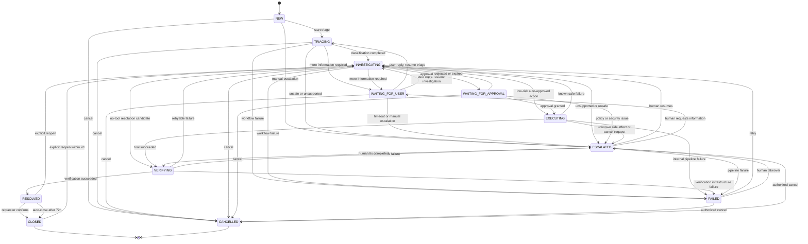

# OpsMind Ticket Workflow — 03 State Machine

> **Domain:** Ticket & Business Workflow  
> **Document Type:** Low-Level State Machine Specification  
> **Version:** 1.0  
> **Status:** Proposed for Review  
> **Dependencies:** `01-domain-model/README_EN.md`, `02-business-invariants/README_EN.md`  
> **Recommended Path:** `docs/low-level-design/domains/02-ticket-workflow/03-state-machine/README_EN.md`

---

## 1. Purpose

This document freezes the Ticket Workflow state set, legal transitions, triggers, guards, transaction actions, domain events, integration events, failure behavior, and idempotency behavior.

It directly constrains:

- Ticket Aggregate domain methods
- Application Services
- API command handlers
- RabbitMQ consumers
- Ticket status history
- Transactional outbox
- Optimistic locking
- SLA processing
- Agent Workflow collaboration
- Policy, Approval, Tool, and Verification collaboration
- Unit, integration, and end-to-end tests

Any transition not explicitly allowed here must be rejected.

---

# 2. Frozen Decisions

## SD-001 `REOPENED` Is Not a Persistent Status

`REOPENED` is a domain event rather than a stable Ticket status.

Actual transition:

```text
RESOLVED / CLOSED
→ INVESTIGATING
```

while emitting:

```text
TicketReopened
```

Reasons:

- Reopened describes an action rather than a stable processing stage.
- A reopened Ticket immediately begins a new investigation cycle.
- This avoids a short-lived state that every client must handle.

## SD-002 `FAILED` Is Recoverable

`FAILED` means automation stopped because of a technical problem; it does not mean the user issue is solved.

Allowed:

```text
FAILED → INVESTIGATING
FAILED → ESCALATED
FAILED → CANCELLED
```

Forbidden:

```text
FAILED → RESOLVED
FAILED → CLOSED
```

## SD-003 Terminal States

```text
CLOSED
CANCELLED
```

- CLOSED can be explicitly reopened within the reopen window.
- CANCELLED cannot be reopened in the MVP; a new Ticket is required.

## SD-004 Approval Rejected or Expired

Default:

```text
WAITING_FOR_APPROVAL
→ INVESTIGATING
```

The Agent may propose an alternative or escalate.

## SD-005 Verification Failure

Default:

```text
VERIFYING
→ INVESTIGATING
```

A resolution cycle allows at most:

```text
2 verification failures
```

The third failure or an unsafe result causes:

```text
VERIFYING
→ ESCALATED
```

The active workflow context owns the verification-attempt counter and includes it in the event.

## SD-006 Auto-close

A Ticket remains RESOLVED for:

```text
72 hours
```

with no requester response or reopen, then:

```text
RESOLVED → CLOSED
```

## SD-007 Reopen Window

A CLOSED Ticket may be reopened within:

```text
7 days
```

by the requester or authorized support.

After seven days, create a new Ticket.

A RESOLVED Ticket may be reopened before auto-close.

## SD-008 SLA Pause

```text
WAITING_FOR_USER → SLA PAUSED
WAITING_FOR_APPROVAL → SLA ACTIVE
```

Waiting for approval remains an IT-owned delay.

## SD-009 Reopen Creates a New Cycle

Reopen creates:

```text
new WorkflowId
new Resolution Cycle
new Verification Attempts
new SLA Cycle
```

Previous resolution, workflow, and SLA history remain immutable.

## SD-010 Cancellation During Execution

EXECUTING and VERIFYING do not directly transition to CANCELLED.

- If the Tool has definitely not started, Tool Gateway may revoke it, return to investigation, and then cancel.
- If a side effect occurred or is unknown, transition to ESCALATED.
- Cancellation never hides an external side effect.

---

# 3. State Set

```text
NEW
TRIAGING
INVESTIGATING
WAITING_FOR_USER
WAITING_FOR_APPROVAL
EXECUTING
VERIFYING
RESOLVED
CLOSED
ESCALATED
FAILED
CANCELLED
```

---

# 4. State Categories

## Active

```text
NEW
TRIAGING
INVESTIGATING
WAITING_FOR_USER
WAITING_FOR_APPROVAL
EXECUTING
VERIFYING
ESCALATED
FAILED
```

## Resolution

```text
RESOLVED
```

## Terminal

```text
CLOSED
CANCELLED
```

## Automation-controlled

```text
TRIAGING
INVESTIGATING
EXECUTING
VERIFYING
FAILED
```

## Human-dependent

```text
WAITING_FOR_USER
WAITING_FOR_APPROVAL
ESCALATED
RESOLVED
```

---

# 5. State Definitions

## NEW

Created and persisted, but triage has not started.

Required:

```text
activeWorkflowId == null
pendingAction == null
resolution == null
```

Outgoing:

```text
TRIAGING
CANCELLED
ESCALATED
```

## TRIAGING

Triage is determining category, priority, and route.

Required:

```text
activeWorkflowId != null
resolution == null
```

Outgoing:

```text
INVESTIGATING
WAITING_FOR_USER
FAILED
ESCALATED
CANCELLED
```

## INVESTIGATING

Agents or support are gathering evidence, retrieving knowledge, identifying root cause, and proposing action.

Outgoing:

```text
WAITING_FOR_USER
WAITING_FOR_APPROVAL
EXECUTING
VERIFYING
FAILED
ESCALATED
CANCELLED
```

## WAITING_FOR_USER

Waiting for requester information.

Required:

```text
openUserRequestId != null
resumeStatus in {TRIAGING, INVESTIGATING}
```

SLA:

```text
PAUSED
```

Outgoing:

```text
TRIAGING
INVESTIGATING
CANCELLED
ESCALATED
```

## WAITING_FOR_APPROVAL

Waiting for a decision on a pending action.

Required:

```text
activeWorkflowId != null
pendingAction != null
pendingAction.approvalId != null
```

SLA remains active.

Outgoing:

```text
EXECUTING
INVESTIGATING
CANCELLED
ESCALATED
```

## EXECUTING

Tool Gateway is executing an authorized action or waiting for a deterministic result.

Required:

```text
activeWorkflowId != null
pendingAction != null
toolExecutionId != null
```

Outgoing:

```text
VERIFYING
INVESTIGATING
FAILED
ESCALATED
```

Never directly to RESOLVED, CANCELLED, or CLOSED.

## VERIFYING

Independent verification is checking whether the issue is actually solved.

Required:

```text
verificationId != null
activeWorkflowId != null
```

Outgoing:

```text
RESOLVED
INVESTIGATING
ESCALATED
FAILED
```

## RESOLVED

Verification succeeded; the system believes the issue is solved and waits for confirmation or auto-close.

Required:

```text
resolution != null
resolution.verificationId != null
resolvedAt != null
pendingAction == null
```

Outgoing:

```text
CLOSED
INVESTIGATING
```

## CLOSED

The lifecycle is formally complete.

Required:

```text
resolution != null
closedAt != null
activeWorkflowId == null
pendingAction == null
```

Only explicit reopen within seven days may transition to INVESTIGATING.

## ESCALATED

The Ticket is assigned to a human or higher-authority path.

Required:

```text
escalationTarget != null
escalationReason != null
```

Outgoing:

```text
INVESTIGATING
WAITING_FOR_USER
VERIFYING
FAILED
CANCELLED
```

It cannot directly resolve.

## FAILED

Automation stopped because of a technical failure.

Outgoing:

```text
INVESTIGATING
ESCALATED
CANCELLED
```

## CANCELLED

The Ticket was legally cancelled.

In the MVP it has no outgoing transitions.

---

# 6. High-Level Diagram



---

# 7. Transition Execution Model

Every transition follows:

```text
1. Authenticate actor or validate event source
2. Deduplicate command or event
3. Load Ticket
4. Validate expected version
5. Validate source state
6. Validate transition guards
7. Apply Ticket domain behavior
8. Increment aggregate version
9. Insert TicketStatusHistory
10. Insert additional append-only records
11. Insert Outbox Event
12. Mark inbound event processed
13. Commit
14. Publish asynchronously through Outbox
```

No external calls occur inside the database transaction.

---

# 8. Transition Matrix

| ID | From | To | Trigger |
|---|---|---|---|
| SM-001 | Initial | NEW | CreateTicket |
| SM-002 | NEW | TRIAGING | StartTriage |
| SM-003 | TRIAGING | INVESTIGATING | ClassificationCompleted |
| SM-004 | TRIAGING | WAITING_FOR_USER | UserInputRequired |
| SM-005 | WAITING_FOR_USER | TRIAGING | UserReplied, resume TRIAGING |
| SM-006 | WAITING_FOR_USER | INVESTIGATING | UserReplied, resume INVESTIGATING |
| SM-007 | INVESTIGATING | WAITING_FOR_USER | UserInputRequired |
| SM-008 | INVESTIGATING | WAITING_FOR_APPROVAL | ApprovalRequested |
| SM-009 | INVESTIGATING | EXECUTING | AutoApprovedActionReady |
| SM-010 | INVESTIGATING | VERIFYING | ResolutionCandidateReady |
| SM-011 | WAITING_FOR_APPROVAL | EXECUTING | ApprovalGranted |
| SM-012 | WAITING_FOR_APPROVAL | INVESTIGATING | ApprovalRejected |
| SM-013 | WAITING_FOR_APPROVAL | INVESTIGATING | ApprovalExpired |
| SM-014 | EXECUTING | VERIFYING | ToolExecutionSucceeded |
| SM-015 | EXECUTING | INVESTIGATING | ToolExecutionFailedSafe |
| SM-016 | EXECUTING | FAILED | ExecutionPipelineFailed |
| SM-017 | EXECUTING | ESCALATED | ToolResultUnknown / CancelDuringExecution |
| SM-018 | VERIFYING | RESOLVED | VerificationSucceeded |
| SM-019 | VERIFYING | INVESTIGATING | VerificationFailedRetryable |
| SM-020 | VERIFYING | ESCALATED | VerificationFailedLimitReached |
| SM-021 | VERIFYING | FAILED | VerificationPipelineFailed |
| SM-022 | RESOLVED | CLOSED | RequesterConfirmed |
| SM-023 | RESOLVED | CLOSED | AutoCloseTimeout |
| SM-024 | RESOLVED | INVESTIGATING | ReopenRequested |
| SM-025 | CLOSED | INVESTIGATING | ReopenRequestedWithinWindow |
| SM-026 | Cancellable active state | CANCELLED | CancelRequested |
| SM-027 | TRIAGING / INVESTIGATING | FAILED | AgentWorkflowFailed |
| SM-028 | FAILED | INVESTIGATING | RetryApproved |
| SM-029 | FAILED | ESCALATED | EscalationRequired |
| SM-030 | ESCALATED | INVESTIGATING | HumanResume |
| SM-031 | ESCALATED | WAITING_FOR_USER | HumanRequestsInput |
| SM-032 | ESCALATED | VERIFYING | HumanFixCompleted |
| SM-033 | Eligible active state | ESCALATED | EscalateRequested |
| SM-034 | NEW | ESCALATED | ManualIntakeEscalation |

---

# 9. Detailed Transitions

## SM-001 Initial → NEW

Trigger:

```text
CreateTicketCommand
```

Actors:

```text
EMPLOYEE
IT_SUPPORT
AUTHORIZED_SERVICE
```

Guards:

- BI-001 through BI-008
- Valid Idempotency-Key
- Requester exists
- Payload passes validation

Transaction:

```text
Insert Ticket
Insert initial history
Insert initial SLA cycle
Insert ticket.created Outbox Event
Insert idempotency record
```

Events:

```text
TicketCreated
ticket.created.v1
```

Same requester, key, and payload return the original Ticket. Different payload with the same key returns `IDEMPOTENCY_KEY_REUSED`.

## SM-002 NEW → TRIAGING

Trigger:

```text
StartTriageCommand
or agent.workflow.started
```

Guards:

- BI-017 through BI-021
- No active workflow
- Workflow belongs to Ticket
- Ticket is not terminal

Actions:

```text
associate activeWorkflowId
status = TRIAGING
```

Events:

```text
TicketStatusChanged
ticket.triaging_started.v1
```

## SM-003 TRIAGING → INVESTIGATING

Trigger:

```text
ticket.classification.completed
```

Guards:

- BI-008, BI-009, BI-019
- Classification belongs to active workflow
- Category and subcategory match
- Confidence passes threshold or has human override

Actions:

```text
set category
set subcategory
set priority
status = INVESTIGATING
```

Events:

```text
TicketClassified
ticket.classified.v1
ticket.investigation_ready.v1
```

## SM-004 TRIAGING → WAITING_FOR_USER

Trigger:

```text
agent.user_input_required
```

Guards:

- BI-023
- Workflow matches
- RequestId and reason exist
- Resume state is TRIAGING

Actions:

```text
status = WAITING_FOR_USER
store open request
pause SLA
```

## SM-005 WAITING_FOR_USER → TRIAGING

Trigger:

```text
UserReplyCommand
```

Guards:

- BI-024 through BI-027
- RequestId matches
- Resume target is TRIAGING
- Actor is requester or authorized support

Transaction:

```text
Insert TicketMessage
Update Ticket
Clear open request
Resume SLA
Insert history
Insert Outbox Event
```

## SM-006 WAITING_FOR_USER → INVESTIGATING

Same as SM-005 with resume target INVESTIGATING.

## SM-007 INVESTIGATING → WAITING_FOR_USER

Trigger:

```text
agent.user_input_required
or SupportRequestUserInputCommand
```

Guards:

- Open request is complete
- Workflow matches
- No conflicting pending action

SLA becomes PAUSED.

## SM-008 INVESTIGATING → WAITING_FOR_APPROVAL

Trigger:

```text
approval.requested
```

Guards:

- BI-028 through BI-035
- One pending action
- Action belongs to active workflow
- Approval reference exists
- Ticket is active

Actions:

```text
store PendingActionReference
status = WAITING_FOR_APPROVAL
```

SLA remains ACTIVE.

## SM-009 INVESTIGATING → EXECUTING

Trigger:

```text
policy.action_auto_approved
```

Use only for explicitly low-risk actions.

Guards:

- BI-028 through BI-031
- BI-040 through BI-044
- Policy decision is AUTO_APPROVED
- No existing execution

Actions:

```text
store pending action
store toolExecutionId
status = EXECUTING
```

## SM-010 INVESTIGATING → VERIFYING

Trigger:

```text
agent.resolution_candidate_ready
```

Used for no-tool resolutions such as user guidance or read-only findings.

Guards:

- Workflow matches
- Resolution candidate exists
- No unresolved pending action
- Verification request exists

## SM-011 WAITING_FOR_APPROVAL → EXECUTING

Trigger:

```text
approval.granted
```

Applicable invariants:

```text
BI-032
BI-033
BI-034
BI-035
BI-036
BI-038
BI-040
BI-043
BI-044
```

Guards:

- Ticket, workflow, action, and type match
- Approval is not expired
- Pending action remains active
- ToolExecutionId is reserved

Duplicate approval is idempotent.

## SM-012 WAITING_FOR_APPROVAL → INVESTIGATING

Trigger:

```text
approval.rejected
```

The pending action is invalidated and investigation resumes.

## SM-013 WAITING_FOR_APPROVAL → INVESTIGATING

Trigger:

```text
approval.expired
```

Expired approval is cleared and cannot be reused.

## SM-014 EXECUTING → VERIFYING

Trigger:

```text
tool.execution.completed
result = SUCCESS
```

Guards:

- BI-041, BI-042, BI-045, BI-048 through BI-051
- Execution matches current action and workflow
- Verification request exists

Tool success never publishes `ticket.resolved`.

## SM-015 EXECUTING → INVESTIGATING

Trigger:

```text
tool.execution.failed
resultCertainty = KNOWN_NO_SIDE_EFFECT
```

The failure is recorded, the action is invalidated, and investigation resumes.

## SM-016 EXECUTING → FAILED

Trigger:

```text
execution.pipeline.failed
```

Used only for technical failure with no unknown external side effect.

## SM-017 EXECUTING → ESCALATED

Trigger:

```text
tool.execution.result_unknown
or CancelRequestedDuringExecution
```

Guards:

- BI-046, BI-069, BI-073 through BI-075
- Blind retry is unsafe

Execution references remain as evidence.

## SM-018 VERIFYING → RESOLVED

Trigger:

```text
verification.completed
result = SUCCESS
```

Guards:

- BI-048 through BI-055
- Verification matches Ticket, workflow, and latest attempt
- Evidence is complete
- No unresolved pending action

Actions:

```text
create resolution
status = RESOLVED
clear pending action
complete workflow
schedule auto-close at +72h
mark SLA cycle MET
```

## SM-019 VERIFYING → INVESTIGATING

Trigger:

```text
verification.completed
result = FAILURE
attemptCount <= 2
```

Used for retryable failure with no safety concern.

## SM-020 VERIFYING → ESCALATED

Trigger:

```text
verification failure with attemptCount > 2
or unsafe/contradictory result
```

## SM-021 VERIFYING → FAILED

Trigger:

```text
verification.pipeline.failed
```

Used for infrastructure failure when the verification outcome is unknown.

## SM-022 RESOLVED → CLOSED

Trigger:

```text
ConfirmResolutionCommand
```

Actor is requester or authorized support.

Actions:

```text
status = CLOSED
closedAt = now
closeReason = REQUESTER_CONFIRMED
activeWorkflowId = null
```

## SM-023 RESOLVED → CLOSED

Trigger:

```text
AutoCloseScheduler
```

Guards:

- RESOLVED for at least 72 hours
- No requester activity or accepted reopen
- Expected version matches

Stable job key:

```text
auto-close:{ticketId}:{resolutionCycleId}
```

## SM-024 RESOLVED → INVESTIGATING

Trigger:

```text
ReopenTicketCommand
```

Guards:

- BI-061 through BI-066
- Authorized actor and reason
- New WorkflowId
- No pending action

Actions:

```text
archive previous cycle
create new workflow and SLA cycle
reset verification attempts
status = INVESTIGATING
```

Events:

```text
TicketReopened
ticket.reopened.v1
```

## SM-025 CLOSED → INVESTIGATING

Same as SM-024, but only within seven days after close.

Otherwise return:

```text
REOPEN_WINDOW_EXPIRED
```

## SM-026 Cancellable Active State → CANCELLED

Allowed sources:

```text
NEW
TRIAGING
INVESTIGATING
WAITING_FOR_USER
WAITING_FOR_APPROVAL
FAILED
ESCALATED
```

Guards:

- BI-067 through BI-071
- Authorized actor
- Reason
- No uncertain tool execution

Actions:

```text
invalidate pending action
request workflow cancellation
cancel SLA cycle
status = CANCELLED
```

Forbidden from EXECUTING, VERIFYING, RESOLVED, CLOSED, or CANCELLED.

## SM-027 TRIAGING / INVESTIGATING → FAILED

Trigger:

```text
agent.workflow.failed
```

The workflow must match and no unknown side effect may exist.

## SM-028 FAILED → INVESTIGATING

Trigger:

```text
RetryAutomationCommand
```

Requires available retry budget and valid workflow path.

## SM-029 FAILED → ESCALATED

Used when retry budget is exhausted or human takeover is required.

## SM-030 ESCALATED → INVESTIGATING

Authorized human resumes investigation with preserved context.

## SM-031 ESCALATED → WAITING_FOR_USER

Human support requests additional information.

MVP resumes to INVESTIGATING after reply.

## SM-032 ESCALATED → VERIFYING

A human fix was completed, but independent verification is still required.

## SM-033 Eligible Active State → ESCALATED

Requires target, reason, and preserved context.

## SM-034 NEW → ESCALATED

Used for direct manual intake or issues that immediately require a privileged team.

---

# 10. Illegal Transitions

| From | To | Reason |
|---|---|---|
| NEW | RESOLVED | No investigation or verification |
| TRIAGING | EXECUTING | No completed investigation or policy decision |
| WAITING_FOR_USER | EXECUTING | Investigation has not resumed |
| WAITING_FOR_APPROVAL | RESOLVED | No execution or verification |
| EXECUTING | RESOLVED | Tool success is not resolution |
| VERIFYING | CLOSED | Must pass through RESOLVED |
| FAILED | RESOLVED | Failure is not resolution |
| ESCALATED | RESOLVED | Verification is still required |
| CLOSED | EXECUTING | Explicit reopen required |
| CANCELLED | Any | CANCELLED is permanent in the MVP |
| RESOLVED | CANCELLED | Close or reopen instead |
| EXECUTING | CANCELLED | Side-effect risk |
| VERIFYING | CANCELLED | Result confirmation already underway |

Return:

```text
INVALID_STATE_TRANSITION
```

---

# 11. State Transition Result

Recommended domain result:

```text
StateTransitionResult
├── fromStatus
├── toStatus
├── reasonCode
├── occurredAt
├── domainEvents
└── changed
```

An idempotent duplicate may return `changed = false` only when the same business effect already occurred.

---

# 12. Domain Method Mapping

| Transition | Domain Method |
|---|---|
| NEW → TRIAGING | `startTriaging(workflowId, actor, now)` |
| TRIAGING → INVESTIGATING | `completeClassification(classification, now)` |
| Active → WAITING_FOR_USER | `requestUserInput(requestRef, resumeStatus, now)` |
| WAITING_FOR_USER → Active | `resumeAfterUserReply(messageId, now)` |
| INVESTIGATING → WAITING_FOR_APPROVAL | `waitForApproval(actionRef, now)` |
| Approval → EXECUTING | `authorizeExecution(approvalRef, executionId, now)` |
| EXECUTING → VERIFYING | `startVerification(toolResult, verificationId, now)` |
| VERIFYING → RESOLVED | `resolve(evidence, resolution, now)` |
| RESOLVED → CLOSED | `close(reason, actor, now)` |
| RESOLVED/CLOSED → INVESTIGATING | `reopen(reason, actor, newWorkflowId, now)` |
| Active → CANCELLED | `cancel(reason, actor, now)` |
| Active → ESCALATED | `escalate(target, reason, actor, now)` |
| Automation → FAILED | `markAutomationFailed(failureRef, now)` |

---

# 13. Status History

Each record contains:

```text
historyId
ticketId
fromStatus
toStatus
reasonCode
actorType
actorId
sourceCommandId?
sourceEventId?
workflowId?
aggregateVersion
occurredAt
```

Rules:

- Append-only
- Same transaction as Ticket
- fromStatus matches actual previous state
- aggregateVersion matches the new Ticket version
- Idempotent duplicates do not add history

---

# 14. Outbox Events

Every successful transition emits at least:

```text
ticket.status_changed.v1
```

and may emit:

```text
ticket.resolved.v1
ticket.closed.v1
ticket.cancelled.v1
ticket.reopened.v1
ticket.escalated.v1
```

Outbox records contain correlation and aggregate version metadata.

---

# 15. Idempotency and Ordering

## Duplicate Event

Unique key:

```text
consumer_name + event_id
```

A duplicate returns idempotent success with no second state change, history, or outbox record.

## Stale Event

An old Workflow, Action, or Attempt event returns:

```text
STALE_EVENT
```

## Out-of-order Event

Use bounded retry, reconciliation, and DLQ. Never bypass the state machine.

---

# 16. Optimistic Concurrency

Every update uses expected version.

```sql
UPDATE ticket.tickets
SET status = :newStatus,
    version = version + 1,
    updated_at = :updatedAt
WHERE ticket_id = :ticketId
  AND version = :expectedVersion;
```

After conflict:

```text
Reload
→ determine whether already applied
→ re-evaluate guards
→ idempotent success, retry, or reject
```

---

# 17. Concurrent Races

## Cancel vs. Approval Granted

If cancel commits first, approval becomes stale.

If approval commits first and Ticket enters EXECUTING, direct cancellation is forbidden; execution state is evaluated and may escalate.

## Reopen vs. Auto-close

If reopen commits first, auto-close fails expected-version validation.

If auto-close commits first, reopen may still succeed within the seven-day window.

## Verification Success vs. Cancel

VERIFYING cannot directly cancel. Successful verification resolves the Ticket.

---

# 18. SLA Mapping

| Ticket Status | SLA |
|---|---|
| NEW | ACTIVE |
| TRIAGING | ACTIVE |
| INVESTIGATING | ACTIVE |
| WAITING_FOR_USER | PAUSED |
| WAITING_FOR_APPROVAL | ACTIVE |
| EXECUTING | ACTIVE |
| VERIFYING | ACTIVE |
| RESOLVED | MET |
| CLOSED | MET |
| ESCALATED | ACTIVE |
| FAILED | ACTIVE |
| CANCELLED | CANCELLED |

Reopen creates a new SLA cycle.

---

# 19. Auto-close Scheduler

Conditions:

```text
status = RESOLVED
resolvedAt <= now - 72h
no accepted reopen
no requester activity after resolvedAt
```

The scheduler uses pagination, expected version, stable idempotency keys, short transactions, and safe conflict retry.

---

# 20. Reopen Cycle

Every reopen creates:

```text
resolutionCycleId
workflowId
slaCycleId
verificationAttemptCounter = 0
```

Previous resolution, verification, workflow, close information, and SLA remain historical.

---

# 21. Failure Handling

- RabbitMQ unavailable: Ticket and Outbox remain committed; publisher retries.
- Outbox insert failure: transition rolls back.
- Agent Workflow failure: FAILED or ESCALATED.
- Unknown Tool result: ESCALATED.
- Verification infrastructure failure: FAILED.
- Telemetry failure: does not affect Ticket state.

---

# 22. Security by Transition

| Transition | Minimum Authority |
|---|---|
| Create | Authenticated Employee / Support |
| Cancel | Requester or authorized Support |
| Reopen RESOLVED | Requester or Support |
| Reopen CLOSED | Requester or Support within window |
| Assign / Escalate | Support |
| Manual Close | Requester confirmation or Support |
| Approval transitions | Trusted service event |
| Tool-result transitions | Trusted Tool Gateway event |
| Verification transitions | Trusted Verification event |
| Retry FAILED | Support or bounded system policy |

Domain validates business eligibility; Spring Security validates identity and permission.

---

# 23. Observability

Transition span:

```text
ticket.state_transition
```

Attributes:

```text
ticket.status.from
ticket.status.to
ticket.transition.id
ticket.transition.reason
ticket.aggregate.version
ticket.workflow.id
event.id
command.id
```

Metrics:

```text
ticket_state_transition_total
ticket_state_transition_failed_total
ticket_invalid_transition_total
ticket_stale_event_total
ticket_out_of_order_event_total
ticket_reopen_total
ticket_auto_close_total
ticket_verification_retry_total
ticket_escalation_total
```

Ticket and requester IDs are not Prometheus labels.

---

# 24. Testing Requirements

Every transition tests:

- Successful path
- Invalid source
- Missing guard
- Duplicate command/event
- Stale workflow/action/attempt
- Optimistic-lock conflict
- Atomic history and outbox

Critical tests:

```text
shouldNotResolveWithoutVerification
shouldNotExecuteWithExpiredApproval
shouldNotApplyApprovalFromOldWorkflow
shouldNotResolveFromToolSuccess
shouldEscalateUnknownToolResult
shouldRejectCancelDuringExecution
shouldAutoCloseAfter72Hours
shouldNotAutoCloseAfterReopen
shouldReopenClosedTicketWithinSevenDays
shouldRejectReopenAfterSevenDays
shouldCreateNewWorkflowAndSlaCycleOnReopen
shouldEscalateAfterThirdVerificationFailure
shouldIgnoreLateVerificationFromPreviousCycle
shouldRejectAnyTransitionFromCancelled
```

---

# 25. Acceptance Criteria

- [x] State set frozen
- [x] Terminal states frozen
- [x] REOPENED modeled as an event
- [x] FAILED modeled as recoverable
- [x] Approval rejected/expired path frozen
- [x] Verification retry limit frozen
- [x] Auto-close frozen at 72 hours
- [x] Reopen window frozen at seven days
- [x] SLA pause policy frozen
- [x] Reopen-cycle strategy frozen
- [x] Cancellation-during-execution strategy frozen
- [x] Legal and illegal transitions defined
- [x] History, outbox, idempotency, and concurrency defined
- [x] Security, observability, and testing requirements defined

---

# 26. Next Step

Create:

```text
04-use-cases/README_CN.md
04-use-cases/README_EN.md
```

Every use case must reference:

```text
SM-xxx transition IDs
BI-xxx invariant IDs
```
