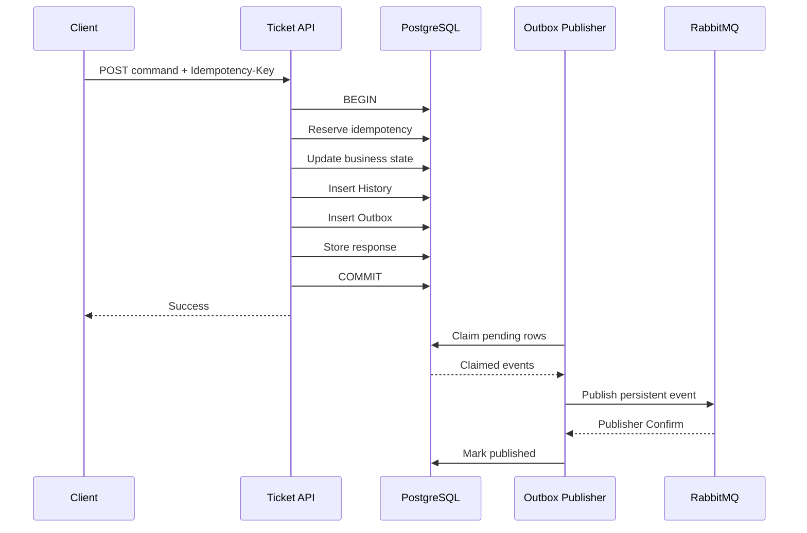
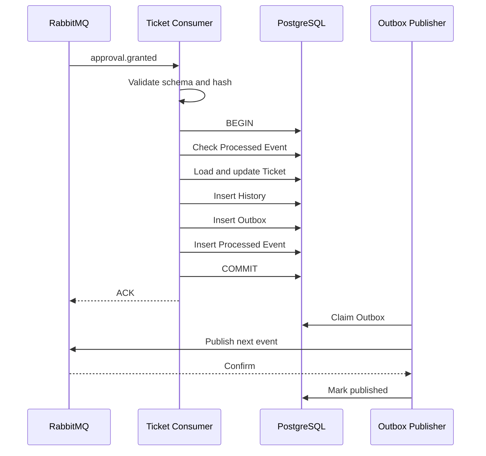

# OpsMind Ticket Workflow — 08 Transaction and Outbox

> **Domain:** Ticket & Business Workflow  
> **Document Type:** Low-Level Transaction and Reliable Messaging Design  
> **Version:** 1.0  
> **Status:** Proposed for Review  
> **Dependencies:** `04-use-cases_EN.md`, `06-event-contracts_EN.md`, `07-data-model_EN.md`  
> **Database:** PostgreSQL 18.x  
> **Message Broker:** RabbitMQ  
> **Transaction Model:** Local ACID Transaction + Transactional Outbox + Idempotent Consumer  
> **Recommended Path:** `System Design/Lower Structure Design_1.0/02-Ticket-Workflow/08-transaction-and-outbox_EN.md`

---

## 1. Purpose

This document defines transaction consistency across Ticket business state, lifecycle history, inbound-event deduplication, and outbound events.

It freezes:

- Local transaction boundaries
- Command and event-consumer transaction templates
- Transactional Outbox writes
- Outbox Publisher lifecycle
- `FOR UPDATE SKIP LOCKED`
- Publisher confirms
- Publish retry
- Crash recovery
- Processed Event Store
- API idempotency records
- Optimistic locking
- Deadlock and serialization-failure handling
- Scheduler transaction patterns
- Database isolation
- Outbox cleanup
- Failure classification
- Observability
- Chaos and integration testing

Core guarantees:

```text
Business state cannot commit while its event is lost.
An event cannot be marked processed while its business update is missing.
Duplicate events cannot repeat business side effects.
Duplicate outbox publication cannot advance Ticket state twice.
```

---

# 2. Transaction Boundary Principles

## 2.1 A Transaction Covers One Service's Data

Ticket Workflow transactions modify only:

```text
ticket.*
```

They do not directly modify Agent, Approval, Tool, Memory, or Evaluation data.

Cross-domain work uses REST commands or versioned events.

## 2.2 No Remote Calls Inside Database Transactions

Transactions do not call:

- RabbitMQ
- Agent Runtime
- LLMs
- LangSmith
- Tool Gateway
- Keycloak Admin API
- Duo or Okta
- MinIO
- Notification Service
- External HTTP APIs

Remote calls increase lock duration and cannot participate in PostgreSQL ACID semantics.

## 2.3 Business State and Outbox Commit Together

Every business change that other services must observe performs:

```text
Update Business State
+
Insert History
+
Insert Outbox Event
+
Commit
```

Direct publish after commit is forbidden because a crash can lose the event.

## 2.4 Inbound Event and Processed Event Commit Together

An event consumer performs:

```text
Apply Business Change
+
Insert History
+
Insert Outbox Event
+
Insert Processed Event
+
Commit
```

The event is never marked processed in a separate earlier transaction.

## 2.5 Transactions Remain Short

A transaction performs only necessary reads, guard validation, aggregate updates, history, outbox, and idempotency writes.

It excludes LLM inference, retrieval, document processing, and external calls.

---

# 3. Consistency Model

OpsMind does not use XA or two-phase commit.

It uses:

```text
PostgreSQL Local ACID
+
Transactional Outbox
+
RabbitMQ At-least-once Delivery
+
Idempotent Consumer
+
Optimistic Concurrency
```

| Scenario | Guarantee |
|---|---|
| Ticket update and Outbox write | Atomic |
| Ticket update and History | Atomic |
| Event processing and Processed Event | Atomic |
| RabbitMQ publication | At least once |
| Consumer business effect | Effectively once |
| Cross-service workflow | Eventually consistent |
| Global exactly once | Not promised |

---

# 4. PostgreSQL Isolation Level

## 4.1 Default

The MVP uses:

```text
READ COMMITTED
```

Ticket concurrency is protected by aggregate versioning, unique constraints, and partial unique indexes.

## 4.2 Explicit Row Locks

`FOR UPDATE SKIP LOCKED` is used for infrastructure claiming:

- Outbox rows
- Cleanup jobs
- Optional scheduler claims

Business Ticket commands prefer optimistic locking.

## 4.3 No Global SERIALIZABLE Mode

Global serializable isolation is rejected because it increases retries and does not replace business idempotency or solve cross-service exactly-once behavior.

---

# 5. Standard Command Transaction Template

Used for create, message, cancel, reopen, confirm, assignment, escalation, and retry:

```text
BEGIN

1. Reserve or validate Idempotency Record
2. Load Ticket Aggregate
3. Validate authorization result
4. Validate If-Match / Expected Version
5. Execute Domain Behavior
6. Persist Ticket and related aggregates
7. Insert lifecycle or domain history
8. Insert one or more Outbox Events
9. Complete Idempotency Record
10. COMMIT

Return response
```

Any failure rolls back all writes.

---

# 6. Standard Event Consumer Transaction

```text
Receive RabbitMQ message

Outside transaction:
1. Validate content type
2. Parse JSON
3. Validate envelope schema
4. Validate payload schema
5. Compute canonical payload hash
6. Continue trace context

BEGIN

7. Check Processed Event Store
8. Compare hash when duplicate
9. Load Ticket
10. Validate Workflow, Action, Attempt, and source state
11. Apply Domain Behavior
12. Persist Ticket
13. Insert History
14. Insert Outbox Events
15. Insert Processed Event Record
16. COMMIT

After commit:
17. ACK RabbitMQ message
```

A failed transaction is rolled back before NACK or retry.

---

# 7. API Idempotency Transaction

## Actor Scope

Suggested scope:

```text
authenticated subject or client
+
operation family
```

Examples:

```text
user:user-123:createTicket
user:user-123:cancelTicket
service:agent-runtime:startTriage
```

## Request Hash

```text
SHA-256(
  HTTP method
  + normalized route
  + canonical request body
  + actor scope
)
```

Trace IDs, timestamps, JWTs, and header ordering are excluded.

## Reservation

```sql
INSERT INTO ticket.idempotency_records (...)
VALUES (...)
ON CONFLICT DO NOTHING;
```

Results:

- New row: continue with `IN_PROGRESS`.
- Same hash and `COMPLETED`: return stored response.
- Different hash: `IDEMPOTENCY_KEY_REUSED`.
- Active `IN_PROGRESS`: return `REQUEST_IN_PROGRESS`.
- Stale `IN_PROGRESS`: apply recovery policy.

## Atomicity

Idempotency record, business update, history, outbox, and stored response commit in one PostgreSQL transaction.

---

# 8. Create Ticket Transaction

```text
BEGIN

INSERT idempotency_record(IN_PROGRESS)
INSERT tickets
INSERT resolution_cycle
INSERT sla_cycle
INSERT status_history
INSERT ticket.created outbox event
UPDATE idempotency_record(COMPLETED, response)

COMMIT
```

Any failure in cycle, history, outbox, or response storage rolls back the whole operation.

---

# 9. Ticket Transition Transaction

```text
BEGIN

Load Ticket
Validate expected version
Apply Domain Transition

UPDATE tickets
  WHERE ticket_id = ?
    AND version = expectedVersion

INSERT status_history
INSERT optional domain history
INSERT ticket.status_changed outbox event
INSERT optional specific business event

COMMIT
```

Required equality:

```text
Ticket.version after update
==
StatusHistory.aggregateVersion
==
Outbox.aggregateVersion
```

---

# 10. Event-driven Transition Transaction

Example: `approval.granted`

```text
BEGIN

Check processed event
If duplicate, compare payload hash

Load Ticket
Validate WAITING_FOR_APPROVAL
Validate workflow, action, approval, and expiration

Update pending action
Update Ticket to EXECUTING using expected version
Insert status history
Insert ticket.execution_ready outbox event
Insert processed event(APPLIED)

COMMIT
ACK
```

No partial records are allowed.

---

# 11. Processed Event Semantics

## APPLIED

The event successfully changes business state.

## DUPLICATE

The same EventId was already processed. The existing record remains authoritative; the consumer reports duplicate metrics and ACKs.

## STALE

The event belongs to an old workflow, action, attempt, or cycle.

The consumer may commit a `STALE` result and ACK.

## REJECTED_BUSINESS_RULE

The event is structurally valid but current business state does not allow it.

Examples:

- Expired approval
- Cancelled Ticket
- Late event for a closed Ticket

## Same EventId, Different Payload

A different payload hash triggers rollback, immediate DLQ, and a security alert.

---

# 12. Outbox Record Lifecycle

## Pending

```text
published_at IS NULL
locked_at IS NULL
available_at <= now()
```

## Claimed

```text
published_at IS NULL
locked_at IS NOT NULL
locked_by IS NOT NULL
```

## Delayed

```text
published_at IS NULL
available_at > now()
```

## Published

```text
published_at IS NOT NULL
```

After the maximum attempt count, the row remains unpublished, is delayed, and triggers an alert. It is never silently discarded.

---

# 13. Outbox Publisher Architecture

Suggested components:

```text
OutboxPublisherScheduler
OutboxClaimRepository
RabbitEventPublisher
PublisherConfirmTracker
OutboxPublishResultRepository
OutboxMetrics
```

Recommended MVP configuration:

```text
pollInterval = 1 second
batchSize = 100
lockTimeout = 5 minutes
maxPublishAttempts = 10
```

The publisher claims rows, publishes outside the claim transaction, waits for confirms, and records results in a short follow-up transaction.

---

# 14. Claiming Outbox Rows

## Transaction A: Claim

```sql
BEGIN;

WITH candidate AS (
    SELECT outbox_id
    FROM ticket.outbox_events
    WHERE published_at IS NULL
      AND available_at <= now()
      AND (
          locked_at IS NULL
          OR locked_at < now() - interval '5 minutes'
      )
    ORDER BY created_at, outbox_id
    FOR UPDATE SKIP LOCKED
    LIMIT :batch_size
)
UPDATE ticket.outbox_events o
SET
    locked_by = :publisher_instance_id,
    locked_at = now()
FROM candidate c
WHERE o.outbox_id = c.outbox_id
RETURNING o.*;

COMMIT;
```

## Publish Outside the Transaction

Publish claimed events and wait for RabbitMQ confirms without holding database row locks.

## Transaction B: Mark Success or Failure

Success sets `published_at` and clears lock fields.

Failure increments attempts, sets `available_at`, stores a standard error code, and releases the lock.

---

# 15. Publisher Confirms

RabbitMQ publishing enables:

```text
Publisher Confirms
Mandatory Publishing
Persistent Delivery Mode
```

An outbox row is marked published only after broker ACK.

NACK, returned messages, or confirm timeout leave the row unpublished and eligible for retry.

Confirm tracking uses:

```text
publisher sequence number
eventId
outboxId
```

A confirm timeout is treated as an unknown result and may cause duplicate publication. Consumers absorb duplicates through EventId idempotency.

---

# 16. Publish Retry

Recommended exponential backoff with jitter:

```text
1s
5s
15s
1m
5m
15m
```

Maximum delay:

```text
15 minutes
```

Retry decisions:

| Error | Retry |
|---|---|
| Broker unavailable | yes |
| Confirm timeout | yes |
| Broker NACK | yes |
| Unroutable mandatory message | alert, no infinite retry |
| Invalid local schema | no |
| Serialization bug | no |
| Authentication failure | limited retry and alert |

---

# 17. Unroutable Messages

Publishing uses `mandatory = true`.

If no queue matches the routing key:

```text
last_publish_error_code = UNROUTABLE_MESSAGE
published_at remains null
Critical alert is raised
```

The event is replayed after topology correction.

---

# 18. Crash Recovery Matrix

## Before Commit

All Ticket, history, processed-event, and outbox changes roll back.

## Commit After HTTP Response Is Lost

The client retries with the same Idempotency-Key and receives the stored response.

## Crash After Claim, Before Publish

The lock expires and another publisher claims the row.

## Broker Received, Confirm Missing

The row remains unpublished and may be published again.

## Confirmed, Before Marking Published

The same EventId may be published again.

## Consumer Crash Before Commit

No ACK; transaction rolls back; broker redelivers.

## Consumer Commit, Before ACK

Broker redelivers; Processed Event Store detects a duplicate.

## Ticket Update Succeeds but Outbox Insert Fails

The transaction rolls back.

---

# 19. Optimistic Locking

API commands use `If-Match`.

Event consumers update using the currently loaded aggregate version.

After conflict:

```text
Rollback
Reload Ticket
Check whether already applied
Re-evaluate guards
Return idempotent success, retry, stale, or reject
```

Blind retries are forbidden.

Maximum application-level optimistic-lock retries:

```text
3
```

with short jittered backoff.

---

# 20. Deadlocks and Transient Database Failures

Recognized PostgreSQL SQLSTATE values include:

```text
40P01 deadlock_detected
40001 serialization_failure
55P03 lock_not_available
08006 connection_failure
```

Handling:

- Roll back.
- Preserve the same Command ID or Event ID.
- Reload current state.
- Retry at most three times.
- Do not retry constraint violations or business-rule failures.

---

# 21. Transaction Timeouts

Recommended:

```text
Command transaction = 3 seconds
Event consumer transaction = 5 seconds
Outbox claim transaction = 2 seconds
Publish-result update = 2 seconds
Scheduler item transaction = 3 seconds
```

Timeouts roll back and follow failure classification.

---

# 22. Spring Transaction Propagation

Recommended:

```text
Application use-case method
@Transactional
```

Rules:

- Default propagation is `REQUIRED`.
- Domain entities do not carry transaction annotations.
- History and Outbox join the same transaction.
- `REQUIRES_NEW` is not used to write Outbox after business commit.
- Publisher execution is independent from business transactions.

---

# 23. Event Construction Timing

```text
Domain Behavior
→ Domain Event
→ Integration Event Mapper
→ JSON Schema Validation
→ Insert Outbox
```

Schema-validation failure rolls back the business transaction because the system must not commit a change that cannot produce a valid integration event.

---

# 24. Multiple Events in One Transaction

A transaction may generate:

```text
ticket.status_changed
ticket.resolved
ticket.notification_requested
```

Each outbox row carries:

```text
aggregate_version
sequence
```

The sequence starts at zero within the transaction.

Publishers preserve a reasonable order, but consumers still validate state and references.

---

# 25. Scheduler Transactions

Applies to auto-close, SLA scans, cleanup, and integrity checks.

Candidate IDs are selected in pages.

Each Ticket is processed in an independent short transaction:

```text
Reload current Ticket
Revalidate due condition and version
Apply transition
Insert history
Insert outbox
Commit
```

One failing Ticket does not block the batch.

Auto-close idempotency key:

```text
auto-close:{ticketId}:{resolutionCycleId}
```

---

# 26. Reopen and Auto-close Race

If reopen commits first, auto-close fails expected-version validation and stops after reload.

If auto-close commits first, reopen may still proceed from CLOSED within the seven-day window.

No distributed lock is required.

---

# 27. Cancel and Approval Race

If cancel commits first, the pending action is invalidated and the late approval is recorded as stale or rejected.

If approval commits first, the Ticket enters EXECUTING and direct cancellation is no longer allowed.

Optimistic locking selects the single legal winner.

---

# 28. Verification from an Old Cycle

After reopen, the Ticket has a new workflow, cycle, and verification attempt.

A late verification event from the previous cycle is recorded as stale and ACKed without modifying current state.

---

# 29. Outbox Cleanup

Only published rows older than 30 days are deleted.

Deletion occurs in small batches.

Unpublished rows are never automatically deleted.

---

# 30. Processed Event Cleanup

Recommended retention:

```text
90 days
```

Long-term broker replay requires longer retention or an archive strategy.

---

# 31. Idempotency Record Recovery

An `IN_PROGRESS` record older than the configured threshold is reconciled:

1. Check the related resource.
2. Check matching history and outbox rows.
3. If business commit occurred, reconstruct and store the response.
4. If no commit occurred, mark retryable or release the reservation.
5. Never infer failure from elapsed time alone.

---

# 32. Failure Classification

| Failure | Transaction | Broker | Client |
|---|---|---|---|
| Validation | no business transaction | N/A | 400 |
| Authorization | no business transaction | N/A | 403 |
| Invalid state | rollback or no update | ACK for late event | 422 |
| Optimistic conflict | rollback | retry or stale | 412 |
| Database unavailable | rollback | retry | 503 |
| Outbox insert failure | rollback | retry event | 500/503 |
| Broker unavailable | business commit remains | outbox retry | command succeeds |
| Invalid event schema | no DB change | DLQ | N/A |
| Duplicate event | no second change | ACK | N/A |
| Reused EventId with different payload | no change | DLQ and alert | N/A |

---

# 33. Observability

Transaction span:

```text
ticket.transaction
```

Attributes:

```text
opsmind.use_case_id
opsmind.transaction_type
opsmind.ticket_status_before
opsmind.ticket_status_after
opsmind.aggregate_version_before
opsmind.aggregate_version_after
db.transaction.retry_count
```

Outbox spans:

```text
ticket.outbox.claim
ticket.outbox.publish
ticket.outbox.mark_published
```

Metrics include transaction rollbacks, optimistic conflicts, deadlocks, outbox backlog, publish failures, duplicate events, and stale events.

Ticket, workflow, event, and idempotency identifiers are not metric labels.

---

# 34. Alerts

Critical examples:

```text
oldest pending outbox age > 300 seconds
unroutable message > 0
EventId reused with different payload > 0
continuously growing outbox backlog
```

Warnings include high publish-failure rate, unusual optimistic conflicts, stale-event spikes, and stale `IN_PROGRESS` idempotency records.

---

# 35. Security

- Outbox payloads are redacted before insertion.
- Logs do not print complete payloads.
- Publisher uses dedicated RabbitMQ credentials.
- Replay records operator identity and audit data.
- Manual updates of `published_at` are prohibited.
- Standard error codes are stored instead of raw credential-bearing messages.

---

# 36. Integration Tests

```text
shouldCommitTicketHistoryAndOutboxAtomically
shouldRollbackTicketWhenOutboxInsertFails
shouldRollbackProcessedEventWhenTicketUpdateFails
shouldReturnStoredResponseAfterCommitBeforeHttpResponseCrash
shouldRejectSameIdempotencyKeyWithDifferentPayload
shouldRecoverStaleInProgressIdempotencyRecord

shouldClaimEachOutboxRowByOnlyOnePublisher
shouldReleaseExpiredOutboxLock
shouldNotHoldDatabaseLockWhileWaitingForBrokerConfirm
shouldMarkPublishedOnlyAfterPublisherConfirm
shouldRetryAfterConfirmTimeout
shouldHandleBrokerNack
shouldDetectUnroutableMessage
shouldRepublishSameEventIdAfterPublisherCrash

shouldAckDuplicateEventAfterConsumerCommitBeforeAckCrash
shouldNotApplyDuplicateApprovalGranted
shouldRecordOldWorkflowVerificationAsStale
shouldRetryTransientDatabaseFailure
shouldNotRetryBusinessRuleFailure
shouldResolveCancelApprovalRaceWithOptimisticLock
shouldResolveReopenAutoCloseRaceWithOptimisticLock
```

---

# 37. Chaos Tests

## Broker Down

Create a Ticket while RabbitMQ is unavailable, verify business commit and pending Outbox, restore RabbitMQ, and verify eventual publication.

## Publisher Crash after Publish

Kill the publisher after broker receipt but before marking the row published. Verify duplicate publication and one consumer-side effect.

## Consumer Crash after Commit

Kill the consumer after database commit and before ACK. Verify redelivery and deduplication.

## Database Restart

Restart PostgreSQL during a transition and verify either complete commit or complete rollback, never partial history or outbox data.

---

# 38. HTTP Command Sequence



---

# 39. Inbound Event Sequence



---

# 40. Rejected Alternatives

- Direct RabbitMQ publish after business commit
- Waiting for RabbitMQ inside the database transaction
- XA or two-phase commit
- ACK before database commit
- Processed Event in a separate earlier transaction
- Outbox polling without row claiming
- Marking published before broker confirm
- Redis as the authoritative Processed Event Store

---

# 41. Acceptance Criteria

- [x] Local transaction boundaries defined
- [x] Command transaction template defined
- [x] Event-consumer transaction template defined
- [x] API idempotency transaction defined
- [x] Atomic Ticket, History, and Outbox relationship defined
- [x] Atomic Processed Event relationship defined
- [x] Outbox lifecycle defined
- [x] `FOR UPDATE SKIP LOCKED` claim defined
- [x] Publisher confirms defined
- [x] Publish retry and unroutable handling defined
- [x] Crash-recovery matrix defined
- [x] Optimistic locking and transient database retries defined
- [x] Scheduler transaction model defined
- [x] Cleanup and recovery jobs defined
- [x] Observability, alerts, integration tests, and chaos tests defined

---

# 42. Next Step

Create:

```text
09-concurrency-and-idempotency_CN.md
09-concurrency-and-idempotency_EN.md
```

That document will further freeze command and event deduplication, race-condition decision tables, aggregate-version ordering, stale and out-of-order classification, retry rules, and multi-instance concurrency.
