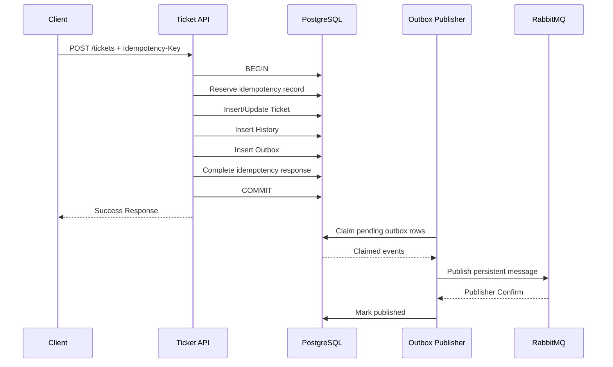
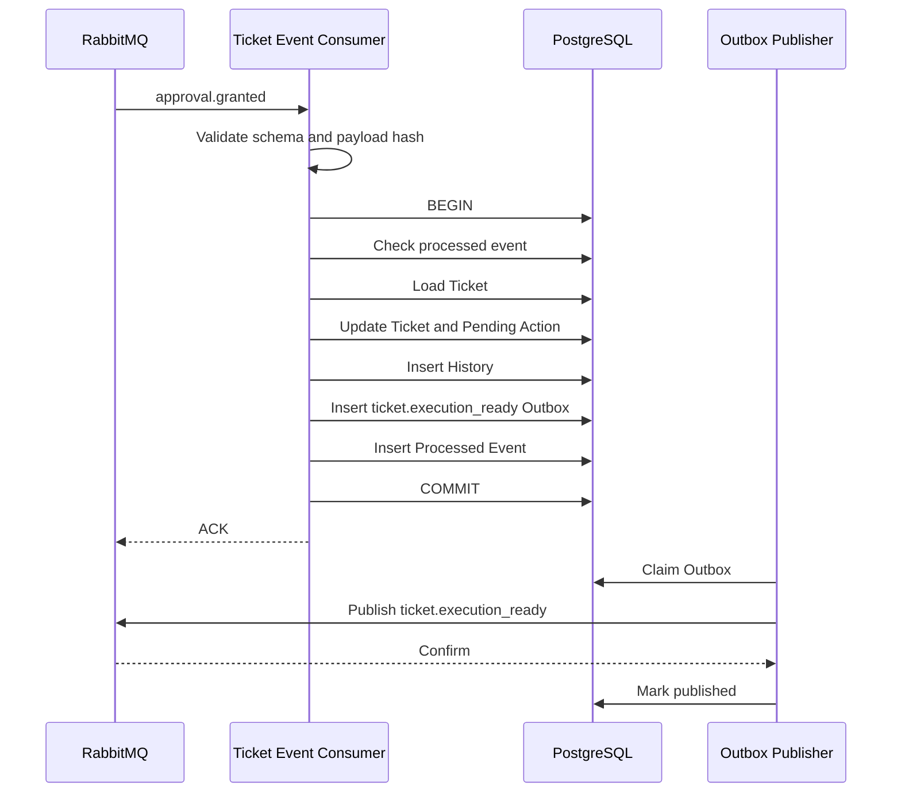

# OpsMind Ticket Workflow — 08 Transaction and Outbox

> **领域：** Ticket & Business Workflow  
> **文档类型：** Low-Level Transaction and Reliable Messaging Design  
> **版本：** 1.0  
> **状态：** Proposed for Review  
> **依赖：** `04-use-cases/README_CN.md`、`06-event-contracts/README_CN.md`、`07-data-model/README_CN.md`  
> **数据库：** PostgreSQL 18.x  
> **消息中间件：** RabbitMQ  
> **事务模型：** Local ACID Transaction + Transactional Outbox + Idempotent Consumer  
> **建议路径：** `docs/low-level-design/domains/02-ticket-workflow/08-transaction-and-outbox/README_CN.md`

---

## 1. 文档目的

本文档定义 Ticket Workflow 中业务数据、状态历史、Inbound Event 去重记录和 Outbound Event 之间的事务一致性。

本文档冻结：

- 本地事务边界
- Command 与 Event Consumer 的事务模板
- Transactional Outbox 写入流程
- Outbox Publisher Lifecycle
- `FOR UPDATE SKIP LOCKED`
- Publisher Confirm
- Publish Retry
- Crash Recovery
- Processed Event Store
- API Idempotency Record
- Optimistic Lock
- Deadlock 与 Serialization Failure 处理
- Scheduler 事务模型
- 数据库 Isolation Level
- Outbox Cleanup
- Failure Matrix
- Observability
- Chaos 与 Integration Test

核心目标：

```text
业务状态不能提交但事件丢失
事件不能标记已处理但业务状态未提交
重复事件不能重复产生业务 Side Effect
Outbox 重复发布不能导致重复状态推进
```

---

# 2. 事务边界原则

## 2.1 一个事务只覆盖一个服务拥有的数据

Ticket Workflow 的数据库事务只能修改：

```text
ticket.*
```

事务内禁止直接修改：

```text
agent.*
approval.*
tool.*
memory.*
evaluation.*
```

跨领域协作使用：

```text
REST Command
或
Versioned Event
```

## 2.2 数据库事务中禁止远程调用

事务内禁止调用：

- RabbitMQ Publish
- Agent Runtime
- LLM
- LangSmith
- Tool Gateway
- Keycloak Admin API
- Duo / Okta
- MinIO
- Notification Service
- External HTTP API

原因：

- 远程调用延长锁持有时间。
- 远程系统无法参与 PostgreSQL ACID Transaction。
- 超时会造成结果不确定。
- 容易形成分布式事务假象。

## 2.3 业务状态与 Outbox 同事务

任何需要通知其他服务的业务变化必须：

```text
Update Business State
+
Insert History
+
Insert Outbox Event
+
Commit
```

不能：

```text
Commit Business State
→ Direct RabbitMQ Publish
```

否则应用在两步之间崩溃时会丢失事件。

## 2.4 Inbound Event 与 Processed Event 同事务

Event Consumer 必须：

```text
Apply Business Change
+
Insert History
+
Insert Outbox Event
+
Insert Processed Event
+
Commit
```

不能先标记 Event Processed，再更新 Ticket。

## 2.5 事务保持短小

事务只执行：

- 必要查询
- Guard 校验
- Aggregate 更新
- History 插入
- Outbox 插入
- Processed Event / Idempotency 更新

不执行长时间计算、LLM 推理、文档检索或外部调用。

---

# 3. 一致性模型

OpsMind 不使用 XA / Two-Phase Commit。

使用：

```text
PostgreSQL Local ACID
+
Transactional Outbox
+
RabbitMQ At-least-once Delivery
+
Idempotent Consumer
+
Optimistic Concurrency
```

提供的保证：

| 场景 | 保证 |
|---|---|
| Ticket 更新与 Outbox 写入 | 原子 |
| Ticket 更新与 Status History | 原子 |
| Event 处理与 Processed Event | 原子 |
| RabbitMQ 发布 | At-least-once |
| Consumer 业务效果 | Effectively-once |
| 跨服务整体流程 | Eventually Consistent |
| 全局 Exactly-once | 不承诺 |

---

# 4. PostgreSQL Isolation Level

## 4.1 默认 Isolation Level

MVP 使用：

```text
READ COMMITTED
```

原因：

- PostgreSQL 默认且成熟。
- Ticket 核心并发由 `version` Optimistic Lock 控制。
- 避免高隔离级别引入不必要的 Serialization Failure。
- 配合 Unique Constraint 与 Partial Unique Index 提供最终防线。

## 4.2 何时使用显式 Row Lock

以下 Infrastructure 场景使用：

```sql
FOR UPDATE SKIP LOCKED
```

- Outbox Publisher Claim
- Cleanup Job Claim
- Scheduler Candidate Claim，若实现需要

Ticket Command 本身优先使用：

```text
Optimistic Lock
```

而不是长期悲观锁。

## 4.3 不使用全局 SERIALIZABLE

MVP 不将所有业务事务设置为 `SERIALIZABLE`。

原因：

- 增加重试复杂度。
- 降低吞吐量。
- 不能替代业务幂等。
- 无法解决跨服务 Exactly-once。

---

# 5. 标准 Command Transaction Template

用于：

- Create Ticket
- Add Message
- Cancel
- Reopen
- Confirm Resolution
- Assign
- Escalate
- Retry Automation

```text
BEGIN

1. Reserve / validate Idempotency Record
2. Load Ticket Aggregate
3. Validate authorization result passed from Application Layer
4. Validate If-Match / Expected Version
5. Execute Domain Behavior
6. Persist Ticket / related Aggregate
7. Insert Status or Domain History
8. Insert one or more Outbox Events
9. Complete Idempotency Record
10. COMMIT

Return response
```

如果任何步骤失败：

```text
ROLLBACK
```

---

# 6. 标准 Event Consumer Transaction Template

```text
Receive RabbitMQ Message

Outside DB transaction:
1. Validate Content-Type
2. Parse JSON
3. Validate Envelope Schema
4. Validate Event-specific Schema
5. Compute Canonical Payload Hash
6. Start / continue Trace

BEGIN

7. Check Processed Event by consumerName + eventId
8. If duplicate, compare payloadHash
9. Load Ticket
10. Validate Workflow / Action / Attempt / Source State
11. Apply Domain Behavior
12. Persist Ticket
13. Insert Status / Domain History
14. Insert Outbox Events
15. Insert Processed Event Record
16. COMMIT

After commit:
17. ACK RabbitMQ Message
```

如果数据库事务失败：

```text
ROLLBACK
NACK / Retry according to failure class
```

ACK 必须发生在 Commit 成功之后。

---

# 7. API Idempotency Transaction

## 7.1 Actor Scope

建议：

```text
actor_scope =
tenant/client identifier
+
authenticated subject
+
operation family
```

示例：

```text
user:user-123:createTicket
user:user-123:cancelTicket
service:agent-runtime:startTriage
```

## 7.2 Request Hash

```text
SHA-256(
  HTTP method
  + normalized route
  + canonical request body
  + relevant actor scope
)
```

不将以下值纳入 Hash：

- Trace ID
- Correlation ID
- Request Timestamp
- JWT
- Header 顺序

## 7.3 Reserve Idempotency Record

第一步尝试：

```sql
INSERT INTO ticket.idempotency_records (...)
VALUES (...)
ON CONFLICT DO NOTHING;
```

如果成功：

```text
status = IN_PROGRESS
继续业务事务
```

如果已存在：

- `request_hash` 相同且 `COMPLETED`：返回已保存 Response。
- `request_hash` 不同：`IDEMPOTENCY_KEY_REUSED`。
- `IN_PROGRESS` 且未超时：返回 `409 REQUEST_IN_PROGRESS`。
- `IN_PROGRESS` 且已超时：进入 Recovery Policy。

## 7.4 与业务事务的关系

推荐：

```text
Idempotency Record
+
Business Update
+
History
+
Outbox
+
Stored Response
```

同一个 PostgreSQL Transaction 完成。

这样避免：

```text
Ticket 已创建
但 Idempotency Result 未保存
```

## 7.5 Response 存储

只保存可安全重放的 Response DTO：

```text
response_status
response_body
resource_type
resource_id
```

不保存：

- Authorization Header
- Access Token
- 大型 Attachment
- 未脱敏 Debug Data

---

# 8. Create Ticket 事务

对应：

```text
UC-01
SM-001
```

事务：

```text
BEGIN

INSERT idempotency_record(IN_PROGRESS)
INSERT tickets
INSERT ticket_resolution_cycles
INSERT ticket_sla_cycles
INSERT ticket_status_history
INSERT outbox_event(ticket.created)
UPDATE idempotency_record(COMPLETED, response)

COMMIT
```

失败规则：

| 失败点 | 结果 |
|---|---|
| Display ID 冲突 | Rollback，重新生成后有限重试 |
| SLA Cycle 插入失败 | 全部 Rollback |
| Status History 插入失败 | 全部 Rollback |
| Outbox 插入失败 | 全部 Rollback |
| Idempotency Response 更新失败 | 全部 Rollback |

---

# 9. Ticket 状态转换事务

通用状态转换：

```text
BEGIN

SELECT Ticket
Validate expected version
Apply Domain Transition

UPDATE tickets
  WHERE ticket_id = ?
    AND version = expectedVersion

INSERT ticket_status_history
INSERT optional domain history
INSERT outbox_event(ticket.status_changed)
INSERT optional specific outbox event

COMMIT
```

必须保证：

```text
Ticket.version after update
==
StatusHistory.aggregateVersion
==
Outbox.aggregateVersion
```

---

# 10. Event-driven 状态转换事务

以 `approval.granted` 为例：

```text
BEGIN

SELECT processed_event
IF exists:
    compare payload hash
    return duplicate result

SELECT Ticket
Validate WAITING_FOR_APPROVAL
Validate workflowId
Validate actionId
Validate approvalId
Validate expiration

UPDATE pending_action
UPDATE tickets to EXECUTING with expected version
INSERT status_history
INSERT outbox_event(ticket.execution_ready)
INSERT processed_event(APPLIED)

COMMIT
ACK
```

任何业务失败都不能留下部分记录。

---

# 11. Processed Event 语义

## 11.1 APPLIED

Event 成功改变业务状态。

```text
processing_result = APPLIED
```

## 11.2 DUPLICATE

同一 Event 已经成功处理。

数据库中不必再插入第二条记录，因为主键相同。

应用可以在 Trace / Metric 中记录 Duplicate。

## 11.3 STALE

来自旧 Workflow、旧 Action、旧 Attempt 或旧 Cycle。

推荐记录：

```text
processing_result = STALE
error_code = STALE_EVENT
```

然后 Commit 并 ACK。

## 11.4 REJECTED_BUSINESS_RULE

Event Schema 合法，但当前业务状态不允许应用。

例如：

```text
Approval 已过期
Ticket 已 Cancelled
Late Event 到达 Closed Ticket
```

根据 Event 类型决定：

- Commit Processed Event 后 ACK；或
- 安全敏感错误进入 DLQ。

## 11.5 同 EventId 不同 Payload

如果已有记录的 `payload_hash` 不同：

```text
Rollback
Immediate DLQ
Security Alert
```

不得作为普通 Duplicate ACK。

---

# 12. Outbox Record Lifecycle

状态通过字段推导：

## Pending

```text
published_at IS NULL
locked_at IS NULL
available_at <= now()
```

## Claimed

```text
published_at IS NULL
locked_at IS NOT NULL
locked_by IS NOT NULL
```

## Delayed

```text
published_at IS NULL
available_at > now()
```

## Published

```text
published_at IS NOT NULL
```

## Abandoned / Poison

MVP 不增加单独状态列。

达到最大 Publish Attempt 后：

```text
available_at = far future
last_publish_error_code = PUBLISH_RETRY_EXHAUSTED
```

并触发 Alert。

后续可新增：

```text
publish_status
```

但不是 MVP 必须项。

---

# 13. Outbox Publisher 架构

建议组件：

```text
OutboxPublisherScheduler
OutboxClaimRepository
RabbitEventPublisher
PublisherConfirmTracker
OutboxPublishResultRepository
OutboxMetrics
```

运行方式：

```text
每 500ms–1s Poll
批量 Claim 50–200 条
逐条或小批 Publish
等待 Publisher Confirm
更新 published_at
```

MVP 推荐参数：

```text
pollInterval = 1 second
batchSize = 100
lockTimeout = 5 minutes
maxPublishAttempts = 10
```

---

# 14. Claim Outbox Rows

## 14.1 推荐两阶段 Claim

### Transaction A：Claim

```sql
BEGIN;

WITH candidate AS (
    SELECT outbox_id
    FROM ticket.outbox_events
    WHERE published_at IS NULL
      AND available_at <= now()
      AND (
          locked_at IS NULL
          OR locked_at < now() - interval '5 minutes'
      )
    ORDER BY created_at, outbox_id
    FOR UPDATE SKIP LOCKED
    LIMIT :batch_size
)
UPDATE ticket.outbox_events o
SET
    locked_by = :publisher_instance_id,
    locked_at = now()
FROM candidate c
WHERE o.outbox_id = c.outbox_id
RETURNING o.*;

COMMIT;
```

### Publish Outside Transaction

```text
Publish claimed Events to RabbitMQ
Wait for Publisher Confirm
```

### Transaction B：Mark Result

成功：

```sql
UPDATE ticket.outbox_events
SET
    published_at = now(),
    publish_attempts = publish_attempts + 1,
    last_publish_error_code = NULL,
    last_publish_error_at = NULL,
    locked_by = NULL,
    locked_at = NULL
WHERE outbox_id = :outbox_id
  AND locked_by = :publisher_instance_id
  AND published_at IS NULL;
```

失败：

```sql
UPDATE ticket.outbox_events
SET
    publish_attempts = publish_attempts + 1,
    available_at = :next_attempt_at,
    last_publish_error_code = :error_code,
    last_publish_error_at = now(),
    locked_by = NULL,
    locked_at = NULL
WHERE outbox_id = :outbox_id
  AND locked_by = :publisher_instance_id
  AND published_at IS NULL;
```

## 14.2 为什么不在 Claim Transaction 中等待 Broker

因为等待 RabbitMQ Confirm 会：

- 长时间持有数据库 Row Lock。
- 降低并发。
- 增加 Deadlock 风险。
- 在 Broker 慢时阻塞数据库事务。

---

# 15. Publisher Confirm

RabbitMQ Publisher 必须启用：

```text
Publisher Confirms
Mandatory Publishing
Persistent Delivery Mode
```

只有收到 Broker ACK，才标记：

```text
published_at != null
```

如果收到 NACK 或 Return：

```text
不标记 Published
记录错误
进入 Retry
```

## 15.1 Confirm 关联

使用：

```text
eventId
message_id
publisher sequence number
```

维护：

```text
publisher sequence → outboxId/eventId
```

## 15.2 Confirm Timeout

如果在配置时间内未收到 Confirm：

```text
视为结果未知
不标记 Published
释放 Lock
进入 Retry
```

即使 Broker 实际已接收，也允许重复发布。

Consumer Idempotency 负责吸收重复。

---

# 16. Publish Retry

推荐 Exponential Backoff + Jitter：

```text
attempt 1: 1s
attempt 2: 5s
attempt 3: 15s
attempt 4: 1m
attempt 5: 5m
attempt 6+: 15m
```

上限：

```text
15 minutes
```

Jitter：

```text
±20%
```

错误分类：

| Error | Retry |
|---|---|
| Broker connection unavailable | yes |
| Confirm timeout | yes |
| Broker NACK | yes |
| Unroutable mandatory message | no automatic infinite retry |
| Invalid locally generated schema | no，Alert |
| Serialization failure | no，Alert |
| Authentication failure | limited retry + Alert |

---

# 17. Unroutable Message

使用：

```text
mandatory = true
```

如果 Exchange 无匹配 Queue，Broker Return Message。

处理：

```text
last_publish_error_code = UNROUTABLE_MESSAGE
不标记 Published
触发 Critical Alert
```

默认不无限重试，因为通常是 Topology 或 Routing Key 配置错误。

修复后可人工 Replay。

---

# 18. Crash Recovery Matrix

## CR-001 Commit 前服务崩溃

```text
Ticket / History / Outbox 全部 Rollback
```

客户端或 Broker 可安全重试。

## CR-002 Commit 后、HTTP Response 前崩溃

业务已成功。

客户端使用相同 Idempotency-Key 重试，返回已保存 Response。

## CR-003 Outbox Claim 后、Publish 前崩溃

Row 保持 Locked。

超过 `lockTimeout` 后其他 Publisher 重新 Claim。

## CR-004 Broker 已接收、Confirm 前 Publisher 崩溃

Outbox 未标记 Published。

恢复后重新发布同一 EventId。

Consumer 去重。

## CR-005 Confirm 成功、标记 Published 前崩溃

恢复后可能重复发布。

Consumer 去重。

## CR-006 标记 Published 后崩溃

Event 已完成，无需特殊处理。

## CR-007 Consumer 收到 Event、Commit 前崩溃

RabbitMQ Message 未 ACK。

Broker Redelivery。

业务事务 Rollback。

## CR-008 Consumer Commit 后、ACK 前崩溃

Broker Redelivery。

Processed Event Store 识别 Duplicate，ACK，不重复更新 Ticket。

## CR-009 Processed Event 插入成功但 Ticket 更新失败

不可能在正确实现下单独提交，因为同一事务会 Rollback。

## CR-010 Ticket 更新成功但 Outbox 插入失败

整个事务 Rollback。

---

# 19. Optimistic Locking

## 19.1 API Command

通过：

```text
If-Match
```

传递 Expected Version。

## 19.2 Event Consumer

Consumer 加载 Ticket 当前 Version，并使用：

```text
UPDATE ... WHERE version = :expectedVersion
```

## 19.3 Conflict Recovery

发生 Conflict：

```text
1. Rollback
2. Reload Ticket
3. Check whether Event / Command already applied
4. Re-evaluate Business Guard
5. Return idempotent success, retry, stale, or reject
```

禁止：

```text
blind retry without re-evaluation
```

## 19.4 最大重试

同一 Command / Event 的 Optimistic Conflict：

```text
最多 3 次应用级重试
```

使用短随机 Backoff：

```text
10–100ms
```

超过后：

```text
API: 412 CONCURRENT_UPDATE
Event: Retry Queue 或 Reconciliation
```

---

# 20. Deadlock 与数据库瞬时故障

需要识别 PostgreSQL SQLSTATE：

```text
40P01 deadlock_detected
40001 serialization_failure
55P03 lock_not_available
08006 connection_failure
```

处理：

- 当前事务 Rollback。
- 重新加载状态。
- 有限重试。
- 保持相同 Command ID / Event ID。
- 不生成新的业务 Idempotency Key。

最大数据库事务重试：

```text
3
```

重试只适用于：

```text
明确的 transient database error
```

Constraint Violation、Business Rule Failure 不重试。

---

# 21. 事务超时

建议：

```text
Command Transaction Timeout = 3 seconds
Event Consumer Transaction Timeout = 5 seconds
Outbox Claim Transaction Timeout = 2 seconds
Publisher Result Update Timeout = 2 seconds
Scheduler Item Transaction Timeout = 3 seconds
```

超时后：

```text
Rollback
记录 Metric
按错误分类重试
```

不得设置过长事务掩盖慢查询。

---

# 22. Transaction Propagation

Spring 建议：

```text
Application Use Case Method
@Transactional
```

原则：

- 默认 `REQUIRED`。
- 不在 Domain Entity 上加 `@Transactional`。
- 不使用 `REQUIRES_NEW` 绕过原事务写 Outbox。
- Audit / History / Outbox 必须加入同一事务。
- Publisher 独立于业务事务运行。

禁止：

```text
Business Update Transaction commits
then REQUIRES_NEW inserts Outbox
```

这会重新引入事件丢失窗口。

---

# 23. Outbox Event 构建时机

Event 必须在 Domain Behavior 成功后构建。

流程：

```text
Domain Behavior
→ Domain Event
→ Integration Event Mapper
→ JSON Schema Validation
→ Insert Outbox
```

Schema Validation 失败：

```text
Rollback Business Transaction
```

原因：

业务不能提交一个无法发布的 Event。

---

# 24. 多 Outbox Event 顺序

同一 Ticket Transaction 可能产生：

```text
ticket.status_changed
ticket.resolved
ticket.notification_requested
```

建议每条 Outbox 记录包含：

```text
aggregate_version
sequence
```

其中：

```text
aggregate_version = Ticket 新 Version
sequence = 同一 Transaction 内顺序，从 0 开始
```

Publisher 排序：

```text
created_at
aggregate_id
aggregate_version
sequence
outbox_id
```

但 Consumer 仍不能只依赖发布顺序。

---

# 25. Scheduler Transaction Model

适用于：

- Auto-close
- SLA Breach Scan
- Idempotency Cleanup
- Outbox Cleanup
- Integrity Scan

## 25.1 Candidate Selection

先分页选 Candidate，不在一个事务中处理所有 Ticket。

## 25.2 每个 Ticket 独立事务

Auto-close：

```text
Select candidate IDs
For each Ticket:
    BEGIN
    Reload current Ticket
    Validate RESOLVED + due time + version
    Close Ticket
    Insert History
    Insert Outbox
    COMMIT
```

某一个 Ticket 失败不阻塞整个 Batch。

## 25.3 Scheduler Idempotency Key

```text
auto-close:{ticketId}:{resolutionCycleId}
```

重复执行安全返回。

---

# 26. Reopen 与 Auto-close Race

## Reopen 先 Commit

- Ticket Version 增加。
- Status 改为 INVESTIGATING。
- Auto-close Expected Version 失败。
- Scheduler Reload 后停止。

## Auto-close 先 Commit

- Ticket 状态变为 CLOSED。
- Reopen Command Reload。
- 只要仍在 7 天 Window 内，可以执行 CLOSED → INVESTIGATING。

不需要分布式锁。

---

# 27. Cancel 与 Approval Race

## Cancel 先 Commit

- Ticket = CANCELLED。
- Pending Action = INVALIDATED。
- `ticket.cancelled` Outbox 写入。
- Late `approval.granted` 消费时记录 STALE / REJECTED，并 ACK。

## Approval 先 Commit

- Ticket = EXECUTING。
- Cancel API 重新加载后发现不可直接 Cancel。
- 返回 `CANCELLATION_NOT_ALLOWED` 或进入 Escalation 流程。

由 Optimistic Lock 决定唯一胜者。

---

# 28. Verification 与旧 Cycle Race

Reopen 后：

```text
new workflowId
new resolutionCycleId
new verification attempt
```

旧 `verification.completed` 到达：

```text
Processed Event Transaction
→ Detect workflow/cycle mismatch
→ Insert STALE result
→ Commit
→ ACK
```

不能更新当前 Ticket。

---

# 29. Outbox Cleanup

## 29.1 清理条件

只清理：

```text
published_at IS NOT NULL
AND published_at < now() - interval '30 days'
```

## 29.2 分批删除

```sql
DELETE FROM ticket.outbox_events
WHERE outbox_id IN (
    SELECT outbox_id
    FROM ticket.outbox_events
    WHERE published_at IS NOT NULL
      AND published_at < :cutoff
    ORDER BY published_at
    LIMIT 1000
);
```

每批单独 Commit。

## 29.3 未发布 Event 永不自动删除

```text
published_at IS NULL
```

的 Event 只能在调查后人工处理。

---

# 30. Processed Event Cleanup

保留：

```text
90 days
```

只有满足以下条件才删除：

- 已超过 Retention。
- 对应业务数据不依赖该记录进行活跃恢复。
- Broker 不会重放超过该窗口的历史消息，或有 Archive Strategy。

若支持长期 Replay，应延长 Retention 或使用 Archive Table。

---

# 31. Idempotency Record Recovery

`IN_PROGRESS` 超过阈值，例如：

```text
5 minutes
```

处理：

1. 查询关联 Resource。
2. 查询是否已有匹配 Outbox / History。
3. 如果业务已提交，重建 Response 并标记 COMPLETED。
4. 如果业务未提交，标记 FAILED_RETRYABLE 或删除后重新 Reserve。
5. 不凭时间直接假设失败。

---

# 32. Failure Classification

| Failure | Transaction | Broker Handling | Client Handling |
|---|---|---|---|
| Validation | No business transaction | N/A | 400 |
| Authorization | No business transaction | N/A | 403 |
| Invalid state | Rollback / no update | ACK if late Event | 422 |
| Optimistic conflict | Rollback | Retry or stale | 412 |
| DB unavailable | Rollback | NACK / Retry | 503 |
| Outbox insert fail | Rollback | Retry Event | 500 / 503 |
| Broker unavailable | Business transaction remains committed | Outbox Retry | Command still succeeds |
| Invalid Event Schema | No DB change | DLQ | N/A |
| Duplicate Event | No second business change | ACK | N/A |
| EventId reused with different payload | No business change | DLQ + Alert | N/A |
| Publisher serialization bug | Outbox remains pending | Alert | Command already committed only if schema validated before insert |

---

# 33. Observability

## 33.1 Transaction Span

```text
ticket.transaction
```

Attributes：

```text
opsmind.use_case_id
opsmind.transaction_type
opsmind.ticket_status_before
opsmind.ticket_status_after
opsmind.aggregate_version_before
opsmind.aggregate_version_after
db.transaction.retry_count
```

## 33.2 Outbox Span

```text
ticket.outbox.claim
ticket.outbox.publish
ticket.outbox.mark_published
```

## 33.3 Metrics

```text
ticket_transaction_total
ticket_transaction_rollback_total
ticket_transaction_retry_total
ticket_optimistic_lock_conflict_total
ticket_deadlock_total
ticket_idempotency_replay_total
ticket_idempotency_in_progress_stale_total

ticket_outbox_claimed_total
ticket_outbox_published_total
ticket_outbox_publish_failed_total
ticket_outbox_publish_retry_total
ticket_outbox_lock_recovered_total
ticket_outbox_unroutable_total
ticket_outbox_pending_count
ticket_outbox_oldest_age_seconds

ticket_processed_event_duplicate_total
ticket_processed_event_stale_total
ticket_processed_event_rejected_total
```

禁止高基数 Label：

```text
ticket_id
event_id
workflow_id
idempotency_key
```

---

# 34. Alert 建议

## Critical

```text
outbox_oldest_age_seconds > 300
unroutable_message_total > 0
event_id_reused_with_different_payload > 0
outbox_pending_count 持续增长
```

## Warning

```text
publish failure rate > 5%
optimistic conflict rate 异常上升
stale event rate 异常上升
IN_PROGRESS idempotency record 超时
```

---

# 35. Security

- Outbox Payload 写入前完成 PII Redaction。
- Outbox 与 Processed Event Table 仅业务账号可访问。
- 日志不输出完整 Payload。
- `last_publish_error` 只保存标准 Error Code，不保存 Credential。
- Publisher 使用独立 RabbitMQ Credential。
- Replay 操作必须有 Operator Identity 和 Audit Record。
- 手工将 Outbox 标记 Published 属于禁止操作。

---

# 36. Integration Test 场景

```text
shouldCommitTicketHistoryAndOutboxAtomically
shouldRollbackTicketWhenOutboxInsertFails
shouldRollbackProcessedEventWhenTicketUpdateFails
shouldReturnStoredResponseAfterCommitBeforeHttpResponseCrash
shouldRejectSameIdempotencyKeyWithDifferentPayload
shouldRecoverStaleInProgressIdempotencyRecord

shouldClaimEachOutboxRowByOnlyOnePublisher
shouldReleaseExpiredOutboxLock
shouldNotHoldDatabaseLockWhileWaitingForBrokerConfirm
shouldMarkPublishedOnlyAfterPublisherConfirm
shouldRetryAfterConfirmTimeout
shouldHandleBrokerNack
shouldDetectUnroutableMessage
shouldRepublishSameEventIdAfterPublisherCrash

shouldAckDuplicateEventAfterConsumerCommitBeforeAckCrash
shouldNotApplyDuplicateApprovalGranted
shouldRecordOldWorkflowVerificationAsStale
shouldRetryTransientDatabaseFailure
shouldNotRetryBusinessRuleFailure
shouldResolveCancelApprovalRaceWithOptimisticLock
shouldResolveReopenAutoCloseRaceWithOptimisticLock
```

---

# 37. Chaos Test 场景

## Chaos-01 Broker Down

步骤：

1. 停止 RabbitMQ。
2. 创建 Ticket。
3. 验证 Ticket、History、Outbox 已提交。
4. 恢复 RabbitMQ。
5. 验证 Event 最终发布。

## Chaos-02 Publisher Crash after Publish

1. Publish Event。
2. 在更新 `published_at` 前 Kill Publisher。
3. 重启。
4. 验证 Event 重复发布。
5. 验证 Consumer 只应用一次。

## Chaos-03 Consumer Crash after Commit

1. Consumer Commit。
2. 在 ACK 前 Kill Consumer。
3. Broker Redelivery。
4. 验证 Processed Event 去重。

## Chaos-04 Database Restart

1. 执行状态转换。
2. 在事务中重启 PostgreSQL。
3. 验证事务完整 Rollback 或完整 Commit。
4. 不允许部分 History / Outbox。

---

# 38. Sequence Diagram：HTTP Command



---

# 39. Sequence Diagram：Inbound Event



---

# 40. 被拒绝的方案

## 40.1 业务提交后直接 Publish RabbitMQ

拒绝，因为存在事件丢失窗口。

## 40.2 RabbitMQ Publish 放在数据库事务中等待

拒绝，因为远程 Broker 不参与 PostgreSQL Transaction，并会长时间持锁。

## 40.3 使用 XA / Two-Phase Commit

拒绝，因为复杂度高、可用性差，不适合本项目和微服务边界。

## 40.4 Consumer 先 ACK 再 Commit

拒绝，因为 Commit 失败后 Event 丢失。

## 40.5 Consumer 先写 Processed Event，再单独更新 Ticket

拒绝，因为会出现 Event 已处理但业务未更新。

## 40.6 Outbox Publisher 只使用 `SELECT` 不 Claim

拒绝，因为多个实例会同时发布同一 Row，虽然 Consumer 能去重，但会造成大量重复流量。

## 40.7 Publisher Confirm 前标记 Published

拒绝，因为 Broker 可能未接收 Event。

## 40.8 用 Redis 替代 Processed Event Store

拒绝作为 Source of Truth。Redis 故障或 Eviction 会破坏去重保证。

---

# 41. 验收标准

- [x] Local Transaction Boundary 已定义。
- [x] Command Transaction Template 已定义。
- [x] Event Consumer Transaction Template 已定义。
- [x] API Idempotency Transaction 已定义。
- [x] Ticket、History、Outbox 原子关系已定义。
- [x] Processed Event 原子关系已定义。
- [x] Outbox Lifecycle 已定义。
- [x] `FOR UPDATE SKIP LOCKED` Claim 已定义。
- [x] Publisher Confirm 已定义。
- [x] Publish Retry 与 Unroutable 处理已定义。
- [x] Crash Recovery Matrix 已定义。
- [x] Optimistic Lock 与数据库瞬时故障重试已定义。
- [x] Scheduler 事务模型已定义。
- [x] Cleanup 与 Recovery Job 已定义。
- [x] Observability、Alert、Integration Test 和 Chaos Test 已定义。

---

# 42. 下一步

下一份文档：

```text
09-concurrency-and-idempotency/README_CN.md
09-concurrency-and-idempotency/README_EN.md
```

该文档将进一步冻结：

- Command Deduplication
- Event Deduplication
- Optimistic Lock Retry
- Race Condition Decision Table
- Aggregate Version 与 Event Ordering
- Stale / Duplicate / Out-of-order 判定算法
- 多实例并发处理策略
