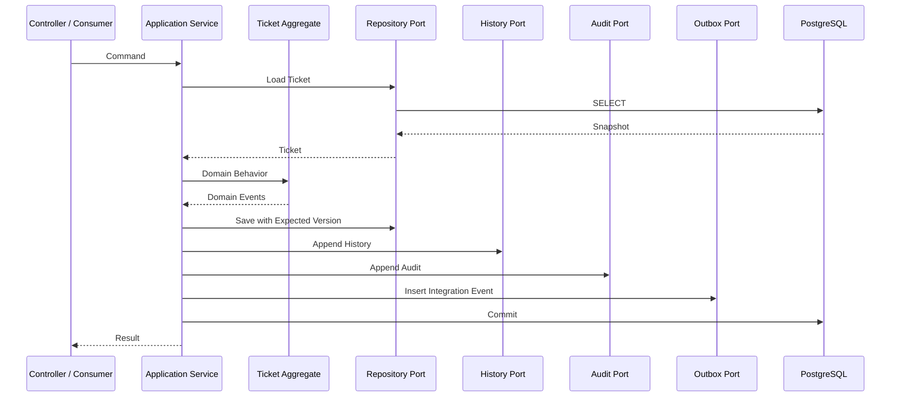
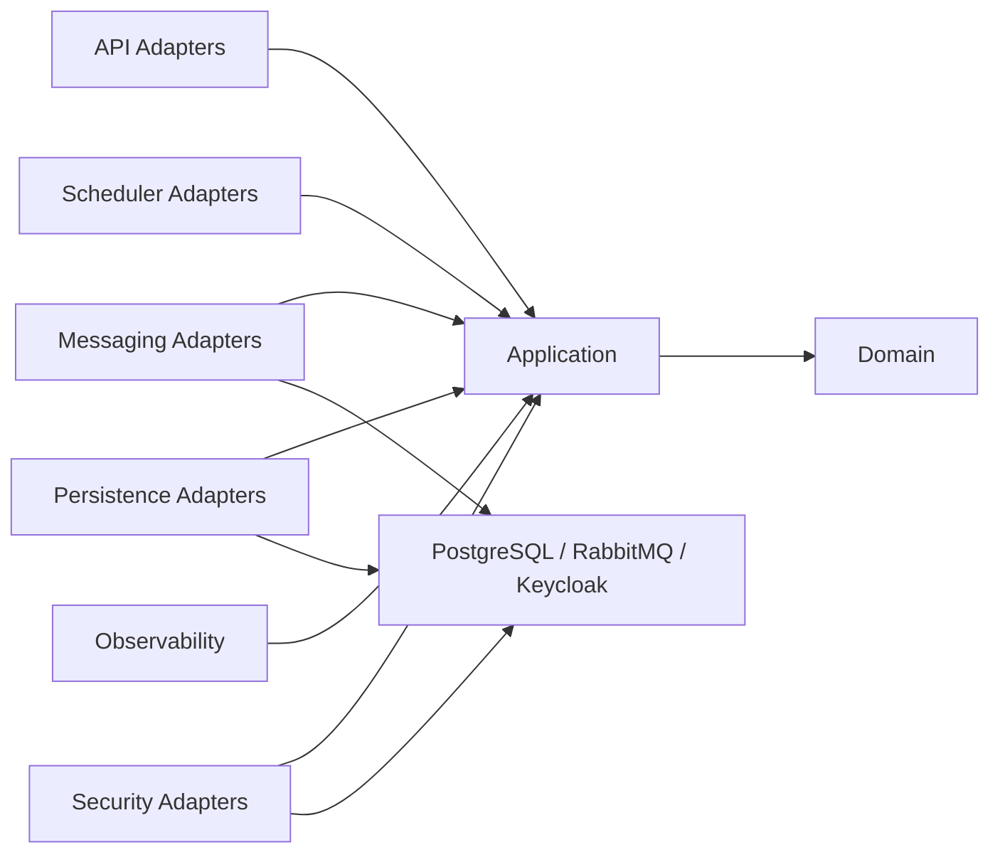
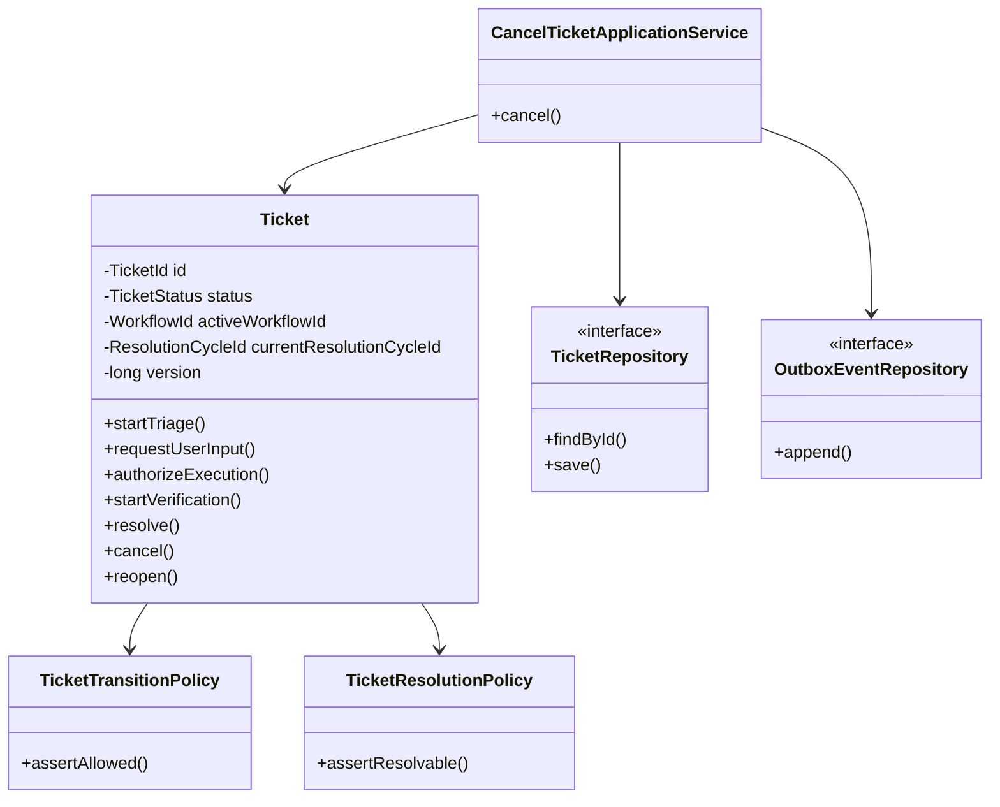

# OpsMind Ticket Workflow — 13 Package and Class Design

> **Domain:** Ticket & Business Workflow  
> **Document Type:** Low-Level Java / Spring Boot Package and Class Design  
> **Version:** 1.0  
> **Status:** Proposed for Implementation  
> **Dependencies:** `01-domain-model_EN.md` through `12-observability-and-audit_EN.md`  
> **Language and Frameworks:** Java 21, Spring Boot, Spring Security, Spring Data JPA, RabbitMQ, PostgreSQL, OpenTelemetry  
> **Architecture Style:** Package-by-Feature + Hexagonal Architecture + DDD Tactical Patterns  
> **Recommended Path:** `System Design/Lower Structure Design_1.0/02-Ticket-Workflow/13-package-and-class-design_EN.md`

---

# 1. Purpose

This document maps the first twelve design documents into an implementable Java and Spring Boot code structure.

It freezes:

- Maven or Gradle module boundaries
- Java package structure
- Package dependency direction
- Controllers and DTOs
- Application use cases, commands, and queries
- Domain aggregates, entities, value objects, policies, and domain events
- Persistence ports, JPA entities, mappers, and adapters
- RabbitMQ consumers, event mappers, and contract validation
- Transactional Outbox publishing
- API and event idempotency
- Authorization and Keycloak integration
- Error handling and reconciliation
- Schedulers
- OpenTelemetry, metrics, and audit
- Configuration and bean composition
- Test package structure
- MVP implementation order
- Rejected designs and acceptance criteria

Core goal:

```text
A developer should be able to use this document to determine:
where code belongs;
what each class owns;
which dependencies are legal;
where transactions start;
how the Domain remains framework-independent;
how events enter and leave the service;
and how security, idempotency, audit, and telemetry become code.
```

---

# 2. Architecture Choice

## 2.1 Package-by-Feature

Ticket Workflow does not use a repository-wide top-level structure such as:

```text
controller/
service/
repository/
entity/
```

It uses feature-oriented packages:

```text
ticket/
reconciliation/
audit/
platform/
```

Each feature then contains its own internal layers.

Reasons:

- Domain boundaries remain visible.
- Controllers and repositories from unrelated features do not accumulate in one package.
- Features are easier to extract into separate services later.
- Code review follows business use cases.
- Cross-domain coupling is easier to detect.

## 2.2 Hexagonal Architecture

Core source dependency direction:

```text
Adapter
→ Application
→ Domain
```

The Domain does not depend on:

- Spring
- JPA
- RabbitMQ
- PostgreSQL
- Keycloak
- OpenTelemetry
- Jackson
- LangSmith

The Application layer calls infrastructure through outbound ports.

## 2.3 DDD Tactical Patterns

The design uses:

```text
Aggregate Root
Entity
Value Object
Domain Policy
Domain Event
Repository Port
Application Service
```

It does not require Event Sourcing.

The PostgreSQL aggregate snapshot remains the Ticket business source of truth.

---

# 3. Repository Module

Recommended repository location:

```text
services/
└── ticket-workflow-service/
    ├── pom.xml
    ├── Dockerfile
    ├── README.md
    ├── src/
    │   ├── main/
    │   │   ├── java/
    │   │   └── resources/
    │   └── test/
    │       ├── java/
    │       └── resources/
    └── docker/
```

For Gradle:

```text
build.gradle.kts
```

The MVP should begin as one Spring Boot module with strict internal packages.

The fourteen-day implementation should not prematurely split into many Maven submodules.

---

# 4. Root Package

```text
dev.opsmind.ticketworkflow
```

Recommended root:

```text
dev.opsmind.ticketworkflow
├── TicketWorkflowApplication.java
├── ticket
├── reconciliation
├── audit
├── platform
└── configuration
```

---

# 5. Complete Package Tree

```text
dev.opsmind.ticketworkflow
├── TicketWorkflowApplication.java
│
├── ticket
│   ├── api
│   │   ├── publicapi
│   │   │   ├── PublicTicketController.java
│   │   │   ├── PublicTicketQueryController.java
│   │   │   └── dto
│   │   ├── support
│   │   │   ├── SupportTicketController.java
│   │   │   ├── SupportTicketQueryController.java
│   │   │   └── dto
│   │   ├── internal
│   │   │   ├── InternalTicketCommandController.java
│   │   │   ├── InternalTicketContextController.java
│   │   │   └── dto
│   │   ├── mapper
│   │   └── advice
│   │
│   ├── application
│   │   ├── port
│   │   │   ├── in
│   │   │   └── out
│   │   ├── command
│   │   ├── query
│   │   ├── service
│   │   ├── authorization
│   │   ├── idempotency
│   │   ├── event
│   │   └── model
│   │
│   ├── domain
│   │   ├── model
│   │   ├── value
│   │   ├── policy
│   │   ├── event
│   │   ├── exception
│   │   └── service
│   │
│   └── infrastructure
│       ├── persistence
│       │   ├── jpa
│       │   │   ├── entity
│       │   │   └── repository
│       │   ├── mapper
│       │   ├── adapter
│       │   └── query
│       ├── messaging
│       │   ├── consumer
│       │   ├── publisher
│       │   ├── contract
│       │   ├── mapper
│       │   └── topology
│       ├── outbox
│       ├── idempotency
│       ├── security
│       ├── scheduler
│       ├── observability
│       └── clock
│
├── reconciliation
│   ├── api
│   ├── application
│   ├── domain
│   └── infrastructure
│
├── audit
│   ├── application
│   ├── domain
│   └── infrastructure
│
├── platform
│   ├── error
│   ├── web
│   ├── messaging
│   ├── telemetry
│   └── json
│
└── configuration
    ├── SecurityConfiguration.java
    ├── RabbitMqConfiguration.java
    ├── JacksonConfiguration.java
    ├── OpenTelemetryConfiguration.java
    ├── TransactionConfiguration.java
    └── ClockConfiguration.java
```

---

# 6. Package Dependency Rules

Allowed:

```text
ticket.api
→ ticket.application
→ ticket.domain

ticket.infrastructure
→ ticket.application
→ ticket.domain

configuration
→ adapters and ports
```

Forbidden:

```text
ticket.domain → Spring
ticket.domain → JPA entity
ticket.domain → RabbitMQ
ticket.domain → controller DTO
ticket.application → controller
ticket.application → concrete JpaRepository
ticket.api → JpaRepository
ticket.infrastructure.persistence → API DTO
```

## ArchUnit Rules

Recommended checks:

```text
Domain package may not depend on Spring or JPA.
API package may depend only on Application and platform.web.
Application may not depend on infrastructure implementations.
Infrastructure may implement Application outbound ports.
Controllers may not access repositories.
```

---

# 7. Main Application Class

```java
@SpringBootApplication
public class TicketWorkflowApplication {

    public static void main(String[] args) {
        SpringApplication.run(TicketWorkflowApplication.class, args);
    }
}
```

The main class starts the service only.

It does not contain business beans, RabbitMQ topology, security rules, scheduler logic, or data initialization.

---

# 8. API Layer

## 8.1 PublicTicketController

Responsibilities:

- Create Ticket
- Add employee message
- Cancel
- Reopen
- Confirm resolution

Endpoints:

```text
POST /api/v1/tickets
POST /api/v1/tickets/{ticketId}/messages
POST /api/v1/tickets/{ticketId}/cancel
POST /api/v1/tickets/{ticketId}/reopen
POST /api/v1/tickets/{ticketId}/confirm-resolution
```

```java
@RestController
@RequestMapping("/api/v1/tickets")
@RequiredArgsConstructor
public class PublicTicketController {

    private final CreateTicketUseCase createTicketUseCase;
    private final AddTicketMessageUseCase addTicketMessageUseCase;
    private final CancelTicketUseCase cancelTicketUseCase;
    private final ReopenTicketUseCase reopenTicketUseCase;
    private final ConfirmResolutionUseCase confirmResolutionUseCase;
    private final PublicTicketApiMapper mapper;
}
```

Controllers do not implement state transitions, query repositories, publish RabbitMQ events, mutate JPA entities, or implement idempotency.

## 8.2 PublicTicketQueryController

Endpoints:

```text
GET /api/v1/tickets
GET /api/v1/tickets/{ticketId}
GET /api/v1/tickets/{ticketId}/timeline
```

It uses query use cases and does not load the full aggregate.

## 8.3 SupportTicketController

Responsibilities include:

- Request user input
- Assign
- Escalate
- Retry automation
- Support close
- Add internal message

## 8.4 InternalTicketCommandController

Available only to trusted service identities.

Example endpoints:

```text
POST /internal/v1/tickets/{ticketId}/triage/start
POST /internal/v1/tickets/{ticketId}/verification/start
```

Event-driven interactions remain preferred.

## 8.5 InternalTicketContextController

Provides minimized context:

```text
GET /internal/v1/tickets/{ticketId}/agent-context
GET /internal/v1/tickets/{ticketId}/notification-context
```

Fields are filtered by caller client ID.

---

# 9. API DTOs

Request DTOs:

```text
CreateTicketRequest
AddTicketMessageRequest
CancelTicketRequest
ReopenTicketRequest
ConfirmResolutionRequest
AssignTicketRequest
EscalateTicketRequest
RequestUserInputRequest
RetryAutomationRequest
```

Example:

```java
public record CreateTicketRequest(
    @NotBlank
    @Size(max = 200)
    String title,

    @NotBlank
    @Size(max = 10_000)
    String description,

    @NotBlank
    String applicationCode,

    List<String> attachmentIds
) {}
```

Employee DTOs do not expose:

```text
requesterId
status
priority
category
teamId
workflowId
approvalId
```

Response DTOs:

```text
TicketResponse
TicketSummaryResponse
TicketTimelineResponse
TicketMessageResponse
CommandAcceptedResponse
CursorPageResponse<T>
ErrorResponse
```

---

# 10. API Mappers

```text
PublicTicketApiMapper
SupportTicketApiMapper
InternalTicketContextMapper
```

Responsibilities:

```text
Request DTO → Application Command
Application Result → Response DTO
```

MapStruct is acceptable for simple mappings.

API mappers never access the database.

---

# 11. Inbound Use-case Ports

Package:

```text
ticket.application.port.in
```

Command use cases:

```text
CreateTicketUseCase
AddTicketMessageUseCase
CancelTicketUseCase
ReopenTicketUseCase
ConfirmResolutionUseCase
StartTriageUseCase
CompleteClassificationUseCase
RequestUserInputUseCase
HandleUserReplyUseCase
RequestApprovalUseCase
ApplyApprovalGrantedUseCase
ApplyApprovalRejectedUseCase
ApplyApprovalExpiredUseCase
ApplyAutoApprovalUseCase
ApplyToolExecutionCompletedUseCase
ApplyToolExecutionFailedUseCase
ApplyToolResultUnknownUseCase
StartVerificationUseCase
ApplyVerificationCompletedUseCase
AssignTicketUseCase
EscalateTicketUseCase
CloseTicketUseCase
RetryAutomationUseCase
```

Query use cases:

```text
GetTicketUseCase
ListRequesterTicketsUseCase
ListSupportQueueUseCase
GetTicketTimelineUseCase
GetInternalTicketContextUseCase
```

---

# 12. Command Objects

Package:

```text
ticket.application.command
```

Example:

```java
public record CancelTicketCommand(
    TicketId ticketId,
    long expectedVersion,
    String reasonCode,
    ActorContext actor,
    IdempotencyContext idempotency,
    CommandId commandId,
    Instant requestedAt
) {}
```

Commands contain business execution context.

They do not carry `HttpServletRequest`, JWT objects, Spring `Authentication`, or raw RabbitMQ messages into the Domain.

---

# 13. Query Objects

```text
GetTicketQuery
ListRequesterTicketsQuery
ListSupportQueueQuery
GetTicketTimelineQuery
GetAgentContextQuery
```

Queries may contain:

```text
PrincipalContext
Cursor
Limit
Filter
```

Queries never mutate the aggregate.

---

# 14. Application Services

Package:

```text
ticket.application.service
```

Core classes:

```text
CreateTicketApplicationService
AddTicketMessageApplicationService
CancelTicketApplicationService
ReopenTicketApplicationService
ConfirmResolutionApplicationService
TicketWorkflowEventApplicationService
AssignmentApplicationService
EscalationApplicationService
TicketQueryApplicationService
TicketTimelineApplicationService
```

Responsibilities:

```text
Authorization
Idempotency
Load aggregate
Call domain behavior
Persist
Write history
Write audit
Write Outbox
Map result
Own transaction boundary
```

They do not own HTTP details, Rabbit ACK logic, JPA mapping details, tool execution, or LLM calls.

---

# 15. Transaction Entry Point

The public Application Service method owns the transaction:

```java
@Service
@RequiredArgsConstructor
public class CancelTicketApplicationService implements CancelTicketUseCase {

    @Transactional
    @Override
    public CancelTicketResult cancel(CancelTicketCommand command) {
        // authorize
        // enforce idempotency
        // load aggregate
        // apply domain behavior
        // persist
        // write history
        // write audit
        // write Outbox
        // store response
    }
}
```

Forbidden:

- `@Transactional` on domain entities
- Complete business transactions in controllers
- `REQUIRES_NEW` for Outbox insertion
- External HTTP or RabbitMQ calls inside the transaction

---

# 16. Outbound Ports

Package:

```text
ticket.application.port.out
```

Interfaces:

```text
TicketRepository
TicketMessageRepository
TicketSlaRepository
TicketResolutionCycleRepository
TicketPendingActionRepository
TicketUserInputRequestRepository
TicketHistoryWriter
TicketQueryRepository
TicketTimelineQueryRepository
OutboxEventRepository
ProcessedEventRepository
IdempotencyRepository
AuditRecordRepository
AuthorizationProjectionRepository
ReconciliationPort
EventSchemaValidator
ClockPort
IdentifierGenerator
```

Example:

```java
public interface TicketRepository {

    Optional<Ticket> findById(TicketId ticketId);

    Ticket save(Ticket ticket, long expectedVersion);

    boolean existsByDisplayId(TicketDisplayId displayId);
}
```

Ports expose domain and application types, not JPA entities.

---

# 17. Ticket Aggregate Root

Package:

```text
ticket.domain.model
```

```java
public final class Ticket {

    private final TicketId id;
    private final TicketDisplayId displayId;
    private final RequesterId requesterId;
    private TicketTitle title;
    private TicketDescription description;
    private ApplicationCode applicationCode;
    private TicketCategory category;
    private TicketSubcategory subcategory;
    private TicketPriority priority;
    private TicketStatus status;
    private Assignment assignment;
    private WorkflowId activeWorkflowId;
    private ResolutionCycleId currentResolutionCycleId;
    private Instant autoCloseDueAt;
    private long version;
    private final List<TicketDomainEvent> domainEvents;
}
```

Domain methods:

```text
startTriage
completeClassification
startInvestigation
requestUserInput
resumeAfterUserReply
waitForApproval
authorizeExecution
startVerification
resolve
close
cancel
reopen
assign
escalate
markAutomationFailed
resumeInvestigation
```

Generic setters such as `setStatus` or `setWorkflowId` are forbidden.

---

# 18. Domain Method Example

```java
public void cancel(
    CancellationReason reason,
    ActorReference actor,
    Instant now,
    TicketTransitionPolicy transitionPolicy
) {
    transitionPolicy.assertCancellationAllowed(this);

    TicketStatus previous = this.status;
    this.status = TicketStatus.CANCELLED;
    this.activeWorkflowId = null;
    this.cancelledAt = now;
    this.version++;

    registerEvent(new TicketCancelled(
        id,
        previous,
        status,
        reason,
        actor,
        version,
        now
    ));
}
```

A domain method validates invariants, mutates internal state, and records a domain event.

It does not persist, publish, log, or inspect JWTs.

---

# 19. Domain Entities and Records

Independent aggregates:

```text
TicketMessage
TicketSla
```

Cycle and lifecycle objects:

```text
TicketResolutionCycle
TicketPendingAction
TicketUserInputRequest
```

Append-only records:

```text
TicketStatusHistory
TicketCategoryHistory
TicketAssignmentHistory
TicketEscalationHistory
TicketAutomationFailure
```

For a smaller MVP, some lifecycle records may be coordinated by Application Services, but their invariants remain encapsulated in dedicated domain objects.

---

# 20. Value Objects

Package:

```text
ticket.domain.value
```

Recommended objects:

```text
TicketId
TicketDisplayId
RequesterId
TicketTitle
TicketDescription
ApplicationCode
TicketCategory
TicketSubcategory
TicketPriority
WorkflowId
ResolutionCycleId
ActionId
ApprovalId
ToolExecutionId
VerificationId
ResolutionAttemptId
Assignment
ActorReference
CancellationReason
CloseReason
Resolution
PendingActionReference
```

Value objects are immutable, validate construction, use value equality, and do not depend on Spring or JPA.

---

# 21. Domain Enums

```text
TicketStatus
TicketPriority
TicketSource
ActorType
MessageVisibility
MessageType
PendingActionStatus
ResolutionCycleStatus
SlaStatus
RiskLevel
PolicyDecision
```

Stable enum values align with API and event contracts.

Different layers do not invent different strings for the same concept.

---

# 22. Domain Policies

Package:

```text
ticket.domain.policy
```

Core policies:

```text
TicketTransitionPolicy
TicketResolutionPolicy
TicketReopenPolicy
TicketCancellationPolicy
TicketAssignmentPolicy
TicketEscalationPolicy
TicketVerificationPolicy
TicketPendingActionPolicy
TicketSlaPolicy
```

`TicketTransitionPolicy` owns legal transitions and terminal-state guards.

`TicketResolutionPolicy` enforces trusted current verification and prevents direct resolution from tool success.

`TicketReopenPolicy` enforces source state, time window, new workflow, resolution cycle, and SLA cycle.

---

# 23. Domain Services

Use a domain service only when behavior does not naturally belong to one aggregate.

Candidates:

```text
TicketDisplayIdGenerator
ResolutionCycleFactory
TicketReopenCoordinator
```

Avoid a generic `TicketDomainService` that collects unrelated behavior.

---

# 24. Domain Events

Package:

```text
ticket.domain.event
```

```java
public sealed interface TicketDomainEvent
    permits TicketCreated,
            TicketStatusChanged,
            TicketResolved,
            TicketClosed,
            TicketCancelled,
            TicketReopened,
            TicketEscalated {
}
```

Events include:

```text
TicketCreated
TicketTriagingStarted
TicketClassified
TicketWaitingForUser
TicketUserReplied
TicketWaitingForApproval
TicketExecutionReady
TicketVerificationStarted
TicketResolved
TicketClosed
TicketCancelled
TicketReopened
TicketEscalated
TicketAssigned
TicketAutomationFailed
```

Domain events do not contain routing keys, RabbitMQ headers, queues, or Jackson annotations.

---

# 25. Domain Exceptions

Package:

```text
ticket.domain.exception
```

```text
TicketDomainException
InvalidTicketTransitionException
CancellationNotAllowedException
VerificationRequiredException
ReopenWindowExpiredException
ActiveWorkflowAlreadyExistsException
PendingActionConflictException
ReferenceMismatchException
```

Each exception carries a stable error code, invariant ID, and safe context.

It does not define HTTP status or user-facing text.

---

# 26. Domain Event Collection

The aggregate stores pending domain events and exposes:

```java
public List<TicketDomainEvent> pullDomainEvents()
```

After successful domain behavior, the Application Service:

1. Pulls domain events.
2. Maps them to integration events.
3. Validates schemas.
4. Inserts Outbox rows.

---

# 27. Integration Event Mapping

Package:

```text
ticket.application.event
```

Classes:

```text
TicketIntegrationEventMapper
TicketEventEnvelopeFactory
TicketEventPayloadFactory
```

Responsibility:

```text
Domain Event
→ Versioned Integration Event
→ Canonical Envelope
```

Example:

```java
public IntegrationEvent map(
    TicketResolved event,
    TraceContext traceContext
) {
    return envelopeFactory.create(
        "ticket.resolved",
        "1.0",
        "ticket.resolved.v1",
        event.ticketId(),
        event.workflowId(),
        payloadFactory.from(event)
    );
}
```

---

# 28. Event Schema Validation

Port:

```text
EventSchemaValidator
```

Implementation:

```text
JsonSchemaEventValidator
```

Schemas live under:

```text
src/main/resources/event-schemas/
```

Validation runs before Outbox insertion.

A schema failure rolls back the business transaction with:

```text
EVENT_SCHEMA_GENERATION_FAILED
```

---

# 29. Persistence Infrastructure

Package:

```text
ticket.infrastructure.persistence
```

Subpackages:

```text
jpa.entity
jpa.repository
mapper
adapter
query
```

---

# 30. JPA Entities

```text
TicketJpaEntity
TicketMessageJpaEntity
TicketStatusHistoryJpaEntity
TicketCategoryHistoryJpaEntity
TicketAssignmentHistoryJpaEntity
TicketUserInputRequestJpaEntity
TicketPendingActionJpaEntity
TicketResolutionCycleJpaEntity
TicketSlaCycleJpaEntity
TicketEscalationHistoryJpaEntity
TicketAutomationFailureJpaEntity
OutboxEventJpaEntity
ProcessedEventJpaEntity
IdempotencyRecordJpaEntity
AuditRecordJpaEntity
```

JPA entities exist only for persistence.

Controllers never return them.

---

# 31. TicketJpaEntity

```java
@Entity
@Table(schema = "ticket", name = "tickets")
public class TicketJpaEntity {

    @Id
    private UUID ticketId;

    @Column(nullable = false, unique = true)
    private String displayId;

    @Column(nullable = false)
    private String requesterId;

    @Enumerated(EnumType.STRING)
    private TicketStatus status;

    @Version
    private long version;
}
```

The JPA entity contains persistence state, not domain behavior.

The adapter translates optimistic-lock failures into stable application errors.

---

# 32. Persistence Mappers

```text
TicketPersistenceMapper
TicketMessagePersistenceMapper
TicketSlaPersistenceMapper
TicketResolutionCyclePersistenceMapper
```

They map:

```text
Domain ↔ JPA Entity
```

Aggregate rehydration must restore status, active workflow, current cycle, assignment, and version completely.

---

# 33. Spring Data Repositories

```text
SpringDataTicketJpaRepository
SpringDataTicketMessageJpaRepository
SpringDataOutboxJpaRepository
SpringDataProcessedEventJpaRepository
SpringDataIdempotencyJpaRepository
```

Example:

```java
interface SpringDataTicketJpaRepository
        extends JpaRepository<TicketJpaEntity, UUID> {

    Optional<TicketJpaEntity> findByDisplayId(String displayId);
}
```

Only persistence adapters use these repositories.

---

# 34. Persistence Adapters

```text
TicketPersistenceAdapter
TicketMessagePersistenceAdapter
TicketSlaPersistenceAdapter
TicketResolutionCyclePersistenceAdapter
TicketHistoryPersistenceAdapter
OutboxPersistenceAdapter
ProcessedEventPersistenceAdapter
IdempotencyPersistenceAdapter
AuditPersistenceAdapter
```

Adapters implement outbound ports.

---

# 35. Query Repositories

The query side does not need to load the aggregate.

Classes:

```text
JdbcTicketQueryRepository
JdbcSupportQueueQueryRepository
JdbcTicketTimelineQueryRepository
JdbcAuthorizationProjectionRepository
```

Recommended technology:

```text
NamedParameterJdbcTemplate
RowMapper
Projection Record
```

Benefits:

- Precise cursor pagination
- Avoids JPA N+1
- Selects only required fields
- Supports role-based visibility

---

# 36. Query Projections

Package:

```text
ticket.application.model
```

```text
TicketSummaryView
TicketDetailView
TicketTimelineEntryView
SupportQueueTicketView
AgentTicketContextView
NotificationTicketContextView
TicketAuthorizationProjection
```

Projections are immutable read models without behavior.

---

# 37. RabbitMQ Consumers

Package:

```text
ticket.infrastructure.messaging.consumer
```

Recommended grouping by producer domain:

```text
AgentEventConsumer
ApprovalEventConsumer
ToolExecutionEventConsumer
VerificationEventConsumer
```

The design does not require fourteen nearly identical consumer classes.

Each consumer:

1. Parses the envelope.
2. Validates schema.
3. Validates producer trust.
4. Computes payload hash.
5. Calls an Application use case.
6. Applies ACK, retry, or DLQ disposition.

---

# 38. Consumer Example

```java
@Component
@RequiredArgsConstructor
public class ApprovalEventConsumer {

    private final EventEnvelopeParser parser;
    private final EventTrustValidator trustValidator;
    private final ApprovalEventMapper mapper;
    private final ApplyApprovalGrantedUseCase grantedUseCase;
    private final EventProcessingDecisionHandler decisionHandler;

    @RabbitListener(queues = "${opsmind.queues.approval-events}")
    public void consume(Message message, Channel channel) {
        // parse, validate, dispatch, and disposition
    }
}
```

A shared Spring AMQP error handler may centralize broker disposition.

---

# 39. Event Contract DTOs

Package:

```text
ticket.infrastructure.messaging.contract
```

```text
EventEnvelopeDto
ApprovalGrantedEventV1
ApprovalRejectedEventV1
ToolExecutionCompletedEventV1
ToolExecutionFailedEventV1
ToolExecutionResultUnknownEventV1
VerificationCompletedEventV1
AgentWorkflowStartedEventV1
AgentWorkflowFailedEventV1
ClassificationCompletedEventV1
UserInputRequiredEventV1
ResolutionCandidateReadyEventV1
```

Contract DTOs may use Jackson annotations.

They do not enter the Domain layer.

---

# 40. Event Mappers

```text
ApprovalEventMapper
ToolExecutionEventMapper
VerificationEventMapper
AgentEventMapper
```

Responsibility:

```text
Contract DTO
→ Application Command
```

Example:

```text
ApprovalGrantedEventV1
→ ApplyApprovalGrantedCommand
```

---

# 41. Event Trust Validation

Classes:

```text
EventTrustValidator
EventProducerAllowlist
EventReferencePreValidator
SecretPayloadScanner
```

They validate producer, type, version, routing key, classification, secret presence, and basic reference shape.

Business reference matching remains in Application and Domain logic.

---

# 42. Processed Event Coordination

Application components:

```text
ProcessedEventCoordinator
EventDeduplicationService
EventClassificationService
```

They:

- Query `(consumerName, eventId)`.
- Compare payload hash.
- Detect transport duplicates.
- Coordinate business duplicate and stale classification.
- Persist the processed-event record in the same transaction.

---

# 43. Event Processing Decision

```java
public record EventProcessingDecision(
    EventClassification classification,
    BrokerDisposition disposition,
    String errorCode,
    Duration retryDelay,
    boolean reconciliationRequired
) {}
```

Classifications:

```text
APPLY
DUPLICATE
BUSINESS_DUPLICATE
STALE
OUT_OF_ORDER
REJECTED_BUSINESS_RULE
CORRUPT_REFERENCE
TERMINAL_RESULT_CONFLICT
```

---

# 44. Outbox Components

Package:

```text
ticket.infrastructure.outbox
```

Classes:

```text
OutboxPublisherScheduler
OutboxClaimService
OutboxClaimRepository
RabbitMqEventPublisher
PublisherConfirmTracker
OutboxPublishResultService
OutboxRetryPolicy
OutboxLockRecoveryJob
OutboxCleanupJob
```

---

# 45. Outbox Flow

```text
OutboxPublisherScheduler
→ OutboxClaimService
→ OutboxClaimRepository
→ RabbitMqEventPublisher
→ PublisherConfirmTracker
→ OutboxPublishResultService
```

Claiming and publishing use separate transactions.

```java
public interface OutboxClaimService {
    List<ClaimedOutboxEvent> claimBatch(
        PublisherInstanceId instanceId,
        int batchSize,
        Instant now
    );
}
```

```java
public interface RabbitMqEventPublisher {
    PublishAttemptResult publish(ClaimedOutboxEvent event);
}
```

The publisher does not mutate business aggregates.

---

# 46. API Idempotency Components

Package:

```text
ticket.application.idempotency
```

```text
IdempotencyCoordinator
RequestCanonicalizer
RequestHashCalculator
IdempotencyScopeFactory
IdempotencyReplayService
IdempotencyReconciliationService
```

Infrastructure:

```text
JpaIdempotencyRepository
```

The coordinator supports reserve, replay, complete, retryable failure, and stale in-progress reconciliation.

---

# 47. Security Components

Package:

```text
ticket.infrastructure.security
```

```text
JwtPrincipalFactory
TicketAuthorizationService
TicketAuthorizationProjectionAdapter
QueueMembershipResolver
TemporaryAccessGrantService
ServiceClientAuthorizer
EventProducerAuthorizer
FieldVisibilityPolicy
SensitiveDataRedactor
SecretDetector
StepUpAuthenticationValidator
```

---

# 48. Authorization Port

```java
public interface TicketAuthorizationPort {

    AuthorizationDecision authorize(
        PrincipalContext principal,
        TicketOperation operation,
        TicketAuthorizationProjection ticket
    );
}
```

`@PreAuthorize` performs endpoint-scope prechecks.

Resource ownership and queue authorization are evaluated again in the Application Service.

---

# 49. Principal Context Adapter

```text
SecurityContextPrincipalAdapter
```

Maps:

```text
Spring Security Authentication
→ PrincipalContext
```

Application and Domain code do not depend on Spring `Authentication`.

---

# 50. Field Visibility

Possible policies:

```text
EmployeeTicketVisibilityPolicy
SupportTicketVisibilityPolicy
AuditorTicketVisibilityPolicy
ServiceTicketVisibilityPolicy
```

They may be composed behind:

```text
TicketFieldVisibilityService
```

Input:

```text
PrincipalContext
TicketProjection
RequestedView
```

Output:

```text
Allowed Field Set
```

---

# 51. Error Handling Components

Platform package:

```text
platform.error
```

Classes:

```text
ErrorDescriptor
ErrorCatalog
ApplicationError
ErrorFingerprintFactory
Retryability
ErrorSeverity
```

API:

```text
GlobalRestExceptionHandler
ErrorResponseMapper
```

Messaging:

```text
EventConsumerErrorHandler
BrokerDispositionResolver
RetryHeaderFactory
DlqPublisher
```

---

# 52. Error Catalog

```java
public interface ErrorCatalog {
    ErrorDescriptor descriptorFor(String errorCode);
}
```

Implementation:

```text
StaticErrorCatalog
```

Error metadata is centralized rather than scattered across controllers and consumers.

---

# 53. Reconciliation Module

Root feature:

```text
reconciliation
```

It is separate because it has independent lifecycle, authorization, and audit requirements.

Domain:

```text
ReconciliationCase
ReconciliationEvidence
ReconciliationType
ReconciliationStatus
ReconciliationOutcome
RecoveryAction
```

Application:

```text
OpenReconciliationUseCase
InvestigateReconciliationUseCase
ProposeRecoveryUseCase
ApproveRecoveryUseCase
ExecuteRecoveryUseCase
ResolveReconciliationUseCase
```

Infrastructure:

```text
ReconciliationJpaEntity
ReconciliationEvidenceJpaEntity
ReconciliationPersistenceAdapter
ExternalFactQueryAdapter
```

---

# 54. Reconciliation Coordinators

```text
ReconciliationApplicationService
ToolResultReconciliationService
VerificationConflictReconciliationService
ApprovalConflictReconciliationService
OutOfOrderReconciliationService
IdempotencyReconciliationService
DataIntegrityReconciliationService
```

Recovery invokes normal Ticket use cases.

It never directly assigns `ticket.status`.

---

# 55. Audit Module

Root feature:

```text
audit
```

Domain:

```text
AuditRecord
AuditType
AuditAction
AuditDecision
AuditActor
AuditResource
```

Application:

```text
RecordBusinessAuditUseCase
RecordSecurityAuditUseCase
RecordSensitiveReadAuditUseCase
AuditHashService
```

Infrastructure:

```text
AuditJpaEntity
AuditPersistenceAdapter
AuditOutboxMapper
```

---

# 56. Audit Port

```java
public interface AuditRecordPort {
    void append(AuditRecord record);
}
```

High-risk audit is not best effort.

The audit record joins the business transaction.

---

# 57. Scheduler Components

Package:

```text
ticket.infrastructure.scheduler
```

Classes:

```text
AutoCloseScheduler
SlaBreachScheduler
IntegrityScanScheduler
IdempotencyCleanupScheduler
ProcessedEventCleanupScheduler
```

Outbox schedulers remain in the Outbox package.

A scheduler:

1. Selects candidate IDs.
2. Calls a use case for each candidate.
3. Uses one short transaction per Ticket.
4. Records job telemetry.

It does not directly mutate JPA entities.

---

# 58. Clock and Identifier Generation

Outbound ports:

```text
ClockPort
TicketIdGenerator
DisplayIdGenerator
EventIdGenerator
CommandIdGenerator
```

Infrastructure:

```text
SystemClockAdapter
UuidV7IdentifierGenerator
DatabaseBackedDisplayIdGenerator
```

Tests use:

```text
FixedClock
DeterministicIdGenerator
```

Domain code avoids direct `Instant.now()` and `UUID.randomUUID()` calls.

---

# 59. Observability Components

Package:

```text
ticket.infrastructure.observability
```

```text
TicketTelemetry
TicketMetrics
TicketTraceAttributes
TicketLogContext
TelemetryRedactor
EventProcessingMetrics
OutboxMetrics
SchedulerMetrics
SecurityMetrics
ReconciliationMetrics
```

`TicketTelemetry` exposes explicit methods such as:

```text
recordTransition
recordEventClassification
recordTransactionRetry
recordAuthorizationDecision
recordOutboxPublish
```

Metric names are not assembled ad hoc throughout the codebase.

---

# 60. MDC and Log Context

Filters and interceptors:

```text
CorrelationIdFilter
TraceLogContextFilter
PrincipalLogContextFilter
```

RabbitMQ processing uses:

```text
MessageLogContextScope
```

MDC is always cleared after processing to prevent thread-pool contamination.

---

# 61. Configuration Classes

## SecurityConfiguration

Configures:

- OAuth resource server
- JWT decoder
- Endpoint scopes
- CORS
- Method security

## RabbitMqConfiguration

Configures:

- Exchanges
- Queues
- Bindings
- Retry queues
- DLQs
- Publisher confirms

## JacksonConfiguration

Configures:

- Java time
- Strict contract parsing
- Canonical JSON
- Event mappers

## OpenTelemetryConfiguration

Configures:

- Resource
- Sampling
- Redaction
- Instrumentation

## TransactionConfiguration

Configures transaction manager, timeout, and retry classification.

## ClockConfiguration

Provides the production clock.

Configuration classes do not contain business rules.

---

# 62. Spring Bean Composition

Domain objects are created through constructors, factories, and Application Services.

Infrastructure beans implement ports.

Constructor injection is required.

Forbidden:

- Field injection
- Static service locators
- `ApplicationContext.getBean()` in business logic

---

# 63. Package Visibility

Use:

- `public` for cross-package ports, DTOs, and domain APIs
- package-private for internal implementations and mappers
- `private` for class internals

Not every class should be public.

---

# 64. Naming Conventions

Application services:

```text
<Create/Apply/Handle><Subject>ApplicationService
```

Use cases:

```text
<Create/Apply/Handle><Subject>UseCase
```

Commands:

```text
<Verb><Subject>Command
```

Queries:

```text
<Get/List><Subject>Query
```

Adapters:

```text
<Capability><Technology>Adapter
```

Mappers:

```text
<Source><Target>Mapper
```

Consumers:

```text
<SourceDomain>EventConsumer
```

Schedulers:

```text
<BusinessPurpose>Scheduler
```

Avoid vague names such as `CommonService`, `Helper`, `Util`, `Manager`, or `Processor`.

---

# 65. Java Records

Good uses:

- Command
- Query
- DTO
- Value object
- Result
- Projection
- Event payload

Poor uses:

- Mutable JPA entity
- Aggregate root with internal state transitions
- Domain entity requiring lifecycle mutation

---

# 66. Sealed Interfaces

Candidates:

```text
TicketDomainEvent
ApplicationResult
EventClassificationResult
RecoveryAction
```

They provide compile-time exhaustive handling and define closed type sets.

---

# 67. Result Types

Use cases do not return only `void`.

Examples:

```text
CreateTicketResult
CancelTicketResult
ReopenTicketResult
ApplyEventResult
TicketCommandResult
```

Common fields:

```text
ticketId
displayId
status
version
idempotencyReplayed
outcome
```

---

# 68. Controller Error Flow

```text
Domain or Application Exception
→ GlobalRestExceptionHandler
→ ErrorDescriptor
→ ErrorResponseMapper
→ Safe Error Envelope
```

Controllers do not duplicate try/catch logic.

---

# 69. Consumer Error Flow

```text
Exception or Result
→ EventConsumerErrorHandler
→ EventProcessingDecision
→ ACK / Retry / DLQ
```

Stale, duplicate, and out-of-order classifications are explicit results rather than generic exceptions.

---

# 70. Transaction and Outbox Interaction



---

# 71. Package Dependency Diagram



---

# 72. Core Class Diagram



---

# 73. Suggested Class Inventory

## Required for MVP

API:

```text
PublicTicketController
PublicTicketQueryController
SupportTicketController
GlobalRestExceptionHandler
PublicTicketApiMapper
```

Application:

```text
CreateTicketApplicationService
AddTicketMessageApplicationService
CancelTicketApplicationService
ReopenTicketApplicationService
TicketWorkflowEventApplicationService
TicketQueryApplicationService
TicketTimelineApplicationService
IdempotencyCoordinator
TicketAuthorizationService
TicketIntegrationEventMapper
```

Domain:

```text
Ticket
TicketMessage
TicketSla
TicketStatus
TicketTransitionPolicy
TicketResolutionPolicy
TicketReopenPolicy
TicketCancellationPolicy
TicketDomainEvent hierarchy
Domain Exception hierarchy
```

Persistence:

```text
TicketJpaEntity
TicketMessageJpaEntity
TicketStatusHistoryJpaEntity
OutboxEventJpaEntity
ProcessedEventJpaEntity
IdempotencyRecordJpaEntity
TicketPersistenceAdapter
TicketQueryRepository
TicketPersistenceMapper
```

Messaging:

```text
AgentEventConsumer
ApprovalEventConsumer
ToolExecutionEventConsumer
VerificationEventConsumer
EventEnvelopeParser
EventTrustValidator
EventConsumerErrorHandler
```

Outbox:

```text
OutboxPublisherScheduler
OutboxClaimService
RabbitMqEventPublisher
PublisherConfirmTracker
OutboxRetryPolicy
```

Security and telemetry:

```text
SecurityContextPrincipalAdapter
TicketAuthorizationService
SecretDetector
TicketTelemetry
TicketMetrics
CorrelationIdFilter
```

## Phase 2

```text
Full Reconciliation Module
Temporary Access Grant
Audit Hash Chain
Sensitive Read Audit
Correction Event API
Compensation Workflow
Advanced Tail Sampling
```

---

# 74. Use-case to Class Mapping

| Use Case | Application Class |
|---|---|
| UC-01 Create Ticket | `CreateTicketApplicationService` |
| UC-05 Add Message | `AddTicketMessageApplicationService` |
| UC-06 Start Triage | `TicketWorkflowEventApplicationService` |
| UC-07 Complete Classification | `TicketWorkflowEventApplicationService` |
| UC-08 Request User Input | `TicketWorkflowEventApplicationService` |
| UC-09 User Reply | `AddTicketMessageApplicationService` |
| UC-11 Approval Requested | `TicketWorkflowEventApplicationService` |
| UC-12 Approval Granted | `TicketWorkflowEventApplicationService` |
| UC-16 Tool Completed | `TicketWorkflowEventApplicationService` |
| UC-17 Tool Failed | `TicketWorkflowEventApplicationService` |
| UC-18 Tool Unknown | `TicketWorkflowEventApplicationService` |
| UC-20 Verification Success | `TicketWorkflowEventApplicationService` |
| UC-21 Verification Failure | `TicketWorkflowEventApplicationService` |
| UC-23/24 Close | `CloseTicketApplicationService` |
| UC-25 Reopen | `ReopenTicketApplicationService` |
| UC-26 Cancel | `CancelTicketApplicationService` |
| UC-27 Escalate | `EscalationApplicationService` |
| UC-28 Assign | `AssignmentApplicationService` |

When `TicketWorkflowEventApplicationService` becomes too large, split it into:

```text
ApprovalEventApplicationService
ToolEventApplicationService
VerificationEventApplicationService
AgentEventApplicationService
```

---

# 75. Package and Class Size Guards

Review triggers:

- A class exceeds roughly 300 lines.
- An application method exceeds roughly 80 lines.
- A package exceeds 20–30 classes.
- A class has more than 7–10 dependencies.
- A method has more than three nested levels.

These are review signals rather than mechanical limits.

---

# 76. Test Package Structure

```text
src/test/java/dev/opsmind/ticketworkflow
├── ticket
│   ├── domain
│   ├── application
│   ├── api
│   ├── persistence
│   ├── messaging
│   ├── outbox
│   ├── security
│   └── observability
├── reconciliation
├── audit
├── architecture
└── support
```

Shared test support:

```text
TicketFixtures
EventFixtures
TestClock
TestIdGenerator
PostgresTestContainer
RabbitMqTestContainer
KeycloakTestContainer
```

---

# 77. Test Naming

Pattern:

```text
should<ExpectedBehavior>When<Condition>
```

Examples:

```text
shouldResolveTicketWhenVerificationSucceeds
shouldRejectCancellationWhenToolExecutionIsActive
shouldAckOldWorkflowEventAsStale
shouldPublishOutboxAfterCommit
shouldReturnSameTicketForRepeatedIdempotencyKey
```

---

# 78. Architecture Tests

```text
DomainDoesNotDependOnSpringTest
ApplicationDoesNotDependOnInfrastructureTest
ControllersDoNotAccessRepositoriesTest
JpaEntitiesAreNotReturnedByApiTest
EventContractsDoNotEnterDomainTest
```

Use:

```text
ArchUnit
```

---

# 79. Component Tests

API component tests use:

```text
MockMvc
Spring Security Test
PostgreSQL Testcontainers
```

Messaging component tests use:

```text
RabbitMQ Testcontainers
Real JSON Schema
Processed Event Store
```

Persistence tests use real PostgreSQL and Flyway.

H2 does not replace PostgreSQL for JSONB, constraints, locking, or concurrency behavior.

---

# 80. Configuration Properties

```text
TicketWorkflowProperties
OutboxProperties
EventRetryProperties
SecurityProperties
AuditProperties
SchedulerProperties
TelemetryProperties
```

Use:

```java
@ConfigurationProperties(prefix = "opsmind.ticket")
```

instead of scattered `@Value` fields.

---

# 81. Feature Flags

Possible flags:

```text
reconciliationEnabled
eventSignatureValidationEnabled
auditHashChainEnabled
fullLangSmithCaptureEnabled
temporaryCrossQueueAccessEnabled
```

Safe defaults:

- Unimplemented high-risk features are disabled.
- Complete production prompt capture is disabled.
- Broker ACL and producer allowlists remain required when event signatures are not enabled.

Feature flags never bypass domain guards.

---

# 82. Flyway Resources

```text
src/main/resources/db/migration/
├── V001__create_ticket_schema.sql
├── V002__create_tickets.sql
├── ...
└── V015__create_audit_records.sql
```

Migrations version with the code.

Production does not use:

```text
hibernate.ddl-auto=update
```

Recommended:

```text
validate
```

---

# 83. Event Schema Resources

```text
src/main/resources/event-schemas/
├── common/
│   └── event-envelope-v1.schema.json
├── published/
│   ├── ticket-created-v1.schema.json
│   ├── ticket-resolved-v1.schema.json
│   └── ...
└── consumed/
    ├── approval-granted-v1.schema.json
    ├── tool-execution-completed-v1.schema.json
    └── verification-completed-v1.schema.json
```

---

# 84. OpenAPI Resource

```text
src/main/resources/openapi/
└── ticket-workflow-v1.yaml
```

Contract tests validate:

```text
OperationId
Status codes
Request schemas
Response schemas
Security requirements
Error envelope
```

---

# 85. Build Dependencies

Recommended dependencies:

```text
spring-boot-starter-web
spring-boot-starter-validation
spring-boot-starter-security
spring-boot-starter-oauth2-resource-server
spring-boot-starter-data-jpa
spring-boot-starter-amqp
spring-boot-starter-actuator
postgresql
flyway-core
opentelemetry
micrometer-registry-prometheus
json-schema-validator
mapstruct
testcontainers
archunit
```

Large generic frameworks are added cautiously so that core correctness remains visible.

---

# 86. Code Review Checklist

- Is the class in the correct feature and layer?
- Does the Domain remain framework-independent?
- Is the Controller only an adapter?
- Is the Application Service the transaction entry point?
- Is expected version enforced?
- Does Outbox insertion share the business transaction?
- Does the event consumer deduplicate?
- Could PII or secrets be logged?
- Does authorization check ownership or queue scope?
- Does a high-risk operation append audit?
- Are metric labels low cardinality?
- Does every retry reload and re-evaluate?
- Are required tests present?

---

# 87. Rejected Designs

## God Service

A single `TicketService` owning API, state machine, repository, RabbitMQ, and security is rejected.

## Active Record Domain

Domain calls such as `ticket.save()` or `ticket.publish()` are rejected.

## JPA Entity as Complete Domain Model

Persistence shape may resemble the aggregate, but JPA lifecycle and lazy loading do not control domain behavior.

## Generic Status Endpoint

```text
changeStatus(targetStatus)
```

is rejected.

## Giant Generic Event Handler

A single unrestricted event switch is rejected. Dispatch may be centralized initially, but use cases remain separated by producer domain and business meaning.

## Common Utility Dump

Unrelated logic does not accumulate in `util`, `common`, or `helper`.

## Framework Annotations in Domain

The Domain does not use:

```text
@Entity
@Service
@Component
@Transactional
@JsonProperty
```

---

# 88. Implementation Order

## Step 1

```text
Value objects
TicketStatus
Ticket aggregate
Policies
Domain events
```

## Step 2

```text
Outbound ports
JPA entities
Persistence mappers
Persistence adapters
Flyway
```

## Step 3

```text
Create Ticket
Get Ticket
List Tickets
Add Message
```

## Step 4

```text
State transitions
History
Outbox insertion
```

## Step 5

```text
Outbox Publisher
RabbitMQ consumers
Processed Event Store
```

## Step 6

```text
Security
Ownership
Queue scope
```

## Step 7

```text
Observability
Audit
Schedulers
```

## Step 8

```text
MVP reconciliation
Chaos tests
```

---

# 89. Definition of Done for a Use Case

A new use case includes:

```text
Inbound port
Command or query
Application Service
Authorization
Domain behavior
Repository-port usage
Transaction
History
Audit when required
Outbox when required
API or event adapter
Error mapping
Trace and metric
Unit test
Integration test
Contract test
```

---

# 90. Acceptance Criteria

- [x] Package-by-feature and Hexagonal architecture defined
- [x] Root module and complete package tree defined
- [x] Layer dependency rules defined
- [x] Controllers, DTOs, and mappers defined
- [x] Inbound use cases, commands, queries, and application services defined
- [x] Transaction entry point defined
- [x] Outbound ports defined
- [x] Aggregate, entities, value objects, policies, and domain events defined
- [x] Persistence entities, mappers, repositories, and adapters defined
- [x] Query projections and JDBC query repositories defined
- [x] RabbitMQ consumers, contract DTOs, mappers, and trust validation defined
- [x] Processed Event, Outbox, and idempotency components defined
- [x] Security, error, reconciliation, audit, scheduler, and observability components defined
- [x] Configuration, naming, visibility, and result types defined
- [x] Mermaid sequence, dependency, and class diagrams defined
- [x] MVP class inventory and use-case mapping defined
- [x] Test structure, architecture tests, and component tests defined
- [x] Build, Flyway, schema, OpenAPI, and review rules defined
- [x] Implementation order and use-case Definition of Done defined

---

# 91. Next Step

Create:

```text
14-testing-strategy_CN.md
14-testing-strategy_EN.md
```

That document will define the test pyramid, domain unit tests, application tests, API and event contract tests, PostgreSQL and RabbitMQ integration tests, security tests, concurrency tests, chaos tests, Golden Path end-to-end tests, coverage gates, and the CI pipeline.
