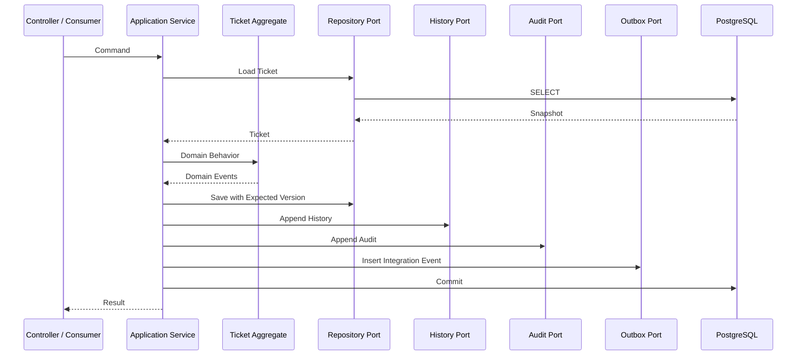
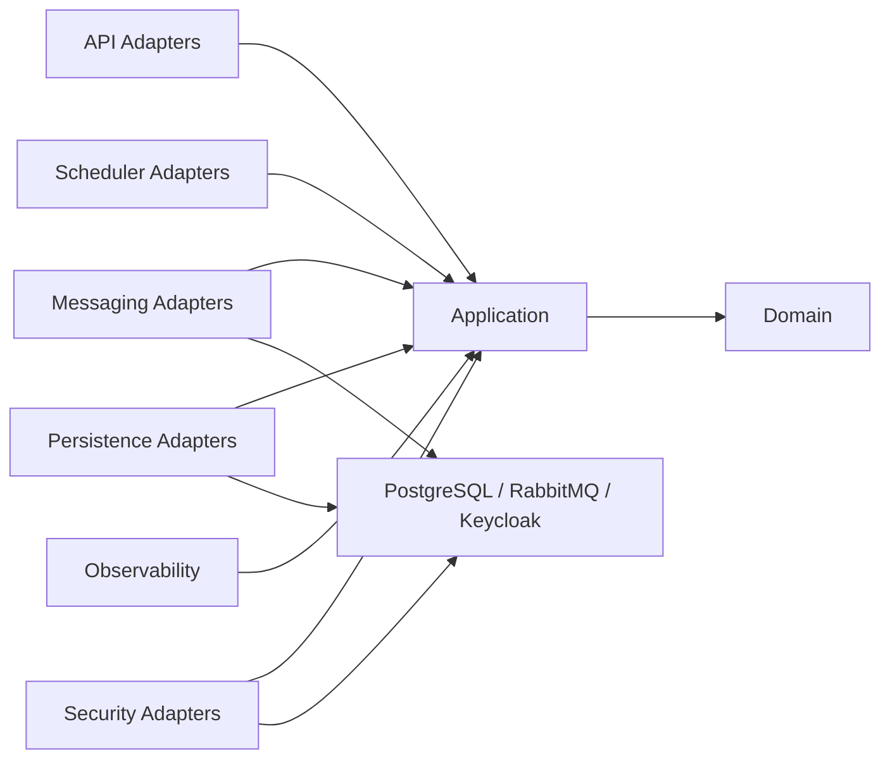
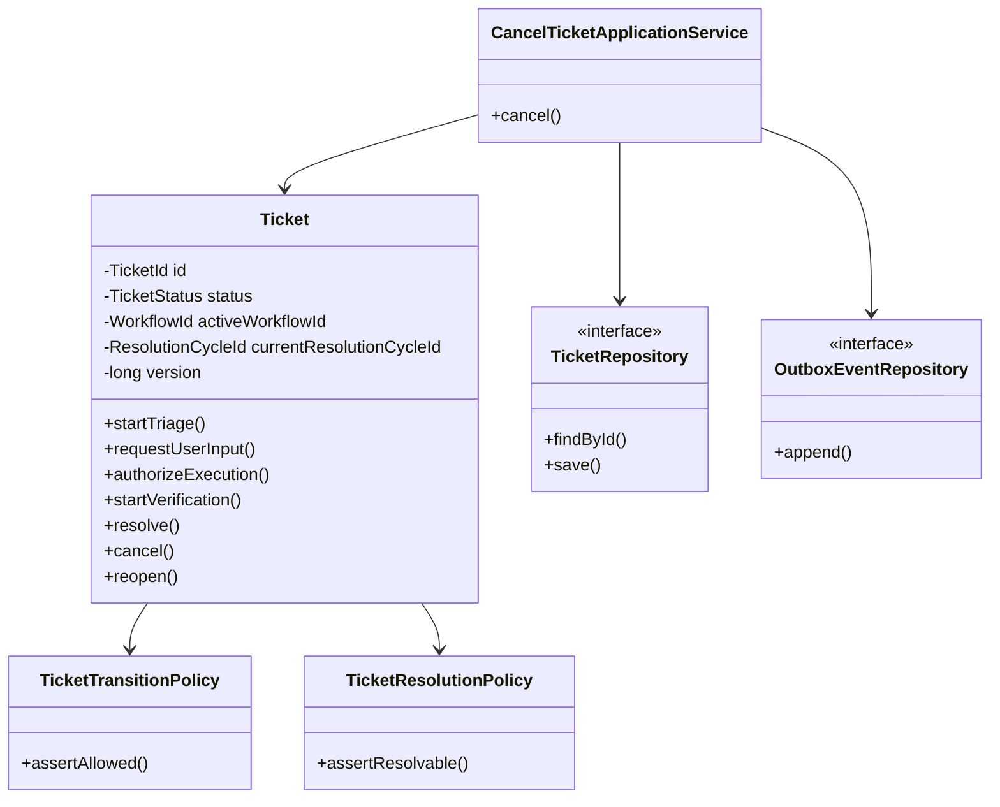

# OpsMind Ticket Workflow — 13 Package and Class Design

> **领域：** Ticket & Business Workflow  
> **文档类型：** Low-Level Java / Spring Boot Package and Class Design  
> **版本：** 1.0  
> **状态：** Proposed for Implementation  
> **依赖：** `01-domain-model/README_CN.md` 至 `12-observability/README_CN.md`  
> **语言与框架：** Java 21、Spring Boot、Spring Security、Spring Data JPA、RabbitMQ、PostgreSQL、OpenTelemetry  
> **架构风格：** Package-by-Feature + Hexagonal Architecture + DDD Tactical Patterns  
> **建议路径：** `docs/low-level-design/domains/02-ticket-workflow/13-package-and-class-design/README_CN.md`

---

# 1. 文档目的

本文档把前十二份设计映射为可实施的 Java / Spring Boot 代码结构。

本文档冻结：

- Maven / Gradle 模块边界
- Java Package Structure
- Package 依赖方向
- Controller 与 DTO
- Application Use Case 与 Command / Query
- Domain Aggregate、Entity、Value Object、Policy 和 Domain Event
- Persistence Port、JPA Entity、Mapper 和 Adapter
- RabbitMQ Consumer、Event Mapper 和 Contract Validator
- Transactional Outbox Publisher
- API / Event Idempotency
- Authorization 与 Keycloak 集成
- Error Handling 与 Reconciliation
- Scheduler
- OpenTelemetry、Metrics、Audit
- Configuration 与 Bean Composition
- Test Package Structure
- MVP 实现顺序
- 反模式与验收标准

核心目标：

```text
开发者只看本文档即可知道：
代码放在哪里；
每个类负责什么；
哪些类可以相互依赖；
事务从哪里开始；
Domain 如何保持框架无关；
事件如何进入和离开系统；
安全、幂等、审计和可观测性如何落到代码中。
```

---

# 2. 架构选择

## 2.1 Package-by-Feature

Ticket Workflow 不采用全项目顶层：

```text
controller/
service/
repository/
entity/
```

这种技术分层方式。

采用：

```text
ticket/
reconciliation/
audit/
platform/
```

每个 Feature 内部再按职责分层。

原因：

- 领域边界更清楚。
- 避免所有 Controller、Service、Repository 混在同一目录。
- 更容易提取独立服务或模块。
- 代码 Review 可以围绕 Use Case 进行。
- 降低跨领域误依赖。

## 2.2 Hexagonal Architecture

核心依赖方向：

```text
Adapter
→ Application
→ Domain
```

Domain 不依赖：

- Spring
- JPA
- RabbitMQ
- PostgreSQL
- Keycloak
- OpenTelemetry
- Jackson
- LangSmith

Application 通过 Port 调用 Infrastructure。

## 2.3 DDD Tactical Patterns

使用：

```text
Aggregate Root
Entity
Value Object
Domain Service / Policy
Domain Event
Repository Port
Application Service
```

不强制使用复杂 Event Sourcing。

PostgreSQL Snapshot 仍是 Ticket Aggregate 的 Source of Truth。

---

# 3. Repository 模块结构

建议仓库：

```text
services/
└── ticket-workflow-service/
    ├── pom.xml
    ├── Dockerfile
    ├── README.md
    ├── src/
    │   ├── main/
    │   │   ├── java/
    │   │   └── resources/
    │   └── test/
    │       ├── java/
    │       └── resources/
    └── docker/
```

如使用 Gradle：

```text
build.gradle.kts
```

MVP 推荐先使用单个 Spring Boot Module，内部严格分包。

不要在 14 天 MVP 中过早拆成多个 Maven 子模块。

---

# 4. Root Package

```text
dev.opsmind.ticketworkflow
```

建议：

```text
dev.opsmind.ticketworkflow
├── TicketWorkflowApplication.java
├── ticket
├── reconciliation
├── audit
├── platform
└── configuration
```

---

# 5. 完整 Package Tree

```text
dev.opsmind.ticketworkflow
├── TicketWorkflowApplication.java
│
├── ticket
│   ├── api
│   │   ├── publicapi
│   │   │   ├── PublicTicketController.java
│   │   │   ├── PublicTicketQueryController.java
│   │   │   └── dto
│   │   ├── support
│   │   │   ├── SupportTicketController.java
│   │   │   ├── SupportTicketQueryController.java
│   │   │   └── dto
│   │   ├── internal
│   │   │   ├── InternalTicketCommandController.java
│   │   │   ├── InternalTicketContextController.java
│   │   │   └── dto
│   │   ├── mapper
│   │   └── advice
│   │
│   ├── application
│   │   ├── port
│   │   │   ├── in
│   │   │   └── out
│   │   ├── command
│   │   ├── query
│   │   ├── service
│   │   ├── authorization
│   │   ├── idempotency
│   │   ├── event
│   │   └── model
│   │
│   ├── domain
│   │   ├── model
│   │   ├── value
│   │   ├── policy
│   │   ├── event
│   │   ├── exception
│   │   └── service
│   │
│   └── infrastructure
│       ├── persistence
│       │   ├── jpa
│       │   │   ├── entity
│       │   │   └── repository
│       │   ├── mapper
│       │   ├── adapter
│       │   └── query
│       ├── messaging
│       │   ├── consumer
│       │   ├── publisher
│       │   ├── contract
│       │   ├── mapper
│       │   └── topology
│       ├── outbox
│       ├── idempotency
│       ├── security
│       ├── scheduler
│       ├── observability
│       └── clock
│
├── reconciliation
│   ├── api
│   ├── application
│   ├── domain
│   └── infrastructure
│
├── audit
│   ├── application
│   ├── domain
│   └── infrastructure
│
├── platform
│   ├── error
│   ├── web
│   ├── messaging
│   ├── telemetry
│   └── json
│
└── configuration
    ├── SecurityConfiguration.java
    ├── RabbitMqConfiguration.java
    ├── JacksonConfiguration.java
    ├── OpenTelemetryConfiguration.java
    ├── TransactionConfiguration.java
    └── ClockConfiguration.java
```

---

# 6. Package Dependency Rules

允许：

```text
ticket.api
→ ticket.application
→ ticket.domain

ticket.infrastructure
→ ticket.application
→ ticket.domain

configuration
→ all adapters and ports
```

禁止：

```text
ticket.domain → Spring
ticket.domain → JPA Entity
ticket.domain → RabbitMQ
ticket.domain → Controller DTO
ticket.application → Controller
ticket.application → JpaRepository
ticket.api → JpaRepository
ticket.infrastructure.persistence → API DTO
```

## 6.1 ArchUnit 规则

建议使用 ArchUnit 验证：

```text
Domain package may not depend on Spring or JPA.
API package may depend only on Application and platform.web.
Application may not depend on infrastructure implementations.
Infrastructure may implement Application outbound ports.
```

---

# 7. Main Application Class

```java
@SpringBootApplication
public class TicketWorkflowApplication {

    public static void main(String[] args) {
        SpringApplication.run(TicketWorkflowApplication.class, args);
    }
}
```

只负责启动。

禁止在 Main Class 中放：

- 业务 Bean
- Queue 声明细节
- Security Rule
- Scheduler Logic
- 数据初始化逻辑

---

# 8. API Layer

## 8.1 PublicTicketController

职责：

- 创建 Ticket
- 添加 Employee Message
- Cancel
- Reopen
- Confirm Resolution

建议端点：

```text
POST /api/v1/tickets
POST /api/v1/tickets/{ticketId}/messages
POST /api/v1/tickets/{ticketId}/cancel
POST /api/v1/tickets/{ticketId}/reopen
POST /api/v1/tickets/{ticketId}/confirm-resolution
```

类：

```java
@RestController
@RequestMapping("/api/v1/tickets")
@RequiredArgsConstructor
public class PublicTicketController {

    private final CreateTicketUseCase createTicketUseCase;
    private final AddTicketMessageUseCase addTicketMessageUseCase;
    private final CancelTicketUseCase cancelTicketUseCase;
    private final ReopenTicketUseCase reopenTicketUseCase;
    private final ConfirmResolutionUseCase confirmResolutionUseCase;
    private final PublicTicketApiMapper mapper;
}
```

Controller 不执行：

- 状态机
- Repository 查询
- RabbitMQ Publish
- JPA Entity 修改
- 业务幂等实现

## 8.2 PublicTicketQueryController

职责：

```text
GET /api/v1/tickets
GET /api/v1/tickets/{ticketId}
GET /api/v1/tickets/{ticketId}/timeline
```

依赖 Query Use Case，不加载完整 Aggregate。

## 8.3 SupportTicketController

职责：

- Request User Input
- Assign
- Escalate
- Retry Automation
- Support Close
- Add Internal Message

## 8.4 InternalTicketCommandController

仅供受信 Service Token 使用。

示例：

```text
POST /internal/v1/tickets/{ticketId}/triage/start
POST /internal/v1/tickets/{ticketId}/verification/start
```

优先使用 Event 驱动；只为必须的同步内部命令保留接口。

## 8.5 InternalTicketContextController

提供最小化 Context：

```text
GET /internal/v1/tickets/{ticketId}/agent-context
GET /internal/v1/tickets/{ticketId}/notification-context
```

根据 Caller ClientId 过滤字段。

---

# 9. API DTO

## Request DTO

```text
CreateTicketRequest
AddTicketMessageRequest
CancelTicketRequest
ReopenTicketRequest
ConfirmResolutionRequest
AssignTicketRequest
EscalateTicketRequest
RequestUserInputRequest
RetryAutomationRequest
```

使用 Java Record：

```java
public record CreateTicketRequest(
    @NotBlank
    @Size(max = 200)
    String title,

    @NotBlank
    @Size(max = 10_000)
    String description,

    @NotBlank
    String applicationCode,

    List<String> attachmentIds
) {}
```

Employee DTO 不包含：

```text
requesterId
status
priority
category
teamId
workflowId
approvalId
```

## Response DTO

```text
TicketResponse
TicketSummaryResponse
TicketTimelineResponse
TicketMessageResponse
CommandAcceptedResponse
CursorPageResponse<T>
ErrorResponse
```

---

# 10. API Mapper

```text
PublicTicketApiMapper
SupportTicketApiMapper
InternalTicketContextMapper
```

职责：

```text
Request DTO → Application Command
Application Result → Response DTO
```

推荐 MapStruct，但 Domain Mapping 可以手写。

API Mapper 不访问数据库。

---

# 11. Inbound Use Case Ports

Package：

```text
ticket.application.port.in
```

接口：

```text
CreateTicketUseCase
AddTicketMessageUseCase
CancelTicketUseCase
ReopenTicketUseCase
ConfirmResolutionUseCase
StartTriageUseCase
CompleteClassificationUseCase
RequestUserInputUseCase
HandleUserReplyUseCase
RequestApprovalUseCase
ApplyApprovalGrantedUseCase
ApplyApprovalRejectedUseCase
ApplyApprovalExpiredUseCase
ApplyAutoApprovalUseCase
ApplyToolExecutionCompletedUseCase
ApplyToolExecutionFailedUseCase
ApplyToolResultUnknownUseCase
StartVerificationUseCase
ApplyVerificationCompletedUseCase
AssignTicketUseCase
EscalateTicketUseCase
CloseTicketUseCase
RetryAutomationUseCase
```

Query Port：

```text
GetTicketUseCase
ListRequesterTicketsUseCase
ListSupportQueueUseCase
GetTicketTimelineUseCase
GetInternalTicketContextUseCase
```

---

# 12. Command Objects

Package：

```text
ticket.application.command
```

示例：

```java
public record CancelTicketCommand(
    TicketId ticketId,
    long expectedVersion,
    String reasonCode,
    ActorContext actor,
    IdempotencyContext idempotency,
    CommandId commandId,
    Instant requestedAt
) {}
```

Command 必须包含业务执行所需上下文。

禁止把整个：

```text
HttpServletRequest
Jwt
Authentication
Rabbit Message
```

传入 Domain。

---

# 13. Query Objects

```text
GetTicketQuery
ListRequesterTicketsQuery
ListSupportQueueQuery
GetTicketTimelineQuery
GetAgentContextQuery
```

Query 采用：

```text
PrincipalContext
Cursor
Limit
Filter
```

Query 不修改 Aggregate。

---

# 14. Application Services

Package：

```text
ticket.application.service
```

推荐一个 Use Case 一个 Service，或按高度相关场景小范围组合。

核心类：

```text
CreateTicketApplicationService
AddTicketMessageApplicationService
CancelTicketApplicationService
ReopenTicketApplicationService
ConfirmResolutionApplicationService
TicketWorkflowEventApplicationService
AssignmentApplicationService
EscalationApplicationService
TicketQueryApplicationService
TicketTimelineApplicationService
```

## 14.1 Application Service 职责

```text
Authorization
Idempotency
Load Aggregate
Call Domain Behavior
Persist
Write History
Write Audit
Write Outbox
Map Result
Transaction Boundary
```

不负责：

- HTTP 细节
- Rabbit ACK
- JPA Mapping 细节
- Tool Execution
- LLM 调用

---

# 15. Transaction Entry Point

事务放在 Application Service Public Method：

```java
@Service
@RequiredArgsConstructor
public class CancelTicketApplicationService implements CancelTicketUseCase {

    @Transactional
    @Override
    public CancelTicketResult cancel(CancelTicketCommand command) {
        // authorization
        // idempotency
        // load
        // domain behavior
        // save
        // history
        // audit
        // outbox
        // response persistence
    }
}
```

禁止：

- Domain Entity 上 `@Transactional`
- Controller 上承载完整业务事务
- Outbox 使用 `REQUIRES_NEW`
- 外部 HTTP / Rabbit Publish 在事务内执行

---

# 16. Outbound Ports

Package：

```text
ticket.application.port.out
```

接口：

```text
TicketRepository
TicketMessageRepository
TicketSlaRepository
TicketResolutionCycleRepository
TicketPendingActionRepository
TicketUserInputRequestRepository
TicketHistoryWriter
TicketQueryRepository
TicketTimelineQueryRepository
OutboxEventRepository
ProcessedEventRepository
IdempotencyRepository
AuditRecordRepository
AuthorizationProjectionRepository
ReconciliationPort
EventSchemaValidator
ClockPort
IdentifierGenerator
```

## 16.1 Repository Port 示例

```java
public interface TicketRepository {

    Optional<Ticket> findById(TicketId ticketId);

    Ticket save(Ticket ticket, long expectedVersion);

    boolean existsByDisplayId(TicketDisplayId displayId);
}
```

Repository Port 使用 Domain 类型，不暴露 JPA Entity。

---

# 17. Domain Aggregate Root：Ticket

Package：

```text
ticket.domain.model
```

```java
public final class Ticket {

    private final TicketId id;
    private final TicketDisplayId displayId;
    private final RequesterId requesterId;
    private TicketTitle title;
    private TicketDescription description;
    private ApplicationCode applicationCode;
    private TicketCategory category;
    private TicketSubcategory subcategory;
    private TicketPriority priority;
    private TicketStatus status;
    private Assignment assignment;
    private WorkflowId activeWorkflowId;
    private ResolutionCycleId currentResolutionCycleId;
    private Instant autoCloseDueAt;
    private long version;
    private final List<TicketDomainEvent> domainEvents;
}
```

## 17.1 Ticket Domain Methods

```text
startTriage(...)
completeClassification(...)
startInvestigation(...)
requestUserInput(...)
resumeAfterUserReply(...)
waitForApproval(...)
authorizeExecution(...)
startVerification(...)
resolve(...)
close(...)
cancel(...)
reopen(...)
assign(...)
escalate(...)
markAutomationFailed(...)
resumeInvestigation(...)
```

禁止：

```text
setStatus(...)
setWorkflowId(...)
setResolvedAt(...)
```

所有状态变化必须通过业务语义方法。

---

# 18. Ticket Method 示例

```java
public void cancel(
    CancellationReason reason,
    ActorReference actor,
    Instant now,
    TicketTransitionPolicy transitionPolicy
) {
    transitionPolicy.assertCancellationAllowed(this);

    TicketStatus previous = this.status;
    this.status = TicketStatus.CANCELLED;
    this.activeWorkflowId = null;
    this.cancelledAt = now;
    this.version++;

    registerEvent(new TicketCancelled(
        id,
        previous,
        status,
        reason,
        actor,
        version,
        now
    ));
}
```

Domain 方法：

- 验证 Invariant
- 修改内部状态
- 注册 Domain Event

不：

- 保存数据库
- 发布 RabbitMQ
- 写 Log
- 检查 JWT

---

# 19. Domain Entities

独立 Aggregate：

```text
TicketMessage
TicketSla
```

Cycle / Lifecycle Record：

```text
TicketResolutionCycle
TicketPendingAction
TicketUserInputRequest
```

Append-only Record：

```text
TicketStatusHistory
TicketCategoryHistory
TicketAssignmentHistory
TicketEscalationHistory
TicketAutomationFailure
```

根据实现复杂度，Cycle Record 可以先由 Application Service + Repository 管理，但业务规则必须通过专用 Domain Object 封装。

---

# 20. Value Objects

Package：

```text
ticket.domain.value
```

建议：

```text
TicketId
TicketDisplayId
RequesterId
TicketTitle
TicketDescription
ApplicationCode
TicketCategory
TicketSubcategory
TicketPriority
WorkflowId
ResolutionCycleId
ActionId
ApprovalId
ToolExecutionId
VerificationId
ResolutionAttemptId
Assignment
ActorReference
CancellationReason
CloseReason
Resolution
PendingActionReference
```

Value Object：

- Immutable
- Constructor Validation
- Value Equality
- 无 Spring / JPA 依赖

---

# 21. Domain Enums

```text
TicketStatus
TicketPriority
TicketSource
ActorType
MessageVisibility
MessageType
PendingActionStatus
ResolutionCycleStatus
SlaStatus
RiskLevel
PolicyDecision
```

Enum 名称必须与 API / Event Contract 的 Stable Value 对齐。

不允许各层自行定义不同字符串。

---

# 22. Domain Policies

Package：

```text
ticket.domain.policy
```

核心类：

```text
TicketTransitionPolicy
TicketResolutionPolicy
TicketReopenPolicy
TicketCancellationPolicy
TicketAssignmentPolicy
TicketEscalationPolicy
TicketVerificationPolicy
TicketPendingActionPolicy
TicketSlaPolicy
```

## 22.1 TicketTransitionPolicy

负责：

- 合法状态转换
- Transition ID
- Source State Guard
- Terminal State Guard

## 22.2 TicketResolutionPolicy

负责：

- Verification 必须存在
- 当前 Workflow / Cycle / Attempt 匹配
- 不能 Tool Success 后直接 Resolve
- Resolution Data 完整

## 22.3 TicketReopenPolicy

负责：

- 来源状态为 RESOLVED / CLOSED
- 时间窗口
- 新 Workflow
- 新 Resolution Cycle
- 新 SLA Cycle

---

# 23. Domain Service

仅当逻辑不自然属于单一 Aggregate 时使用。

候选：

```text
TicketDisplayIdGenerator
ResolutionCycleFactory
TicketReopenCoordinator
```

不要创建：

```text
TicketDomainService
```

作为万能类。

---

# 24. Domain Events

Package：

```text
ticket.domain.event
```

基类：

```java
public sealed interface TicketDomainEvent
    permits TicketCreated,
            TicketStatusChanged,
            TicketResolved,
            TicketClosed,
            TicketCancelled,
            TicketReopened,
            TicketEscalated {
}
```

事件：

```text
TicketCreated
TicketTriagingStarted
TicketClassified
TicketWaitingForUser
TicketUserReplied
TicketWaitingForApproval
TicketExecutionReady
TicketVerificationStarted
TicketResolved
TicketClosed
TicketCancelled
TicketReopened
TicketEscalated
TicketAssigned
TicketAutomationFailed
```

Domain Event 不包含：

- Routing Key
- Rabbit Header
- Jackson Annotation
- Broker Queue

---

# 25. Domain Exceptions

Package：

```text
ticket.domain.exception
```

```text
TicketDomainException
InvalidTicketTransitionException
CancellationNotAllowedException
VerificationRequiredException
ReopenWindowExpiredException
ActiveWorkflowAlreadyExistsException
PendingActionConflictException
ReferenceMismatchException
```

每个 Exception 包含：

```text
errorCode
invariantId
safeContext
```

不包含用户 Message 或 HTTP Status。

---

# 26. Domain Event Collector

Ticket 内部保存：

```java
private final List<TicketDomainEvent> domainEvents;
```

提供：

```java
public List<TicketDomainEvent> pullDomainEvents()
```

Application Service 在成功调用 Domain Behavior 后：

1. Pull Domain Events
2. 映射 Integration Events
3. Schema Validate
4. 写 Outbox

---

# 27. Integration Event Mapper

Package：

```text
ticket.application.event
```

类：

```text
TicketIntegrationEventMapper
TicketEventEnvelopeFactory
TicketEventPayloadFactory
```

职责：

```text
Domain Event
→ Versioned Integration Event
→ Event Envelope
```

示例：

```java
public IntegrationEvent map(
    TicketResolved event,
    TraceContext traceContext
) {
    return envelopeFactory.create(
        "ticket.resolved",
        "1.0",
        "ticket.resolved.v1",
        event.ticketId(),
        event.workflowId(),
        payloadFactory.from(event)
    );
}
```

---

# 28. Event Schema Validation

接口：

```text
EventSchemaValidator
```

实现：

```text
JsonSchemaEventValidator
```

Schema 路径：

```text
src/main/resources/event-schemas/
```

Outbox Insert 前必须验证。

失败：

```text
Rollback Business Transaction
EVENT_SCHEMA_GENERATION_FAILED
```

---

# 29. Persistence Infrastructure

Package：

```text
ticket.infrastructure.persistence
```

子包：

```text
jpa.entity
jpa.repository
mapper
adapter
query
```

---

# 30. JPA Entities

```text
TicketJpaEntity
TicketMessageJpaEntity
TicketStatusHistoryJpaEntity
TicketCategoryHistoryJpaEntity
TicketAssignmentHistoryJpaEntity
TicketUserInputRequestJpaEntity
TicketPendingActionJpaEntity
TicketResolutionCycleJpaEntity
TicketSlaCycleJpaEntity
TicketEscalationHistoryJpaEntity
TicketAutomationFailureJpaEntity
OutboxEventJpaEntity
ProcessedEventJpaEntity
IdempotencyRecordJpaEntity
AuditRecordJpaEntity
```

JPA Entity 仅用于持久化。

禁止从 Controller 返回 JPA Entity。

---

# 31. TicketJpaEntity

```java
@Entity
@Table(schema = "ticket", name = "tickets")
public class TicketJpaEntity {

    @Id
    private UUID ticketId;

    @Column(nullable = false, unique = true)
    private String displayId;

    @Column(nullable = false)
    private String requesterId;

    @Enumerated(EnumType.STRING)
    private TicketStatus status;

    @Version
    private long version;

    // persistence fields only
}
```

注意：

- 是否直接复用 Domain Enum 需统一评估。
- 不把 Domain Behavior 放入 JPA Entity。
- `@Version` 作为数据库保护，Adapter 仍要映射并解释 Conflict。

---

# 32. Persistence Mapper

```text
TicketPersistenceMapper
TicketMessagePersistenceMapper
TicketSlaPersistenceMapper
TicketResolutionCyclePersistenceMapper
```

职责：

```text
Domain ↔ JPA Entity
```

复杂 Aggregate 重建必须完整恢复：

- Current Status
- Active Workflow
- Resolution Cycle Ref
- Assignment
- Version

不得遗漏隐含状态。

---

# 33. Spring Data Repositories

```text
SpringDataTicketJpaRepository
SpringDataTicketMessageJpaRepository
SpringDataOutboxJpaRepository
SpringDataProcessedEventJpaRepository
SpringDataIdempotencyJpaRepository
```

示例：

```java
interface SpringDataTicketJpaRepository
        extends JpaRepository<TicketJpaEntity, UUID> {
    Optional<TicketJpaEntity> findByDisplayId(String displayId);
}
```

这些接口只能被 Persistence Adapter 使用。

---

# 34. Persistence Adapters

```text
TicketPersistenceAdapter
TicketMessagePersistenceAdapter
TicketSlaPersistenceAdapter
TicketResolutionCyclePersistenceAdapter
TicketHistoryPersistenceAdapter
OutboxPersistenceAdapter
ProcessedEventPersistenceAdapter
IdempotencyPersistenceAdapter
AuditPersistenceAdapter
```

Adapter 实现 Application Outbound Port。

---

# 35. Query Repositories

Query Side 不必加载 Aggregate。

类：

```text
JdbcTicketQueryRepository
JdbcSupportQueueQueryRepository
JdbcTicketTimelineQueryRepository
JdbcAuthorizationProjectionRepository
```

推荐使用：

```text
NamedParameterJdbcTemplate
RowMapper
Projection Record
```

理由：

- Cursor Pagination 清晰。
- 避免 JPA N+1。
- 易于精确选择字段。
- 支持角色可见性过滤。

---

# 36. Query Projections

Package：

```text
ticket.application.model
```

```text
TicketSummaryView
TicketDetailView
TicketTimelineEntryView
SupportQueueTicketView
AgentTicketContextView
NotificationTicketContextView
TicketAuthorizationProjection
```

Projection 是只读模型，不包含行为。

---

# 37. RabbitMQ Consumers

Package：

```text
ticket.infrastructure.messaging.consumer
```

推荐按来源拆分：

```text
AgentEventConsumer
ApprovalEventConsumer
ToolExecutionEventConsumer
VerificationEventConsumer
```

不要为 14 个 Event 创建 14 个完全重复的 Consumer 类，除非逻辑显著不同。

每个 Consumer：

1. 接收 Raw Message
2. Envelope Parse
3. Schema Validate
4. Producer Validate
5. Payload Hash
6. 调用 Event Application Service
7. 根据 Decision ACK / Retry / DLQ

---

# 38. Consumer 示例

```java
@Component
@RequiredArgsConstructor
public class ApprovalEventConsumer {

    private final EventEnvelopeParser parser;
    private final EventTrustValidator trustValidator;
    private final ApprovalEventMapper mapper;
    private final ApplyApprovalGrantedUseCase grantedUseCase;
    private final EventProcessingDecisionHandler decisionHandler;

    @RabbitListener(queues = "${opsmind.queues.approval-events}")
    public void consume(Message message, Channel channel) {
        // parse, validate, dispatch, disposition
    }
}
```

如果使用 Spring AMQP Container 的统一 Error Handler，可让 Consumer 返回 Decision，而不是手写所有 ACK 逻辑。

---

# 39. Event Payload DTO

Package：

```text
ticket.infrastructure.messaging.contract
```

```text
EventEnvelopeDto
ApprovalGrantedEventV1
ApprovalRejectedEventV1
ToolExecutionCompletedEventV1
ToolExecutionFailedEventV1
ToolExecutionResultUnknownEventV1
VerificationCompletedEventV1
AgentWorkflowStartedEventV1
AgentWorkflowFailedEventV1
ClassificationCompletedEventV1
UserInputRequiredEventV1
ResolutionCandidateReadyEventV1
```

Contract DTO 可使用 Jackson Annotation。

这些 DTO 不进入 Domain。

---

# 40. Event Mapper

```text
ApprovalEventMapper
ToolExecutionEventMapper
VerificationEventMapper
AgentEventMapper
```

职责：

```text
Contract DTO
→ Application Command
```

例如：

```text
ApprovalGrantedEventV1
→ ApplyApprovalGrantedCommand
```

---

# 41. Event Trust Validator

类：

```text
EventTrustValidator
EventProducerAllowlist
EventReferencePreValidator
SecretPayloadScanner
```

验证：

- Producer
- Event Type
- Version
- Routing Key
- Data Classification
- Secret
- 基本 Reference 格式

业务 Reference 匹配在 Application / Domain 中完成。

---

# 42. Processed Event Coordinator

Application 类：

```text
ProcessedEventCoordinator
EventDeduplicationService
EventClassificationService
```

职责：

- 查 `(consumerName, eventId)`
- 比较 Payload Hash
- 识别 Transport Duplicate
- 把 Business Duplicate / Stale 交给 Use Case
- 与业务更新同事务写 Processed Event

---

# 43. Event Processing Decision

```java
public record EventProcessingDecision(
    EventClassification classification,
    BrokerDisposition disposition,
    String errorCode,
    Duration retryDelay,
    boolean reconciliationRequired
) {}
```

Enum：

```text
APPLY
DUPLICATE
BUSINESS_DUPLICATE
STALE
OUT_OF_ORDER
REJECTED_BUSINESS_RULE
CORRUPT_REFERENCE
TERMINAL_RESULT_CONFLICT
```

---

# 44. Outbox Components

Package：

```text
ticket.infrastructure.outbox
```

类：

```text
OutboxPublisherScheduler
OutboxClaimService
OutboxClaimRepository
RabbitMqEventPublisher
PublisherConfirmTracker
OutboxPublishResultService
OutboxRetryPolicy
OutboxLockRecoveryJob
OutboxCleanupJob
```

---

# 45. Outbox Publisher Flow

```text
OutboxPublisherScheduler
→ OutboxClaimService
→ OutboxClaimRepository
→ RabbitMqEventPublisher
→ PublisherConfirmTracker
→ OutboxPublishResultService
```

Claim Transaction 与 Publish 分离。

## 45.1 OutboxClaimService

```java
public interface OutboxClaimService {
    List<ClaimedOutboxEvent> claimBatch(
        PublisherInstanceId instanceId,
        int batchSize,
        Instant now
    );
}
```

## 45.2 RabbitMqEventPublisher

```java
public interface RabbitMqEventPublisher {
    PublishAttemptResult publish(ClaimedOutboxEvent event);
}
```

Publisher 不修改业务 Aggregate。

---

# 46. API Idempotency Components

Package：

```text
ticket.application.idempotency
```

类：

```text
IdempotencyCoordinator
RequestCanonicalizer
RequestHashCalculator
IdempotencyScopeFactory
IdempotencyReplayService
IdempotencyReconciliationService
```

Infrastructure：

```text
JpaIdempotencyRepository
```

## 46.1 IdempotencyCoordinator

```text
reserve
replay
complete
markRetryableFailure
reconcileStaleInProgress
```

必须在 Application Transaction 中使用。

---

# 47. Security Components

Package：

```text
ticket.infrastructure.security
```

类：

```text
JwtPrincipalFactory
TicketAuthorizationService
TicketAuthorizationProjectionAdapter
QueueMembershipResolver
TemporaryAccessGrantService
ServiceClientAuthorizer
EventProducerAuthorizer
FieldVisibilityPolicy
SensitiveDataRedactor
SecretDetector
StepUpAuthenticationValidator
```

---

# 48. Authorization Service

Application Port：

```java
public interface TicketAuthorizationPort {

    AuthorizationDecision authorize(
        PrincipalContext principal,
        TicketOperation operation,
        TicketAuthorizationProjection ticket
    );
}
```

Controller 不应只依赖 `@PreAuthorize`。

`@PreAuthorize` 用于 Scope 初筛，Resource Authorization 在 Application Service 中再次执行。

---

# 49. Principal Context Adapter

```text
SecurityContextPrincipalAdapter
```

职责：

```text
Spring Security Authentication
→ PrincipalContext
```

Application 和 Domain 不依赖 Spring `Authentication`。

---

# 50. Field Visibility Policy

```text
EmployeeTicketVisibilityPolicy
SupportTicketVisibilityPolicy
AuditorTicketVisibilityPolicy
ServiceTicketVisibilityPolicy
```

可以统一为：

```text
TicketFieldVisibilityService
```

输入：

```text
PrincipalContext
TicketProjection
RequestedView
```

输出：

```text
Allowed Field Set
```

---

# 51. Error Handling Components

Platform：

```text
platform.error
```

类：

```text
ErrorDescriptor
ErrorCatalog
ApplicationError
ErrorFingerprintFactory
Retryability
ErrorSeverity
```

API：

```text
GlobalRestExceptionHandler
ErrorResponseMapper
```

Messaging：

```text
EventConsumerErrorHandler
BrokerDispositionResolver
RetryHeaderFactory
DlqPublisher
```

---

# 52. Error Catalog

```java
public interface ErrorCatalog {
    ErrorDescriptor descriptorFor(String errorCode);
}
```

实现：

```text
StaticErrorCatalog
```

错误元数据不散落在 Controller 和 Consumer 中。

---

# 53. Reconciliation Module

Root：

```text
reconciliation
```

建议独立 Feature Package，因为它跨越普通 Ticket 生命周期并具有独立权限和审计。

## 53.1 Domain

```text
ReconciliationCase
ReconciliationEvidence
ReconciliationType
ReconciliationStatus
ReconciliationOutcome
RecoveryAction
```

## 53.2 Application

```text
OpenReconciliationUseCase
InvestigateReconciliationUseCase
ProposeRecoveryUseCase
ApproveRecoveryUseCase
ExecuteRecoveryUseCase
ResolveReconciliationUseCase
```

## 53.3 Infrastructure

```text
ReconciliationJpaEntity
ReconciliationEvidenceJpaEntity
ReconciliationPersistenceAdapter
ExternalFactQueryAdapter
```

---

# 54. Reconciliation Coordinator

```text
ReconciliationApplicationService
ToolResultReconciliationService
VerificationConflictReconciliationService
ApprovalConflictReconciliationService
OutOfOrderReconciliationService
IdempotencyReconciliationService
DataIntegrityReconciliationService
```

所有 Recovery 必须调用正常 Ticket Use Case，禁止直接改 `ticket.status`。

---

# 55. Audit Module

Root：

```text
audit
```

Domain：

```text
AuditRecord
AuditType
AuditAction
AuditDecision
AuditActor
AuditResource
```

Application：

```text
RecordBusinessAuditUseCase
RecordSecurityAuditUseCase
RecordSensitiveReadAuditUseCase
AuditHashService
```

Infrastructure：

```text
AuditJpaEntity
AuditPersistenceAdapter
AuditOutboxMapper
```

高风险业务操作通过 Outbound Port 在同一事务写 Audit。

---

# 56. Audit Port

```java
public interface AuditRecordPort {

    void append(AuditRecord record);
}
```

禁止：

```text
best effort audit
```

用于高风险操作。

普通低风险 Read Log 可以 Best Effort，但 Sensitive Read Audit 不能丢失。

---

# 57. Scheduler Components

Package：

```text
ticket.infrastructure.scheduler
```

类：

```text
AutoCloseScheduler
SlaBreachScheduler
IntegrityScanScheduler
IdempotencyCleanupScheduler
ProcessedEventCleanupScheduler
```

Outbox Scheduler 放在 Outbox Package。

## 57.1 Scheduler Rule

Scheduler 只：

1. 查 Candidate ID
2. 对每个 Candidate 调用 Use Case
3. 每个 Ticket 独立事务
4. 记录 Job Metric

Scheduler 不直接修改 JPA Entity。

---

# 58. Clock and ID Generation

Outbound Port：

```text
ClockPort
TicketIdGenerator
DisplayIdGenerator
EventIdGenerator
CommandIdGenerator
```

Infrastructure：

```text
SystemClockAdapter
UuidV7IdentifierGenerator
DatabaseBackedDisplayIdGenerator
```

测试使用：

```text
FixedClock
DeterministicIdGenerator
```

避免在 Domain 内直接调用：

```java
Instant.now()
UUID.randomUUID()
```

---

# 59. Observability Components

Package：

```text
ticket.infrastructure.observability
```

类：

```text
TicketTelemetry
TicketMetrics
TicketTraceAttributes
TicketLogContext
TelemetryRedactor
EventProcessingMetrics
OutboxMetrics
SchedulerMetrics
SecurityMetrics
ReconciliationMetrics
```

## 59.1 TicketTelemetry

提供明确方法：

```text
recordTransition
recordEventClassification
recordTransactionRetry
recordAuthorizationDecision
recordOutboxPublish
```

禁止到处直接拼 Metric Name。

---

# 60. MDC / Log Context

Filter / Interceptor：

```text
CorrelationIdFilter
TraceLogContextFilter
PrincipalLogContextFilter
```

Rabbit Consumer：

```text
MessageLogContextScope
```

确保处理结束后清理 MDC，避免线程复用污染。

---

# 61. Configuration Classes

Root：

```text
configuration
```

## SecurityConfiguration

- Resource Server
- JWT Decoder
- Endpoint Scope
- CORS
- Method Security

## RabbitMqConfiguration

- Exchange
- Queue
- Binding
- Retry Queue
- DLQ
- Publisher Confirm

## JacksonConfiguration

- Java Time
- Strict Unknown Fields Policy
- Canonical JSON Mapper
- Event Mapper

## OpenTelemetryConfiguration

- Resource
- Sampler
- Redaction
- Instrumentation

## TransactionConfiguration

- Transaction Manager
- Timeout
- Retry Classification

## ClockConfiguration

- System Clock Bean

配置类不写业务规则。

---

# 62. Spring Bean Composition

Domain Object 通过：

- Factory
- Application Service
- Domain Constructor

创建。

Infrastructure Bean 实现 Port。

推荐使用 Constructor Injection。

禁止：

- Field Injection
- 静态 Service Locator
- `ApplicationContext.getBean()` 驱动业务逻辑

---

# 63. Package Visibility

尽量使用：

- `public`：跨 Package Port、DTO、Domain API
- package-private：内部 Mapper、Helper、Implementation
- `private`：类内部细节

不要把所有类都设为 `public`。

---

# 64. Naming Conventions

## Application Service

```text
<Create/Apply/Handle><Subject>ApplicationService
```

## Use Case

```text
<Create/Apply/Handle><Subject>UseCase
```

## Command

```text
<Verb><Subject>Command
```

## Query

```text
<Get/List><Subject>Query
```

## Adapter

```text
<Capability><Technology>Adapter
```

## Mapper

```text
<Source><Target>Mapper
```

## Consumer

```text
<SourceDomain>EventConsumer
```

## Scheduler

```text
<BusinessPurpose>Scheduler
```

避免：

```text
CommonService
Helper
Util
Manager
Processor
Handler
```

除非职责非常明确。

---

# 65. Java Record 使用规则

适合 Record：

- Command
- Query
- DTO
- Value Object
- Result
- Projection
- Event Payload

不适合 Record：

- 可变 JPA Entity
- 复杂 Aggregate Root
- 需要内部状态变化的 Domain Entity

---

# 66. Sealed Interface 使用

候选：

```text
TicketDomainEvent
ApplicationResult
EventClassificationResult
RecoveryAction
```

优点：

- 编译期 Exhaustive Switch
- 限制合法子类型
- 清晰表达 Closed Set

---

# 67. Result Types

不要所有 Use Case 都只返回 `void`。

示例：

```text
CreateTicketResult
CancelTicketResult
ReopenTicketResult
ApplyEventResult
TicketCommandResult
```

包含：

```text
ticketId
displayId
status
version
idempotencyReplayed
outcome
```

---

# 68. Controller Error Flow

```text
Domain / Application Exception
→ GlobalRestExceptionHandler
→ ErrorDescriptor
→ ErrorResponseMapper
→ Safe Error Envelope
```

Controller 不写重复 Try/Catch。

---

# 69. Consumer Error Flow

```text
Exception / Result
→ EventConsumerErrorHandler
→ EventProcessingDecision
→ ACK / Retry / DLQ
```

Business Stale 不作为异常抛出。

推荐：

```text
Stale / Duplicate / Out-of-order
```

作为显式 Result。

---

# 70. Transaction + Outbox Class Interaction



---

# 71. Package Dependency Diagram



注意：

Infrastructure Adapter 通过实现 Port 被 Application 调用，图中的箭头表示源码依赖方向与运行时调用需要分别理解。

---

# 72. Core Class Diagram



---

# 73. Suggested Class Inventory

## MVP 必须

### API

```text
PublicTicketController
PublicTicketQueryController
SupportTicketController
GlobalRestExceptionHandler
PublicTicketApiMapper
```

### Application

```text
CreateTicketApplicationService
AddTicketMessageApplicationService
CancelTicketApplicationService
ReopenTicketApplicationService
TicketWorkflowEventApplicationService
TicketQueryApplicationService
TicketTimelineApplicationService
IdempotencyCoordinator
TicketAuthorizationService
TicketIntegrationEventMapper
```

### Domain

```text
Ticket
TicketMessage
TicketSla
TicketStatus
TicketTransitionPolicy
TicketResolutionPolicy
TicketReopenPolicy
TicketCancellationPolicy
TicketDomainEvent hierarchy
Domain Exception hierarchy
```

### Persistence

```text
TicketJpaEntity
TicketMessageJpaEntity
TicketStatusHistoryJpaEntity
OutboxEventJpaEntity
ProcessedEventJpaEntity
IdempotencyRecordJpaEntity
TicketPersistenceAdapter
TicketQueryRepository
TicketPersistenceMapper
```

### Messaging

```text
AgentEventConsumer
ApprovalEventConsumer
ToolExecutionEventConsumer
VerificationEventConsumer
EventEnvelopeParser
EventTrustValidator
EventConsumerErrorHandler
```

### Outbox

```text
OutboxPublisherScheduler
OutboxClaimService
RabbitMqEventPublisher
PublisherConfirmTracker
OutboxRetryPolicy
```

### Security / Observability

```text
SecurityContextPrincipalAdapter
TicketAuthorizationService
SecretDetector
TicketTelemetry
TicketMetrics
CorrelationIdFilter
```

## Phase 2

```text
Full Reconciliation Module
Temporary Access Grant
Audit Hash Chain
Sensitive Read Audit
Correction Event API
Compensation Workflow
Advanced Tail Sampling
```

---

# 74. MVP Use Case to Class Mapping

| Use Case | Application Class |
|---|---|
| UC-01 Create Ticket | `CreateTicketApplicationService` |
| UC-05 Add Message | `AddTicketMessageApplicationService` |
| UC-06 Start Triage | `TicketWorkflowEventApplicationService` |
| UC-07 Complete Classification | `TicketWorkflowEventApplicationService` |
| UC-08 Request User Input | `TicketWorkflowEventApplicationService` |
| UC-09 User Reply | `AddTicketMessageApplicationService` |
| UC-11 Approval Requested | `TicketWorkflowEventApplicationService` |
| UC-12 Approval Granted | `TicketWorkflowEventApplicationService` |
| UC-16 Tool Completed | `TicketWorkflowEventApplicationService` |
| UC-17 Tool Failed | `TicketWorkflowEventApplicationService` |
| UC-18 Tool Unknown | `TicketWorkflowEventApplicationService` |
| UC-20 Verification Success | `TicketWorkflowEventApplicationService` |
| UC-21 Verification Failure | `TicketWorkflowEventApplicationService` |
| UC-23/24 Close | `CloseTicketApplicationService` |
| UC-25 Reopen | `ReopenTicketApplicationService` |
| UC-26 Cancel | `CancelTicketApplicationService` |
| UC-27 Escalate | `EscalationApplicationService` |
| UC-28 Assign | `AssignmentApplicationService` |

当 `TicketWorkflowEventApplicationService` 过大时，再拆分：

```text
ApprovalEventApplicationService
ToolEventApplicationService
VerificationEventApplicationService
AgentEventApplicationService
```

---

# 75. Package Size Guard

经验规则：

- 单类建议少于 300 行。
- Application Service 单方法建议少于 80 行。
- 单 Package 超过 20–30 个类时评估子 Feature。
- 一个类超过 7–10 个依赖时评估职责过大。
- 一个方法超过 3 层嵌套时重构。

这些是 Review Trigger，不是机械硬限制。

---

# 76. Test Package Structure

```text
src/test/java/dev/opsmind/ticketworkflow
├── ticket
│   ├── domain
│   ├── application
│   ├── api
│   ├── persistence
│   ├── messaging
│   ├── outbox
│   ├── security
│   └── observability
├── reconciliation
├── audit
├── architecture
└── support
```

Support：

```text
TicketFixtures
EventFixtures
TestClock
TestIdGenerator
PostgresTestContainer
RabbitMqTestContainer
KeycloakTestContainer
```

---

# 77. Test Naming

```text
should<ExpectedBehavior>When<Condition>
```

示例：

```text
shouldResolveTicketWhenVerificationSucceeds
shouldRejectCancellationWhenToolExecutionIsActive
shouldAckOldWorkflowEventAsStale
shouldPublishOutboxAfterCommit
shouldReturnSameTicketForRepeatedIdempotencyKey
```

---

# 78. Architecture Tests

```text
DomainDoesNotDependOnSpringTest
ApplicationDoesNotDependOnInfrastructureTest
ControllersDoNotAccessRepositoriesTest
JpaEntitiesAreNotReturnedByApiTest
EventContractsDoNotEnterDomainTest
```

使用：

```text
ArchUnit
```

---

# 79. Component Tests

## API Component

```text
MockMvc
Spring Security Test
Testcontainers PostgreSQL
```

## Messaging Component

```text
RabbitMQ Testcontainer
Real JSON Schema
Processed Event Store
```

## Persistence Component

```text
PostgreSQL Testcontainer
Flyway
Real Constraint
```

不以 H2 替代 PostgreSQL 关键并发和 JSONB 测试。

---

# 80. Configuration Properties

```text
TicketWorkflowProperties
OutboxProperties
EventRetryProperties
SecurityProperties
AuditProperties
SchedulerProperties
TelemetryProperties
```

使用：

```java
@ConfigurationProperties(prefix = "opsmind.ticket")
```

而不是大量散落的 `@Value`。

---

# 81. Feature Flags

MVP 可定义：

```text
reconciliationEnabled
eventSignatureValidationEnabled
auditHashChainEnabled
fullLangSmithCaptureEnabled
temporaryCrossQueueAccessEnabled
```

默认安全值：

- 未实现的高风险能力关闭。
- 生产完整 Prompt Capture 关闭。
- Event Signature 未配置时使用 Broker ACL + Producer Allowlist。

Feature Flag 不允许绕过 Domain Guard。

---

# 82. Flyway Resource Structure

```text
src/main/resources/db/migration/
├── V001__create_ticket_schema.sql
├── V002__create_tickets.sql
├── ...
└── V015__create_audit_records.sql
```

Migration 与代码同版本发布。

禁止运行时自动：

```text
hibernate.ddl-auto=update
```

生产建议：

```text
validate
```

---

# 83. Event Schema Resource Structure

```text
src/main/resources/event-schemas/
├── common/
│   └── event-envelope-v1.schema.json
├── published/
│   ├── ticket-created-v1.schema.json
│   ├── ticket-resolved-v1.schema.json
│   └── ...
└── consumed/
    ├── approval-granted-v1.schema.json
    ├── tool-execution-completed-v1.schema.json
    └── verification-completed-v1.schema.json
```

---

# 84. OpenAPI Resource

```text
src/main/resources/openapi/
└── ticket-workflow-v1.yaml
```

Controller Contract Test 应验证：

```text
OperationId
Status Code
Request Schema
Response Schema
Security Requirement
Error Envelope
```

---

# 85. Build Dependencies

建议主要依赖：

```text
spring-boot-starter-web
spring-boot-starter-validation
spring-boot-starter-security
spring-boot-starter-oauth2-resource-server
spring-boot-starter-data-jpa
spring-boot-starter-amqp
spring-boot-starter-actuator
postgresql
flyway-core
opentelemetry
micrometer-registry-prometheus
json-schema-validator
mapstruct
testcontainers
archunit
```

谨慎加入大型通用 Framework，避免隐藏核心实现。

---

# 86. Code Review Checklist

- 类是否放在正确 Feature / Layer？
- Domain 是否依赖框架？
- Controller 是否只做 Adapter 工作？
- Application 是否是事务入口？
- 是否使用 Expected Version？
- Outbox 是否与业务同事务？
- Event Consumer 是否做 Dedup？
- 是否可能记录 PII / Secret？
- Authorization 是否检查 Ownership / Queue？
- 高风险操作是否写 Audit？
- Metric Label 是否低基数？
- Retry 是否 Reload + Re-evaluate？
- 是否有对应测试？

---

# 87. Rejected Designs

## 87.1 God Service

```text
TicketService.java
```

同时负责 API、状态机、Repository、Rabbit、Security。

拒绝。

## 87.2 Active Record Domain

Domain 直接调用：

```text
ticket.save()
ticket.publish()
```

拒绝。

## 87.3 JPA Entity 即 Domain Aggregate

对于简单字段可以映射相似，但不让 JPA Lifecycle 和 Lazy Loading 控制 Domain Behavior。

## 87.4 Generic Status Endpoint

```text
changeStatus(targetStatus)
```

拒绝。

## 87.5 Generic Event Handler

一个大型 `switch(eventType)` 超过所有边界。

MVP 可集中 Dispatch，但必须按来源和 Use Case 分离。

## 87.6 Common Util Package

把不相关逻辑放入：

```text
util/
common/
helper/
```

拒绝。

## 87.7 Framework Annotation in Domain

拒绝：

```text
@Entity
@Service
@Component
@Transactional
@JsonProperty
```

进入 Domain。

---

# 88. Implementation Order

建议：

## Step 1

```text
Domain Value Objects
TicketStatus
Ticket Aggregate
Policies
Domain Events
```

## Step 2

```text
Outbound Ports
JPA Entities
Persistence Mapper
Persistence Adapter
Flyway
```

## Step 3

```text
Create Ticket
Get Ticket
List Ticket
Add Message
```

## Step 4

```text
State Transitions
History
Outbox Insert
```

## Step 5

```text
Outbox Publisher
Rabbit Consumers
Processed Event
```

## Step 6

```text
Security
Ownership
Queue Scope
```

## Step 7

```text
Observability
Audit
Schedulers
```

## Step 8

```text
Reconciliation MVP
Chaos Tests
```

---

# 89. Definition of Done for a New Use Case

一个新 Use Case 完成必须包含：

```text
Inbound Port
Command / Query
Application Service
Authorization
Domain Behavior
Repository Port Usage
Transaction
History
Audit if required
Outbox if required
API or Event Adapter
Error Mapping
Trace / Metric
Unit Test
Integration Test
Contract Test
```

---

# 90. Acceptance Criteria

- [x] Package-by-Feature 与 Hexagonal 分层已定义。
- [x] Root Module 和完整 Package Tree 已定义。
- [x] Layer Dependency Rule 已定义。
- [x] API Controller、DTO 和 Mapper 已定义。
- [x] Inbound Use Case、Command、Query 和 Application Service 已定义。
- [x] Transaction Entry Point 已定义。
- [x] Outbound Port 已定义。
- [x] Ticket Aggregate、Entity、Value Object、Policy 和 Domain Event 已定义。
- [x] Persistence Entity、Mapper、Repository 和 Adapter 已定义。
- [x] Query Projection 和 JDBC Query Repository 已定义。
- [x] RabbitMQ Consumer、Contract DTO、Mapper 和 Trust Validator 已定义。
- [x] Processed Event、Outbox、Idempotency 组件已定义。
- [x] Security、Error、Reconciliation、Audit、Scheduler 和 Observability 组件已定义。
- [x] Configuration、Naming、Package Visibility 和 Result Type 已定义。
- [x] Mermaid Sequence、Dependency 和 Class Diagram 已定义。
- [x] MVP Class Inventory 和 Use Case Mapping 已定义。
- [x] Test Structure、Architecture Test 和 Component Test 已定义。
- [x] Build、Flyway、Schema、OpenAPI 和 Code Review 要求已定义。
- [x] 实现顺序与 Definition of Done 已定义。

---

# 91. 下一步

下一份文档：

```text
14-testing-strategy/README_CN.md
14-testing-strategy/README_EN.md
```

该文档将定义：

- Test Pyramid
- Domain Unit Test
- Application Test
- API Contract Test
- Event Contract Test
- PostgreSQL Integration Test
- RabbitMQ Integration Test
- Security Test
- Concurrency Test
- Chaos Test
- End-to-End Golden Path
- Coverage Gate
- CI Pipeline
